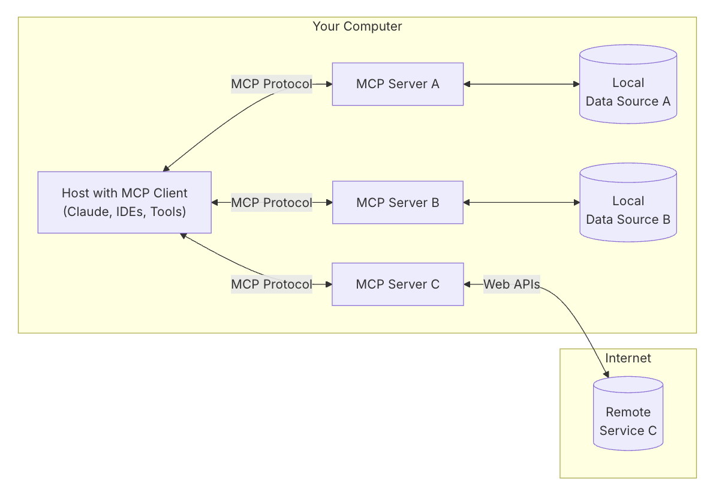

# MCP 概念
## 介绍
MCP (Model Context Protocol) 是一个开放协议，用于标准化应用程序如何向 LLM 提供上下文。可以将 MCP 想象成 AI 应用程序的 USB-C 接口。就像 USB-C 为设备连接各种外设和配件提供标准化方式一样，MCP 为 AI 模型连接不同的数据源和工具提供了标准化的方式。

MCP 可以让用户或开发者：
1. 构建为 LLMs 提供工具和数据的服务器
2. 将这些服务器连接到兼容 MCP 的客户端
3. 通过自定义功能扩展 LLM 的能力

## MCP 架构

**MCP 主机**: 像 Claude Desktop、IDE 或 AI 工具等想要通过 MCP 访问数据的程序
**MCP 客户端**: 与服务器保持 1:1 连接的协议客户端
**MCP 服务器**: 通过标准化的模型上下文协议暴露特定功能的轻量级程序
**本地数据源**: MCP 服务器可以安全访问的计算机文件、数据库和服务
**远程服务**: MCP 服务器可以连接的通过互联网提供的外部系统（例如通过 API）

## 核心
MCP 服务器可以提供三种主要类型的功能：

1. **工具**：可被 LLM 调用的函数（需要用户批准）
2. **资源**：可被客户端读取的类文件数据（如 API 响应或文件内容）
3. **提示词**：帮助用户完成特定任务的预设模板

# 教程: 从零到一搭建第一个 MCP 服务器

