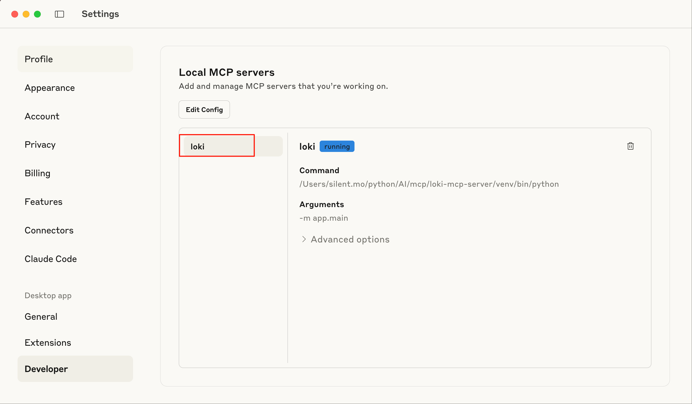
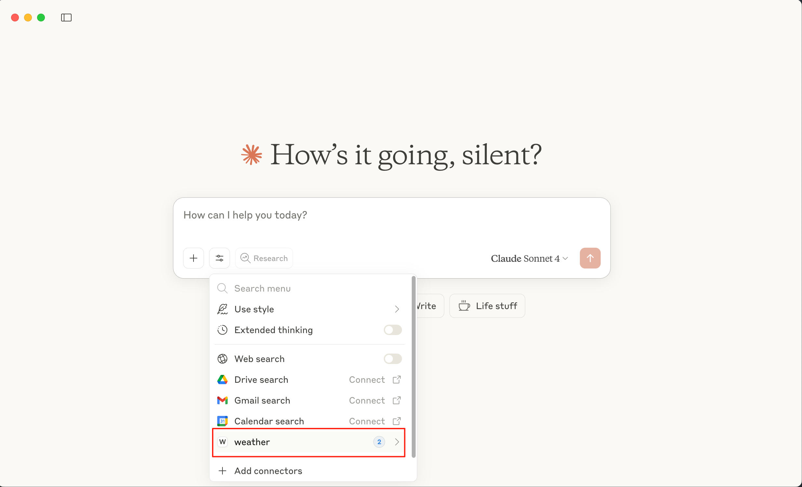
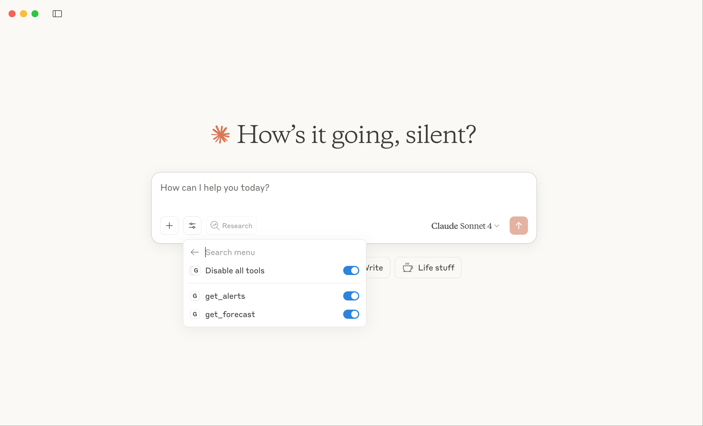

# MCP 概念

> [!TIP]
>
> 1. 一般来说，大多数人包括开源社区都只是开发 server, 很多时候都是通过一些APP(如：Claude Desktop) 或者 IDE  来充当 Client。
>
> 2. 如果有能力，可以把 mcp server 开发成 sse 或者 http 方式部署到服务器，提供外部访问
> 3. 另外很多人会误解 MCP 跟 Agent 的概念，其实他们是不一样的概念。
>    - MCP Server 通过 MCP 协议标准定义输入输出给所有大模型提供外部信息，MCP Server 就是一个通用工具，它本身跟大模型没关系
>    - Agent可以理解为某种能自主理解、规划决策、执行复杂任务的智能体。它是基于 LLM  的。并且我认为的 Agent 其实就是用 Prompt + LLM 实现，Prompt 给 LLM 更加拟人化，场景化，而不是通用简单的回答。
> 4. 想写 Client 的看这里: [Model Context protocal Client Quickstart](https://modelcontextprotocol.io/quickstart/client)

## 介绍

MCP (Model Context Protocol) 是一个开放协议，用于标准化应用程序如何向 LLM 提供上下文。可以将 MCP 想象成 AI 应用程序的 USB-C 接口。就像 USB-C 为设备连接各种外设和配件提供标准化方式一样，MCP 为 AI 模型连接不同的数据源和工具提供了标准化的方式。

MCP 可以让用户或开发者：
1. 构建为 LLMs 提供工具和数据的服务器
2. 将这些服务器连接到兼容 MCP 的客户端
3. 通过自定义功能扩展 LLM 的能力

## MCP 架构


**MCP 主机**: 像 Claude Desktop、IDE 或 AI 工具等想要通过 MCP 访问数据的程序
**MCP 客户端**: 与服务器保持 1:1 连接的协议客户端
**MCP 服务器**: 通过标准化的模型上下文协议暴露特定功能的轻量级程序
**本地数据源**: MCP 服务器可以安全访问的计算机文件、数据库和服务
**远程服务**: MCP 服务器可以连接的通过互联网提供的外部系统（例如通过 API）

## 核心
MCP 服务器可以提供三种主要类型的功能：

1. **工具**：可被 LLM 调用的函数（需要用户批准）
2. **资源**：可被客户端读取的类文件数据（如 API 响应或文件内容）
3. **提示词**：帮助用户完成特定任务的预设模板

# 教程: 从零到一搭建第一个 MCP 服务器

> [!CAUTION]
>
> 本教程的使用的系统是 MacOS
>
> [完整代码](https://github.com/modelcontextprotocol/quickstart-resources/tree/main/weather-server-python)

## 服务器开发

本教程中, 我们将使用 Python 来构建一个简单的 MCP 天气服务器并将其连接到宿主应用程序 Claude Desktop。

### 系统环境配置

**系统要求**:
1. Python 3.10 或更高版本
2. Python MCP SDK 1.2.0或更高版本

**安装 uv**

```
# MacOS/Linux
curl -LsSf https://astral.sh/uv/install.sh | sh
# Windows
powershell -ExecutionPolicy ByPass -c "irm https://astral.sh/uv/install.ps1 | iex"
```

**创建项目**
```
# Create a new directory for our project
uv init weather
cd weather

# Create virtual environment and activate it
uv venv
source .venv/bin/activate

# Install dependencies
uv add "mcp[cli]" httpx

# Create our server file
touch weather.py
```

### 构建 MCP Server

#### 导入包并设计实例

将这些添加到您的`weather.py`顶部：

```python
from typing import Any
import httpx
from mcp.server.fastmcp import FastMCP

# 初始化FastMCP服务器
mcp = FastMCP("weather")

# 常量
NWS_API_BASE = "https://api.weather.gov"
USER_AGENT = "weather-app/1.0"
```

FastMCP类使用Python类型提示和文档字符串自动生成工具定义，使创建和维护MCP工具变得简单。

#### 辅助函数 

接下来，添加辅助函数，用于查询和格式化来自国家气象服务API的数据：

```python
async def make_nws_request(url: str) -> dict[str, Any] | None:
    """向NWS API发出GET请求，处理错误并返回JSON响应"""
    headers = {
        "User-Agent": USER_AGENT,
        "Accept": "application/geo+json"
    }
    async with httpx.AsyncClient() as client:
        try:
            response = await client.get(url, headers=headers, timeout=30.0)
            response.raise_for_status()
            return response.json()
        except Exception:
            return None

def format_alert(feature: dict) -> str:
    """将警报特征格式化为可读字符串。"""
    props = feature["properties"]
    return f"""
Event: {props.get('event', 'Unknown')}
Area: {props.get('areaDesc', 'Unknown')}
Severity: {props.get('severity', 'Unknown')}
Description: {props.get('description', 'No description available')}
Instructions: {props.get('instruction', 'No specific instructions provided')}
"""
```

#### 实现工具执行 

工具执行处理程序负责实际执行每个工具的逻辑：

```python
@mcp.tool()
async def get_alerts(state: str) -> str:
    """获取指定州的天气警报（使用两字母州代码如CA/NY）"""
    url = f"{NWS_API_BASE}/alerts/active/area/{state}"
    data = await make_nws_request(url)

    if not data or "features" not in data:
        return "无法获取警报或未找到警报。"

    if not data["features"]:
        return "该州没有活动警报。"

    alerts = [format_alert(feature) for feature in data["features"]]
    return "\n---\n".join(alerts)

@mcp.tool()
async def get_forecast(latitude: float, longitude: float) -> str:
    """获取位置的天气预报。

    Args:
        latitude: 位置的纬度
        longitude: 位置的经度
    """
    # 首先获取预报网格端点
    points_url = f"{NWS_API_BASE}/points/{latitude},{longitude}"
    points_data = await make_nws_request(points_url)

    if not points_data:
        return "无法为此位置获取预报数据。"

    # 从点响应中获取预报URL
    forecast_url = points_data["properties"]["forecast"]
    forecast_data = await make_nws_request(forecast_url)

    if not forecast_data:
        return "无法获取详细预报。"

    # 将时段格式化为可读预报
    periods = forecast_data["properties"]["periods"]
    forecasts = []
    for period in periods[:5]:  # 只显示接下来的5个时段
        forecast = f"""
{period['name']}:
Temperature: {period['temperature']}°{period['temperatureUnit']}
Wind: {period['windSpeed']} {period['windDirection']}
Forecast: {period['detailedForecast']}
"""
        forecasts.append(forecast)

    return "\n---\n".join(forecasts)
```

#### 运行服务器 

最后，初始化并运行服务器：

```python
if __name__ == "__main__":
    # 初始化并运行服务器
    mcp.run(transport='stdio')
```

运行`uv run weather.py`以确认一切正常工作。

## 快速使用(Claude Desktop)

> [!TIP]
>
> Claude Desktop 需要 Claude 账号以及全局的外网环境

1. [安装 Claude Desktop](https://claude.ai/download)

2. 将上面的天气服务器添加到 Claude Desktop，打开配置文件
   ```shell
   # mac
   code ~/Library/Application\ Support/Claude/claude_desktop_config.json
   # windows
   code %APPDATA%\Claude\claude_desktop_config.json
   ```

   > [!TIP]
   >
   > macOS 打开 Claude Desktop 快速打开配置文件，Claude->setting->Developer
   > 

   

3. 配置如下：

   ```json
   {
       "mcpServers": {
           "weather": {
               "command": "uv",
               "args": [
                   "--directory",
                   "ABSOLUTE_PATH_PLACEHOLDER", // 这里写项目的绝对路径，并且把这个注释删掉
                   "run",
                   "weather.py"
               ]
           }
       }
   }
   ```

4. 然后重启 Claude Desktop，你会看到如下的MCP 图标
   

   

5. 接下来就问天气问题，Claude Desktop 会自动调用这个 MCP Weather了

# 参考

[1] [Model Context Protocol Server Quickstart](https://modelcontextprotocol.io/quickstart/server)


