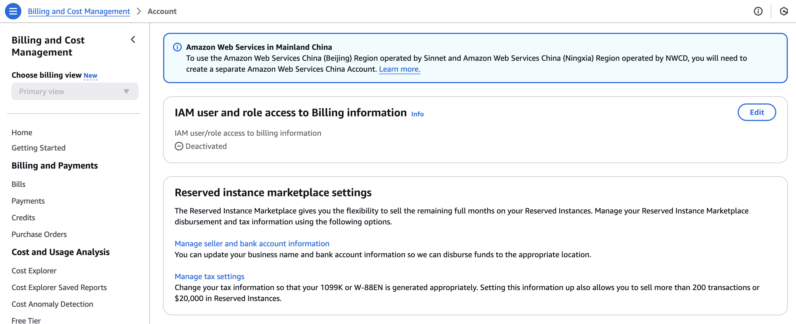
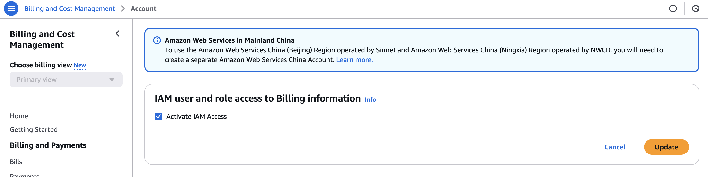

## Activate IAM access to the Billing and Cost Management console

### Introduction

When I access Cost Explorer using an IAM user or role, I get an error. 

```
You don’t have permission to perform the following operation on the AWS Cost Management console: ce:DescribeReport. Contact your AWS administrator if you need help. If you are an AWS administrator, you can provide permissions for your users or groups by creating IAM policies. [Learn more ](https://docs.aws.amazon.com/awsaccountbilling/latest/aboutv2/billing-permissions-ref.html)
```

And then, I'm confused that I'm the administrator for this account. So why am I getting this error?

> [!IMPORTANT]
>
> Because IAM users and roles in an AWS account can't access the Billing and Cost Management console by default.  This is true even if they have IAM policies that grant access to certain Billing features. To grant access, the AWS account root user can use the **Activate IAM Access** setting.

### Step by Step

> [!NOTE]
>
> As a security best practice, we recommend that you provide access to your resources through identity federation with [AWS IAM Identity Center](https://docs.aws.amazon.com/singlesignon/latest/userguide/what-is.html). When you enable IAM Identity Center in conjunction with AWS Organizations, the Billing and Cost Management console is enabled by default with consolidated billing for all AWS accounts in your organization. For more information, see [Consolidating billing for AWS Organizations](https://docs.aws.amazon.com/awsaccountbilling/latest/aboutv2/consolidated-billing.html) in the *Billing and Cost Management User Guide*.

1. Sign in to the AWS Management Console with **your root user** credentials (specifically, the email address and password that you used to create your AWS account).

2. On the navigation bar, select your account name, and then select [Account](https://console.aws.amazon.com/billing/home#/account).

3. Scroll down the page until you find the section **IAM User and Role Access to Billing Information**, then select **Edit**.
   

4. Select the **Activate IAM Access** check box to activate access to the Billing and Cost Management console pages.
   

5. Choose **Update**.

   The page displays the message **IAM user/role access to billing information is activated**.

   > [!IMPORTANT]
   >
   > Activating IAM access alone doesn't grant any permissions for users or roles to view the Billing and Cost Management console pages. You must also attach the required identity-based policies to IAM roles to grant access to the billing console. Roles provide temporary credentials that users can assume when needed.

6. Use the AWS Management Console to [create a role](https://docs.aws.amazon.com/IAM/latest/UserGuide/id_roles_create_for-user.html) that a user can assume to access the billing console.

7. On the **Add permissions** page for the role, add permissions to list and view details about the Billing resources in your AWS account.

   The AWS managed policy [Billing](https://docs.aws.amazon.com/awsaccountbilling/latest/aboutv2/managed-policies.html#security-iam-awsmanpol-Billing) grants users permission to view and edit the Billing and Cost Management console. This includes viewing account usage, modifying budgets and payment methods. For more policy examples that you can attach to IAM roles to control access to your account’s billing information, see [AWS Billing policy examples](https://docs.aws.amazon.com/awsaccountbilling/latest/aboutv2/billing-example-policies.html) in the *Billing and Cost Management User Guide*.