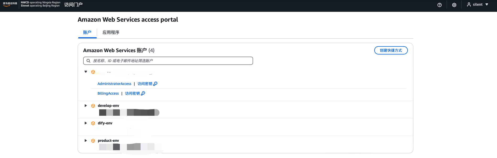
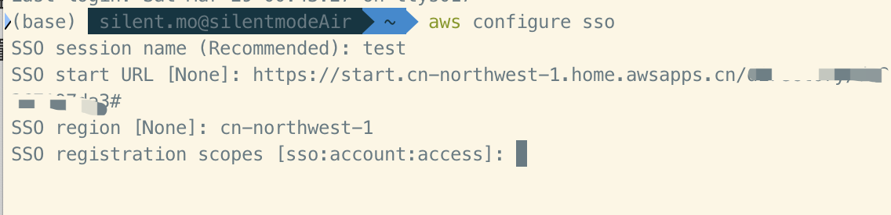
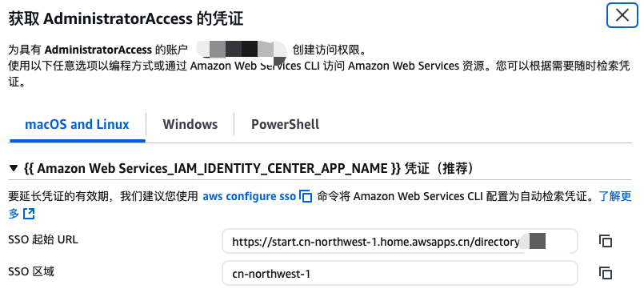
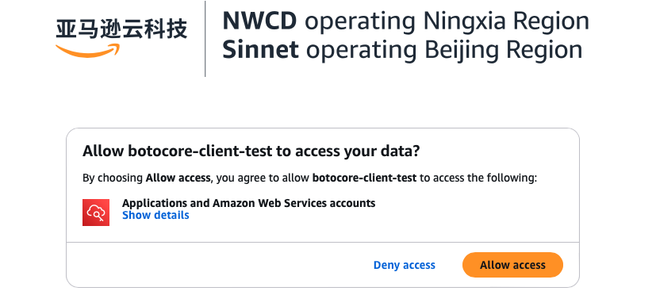
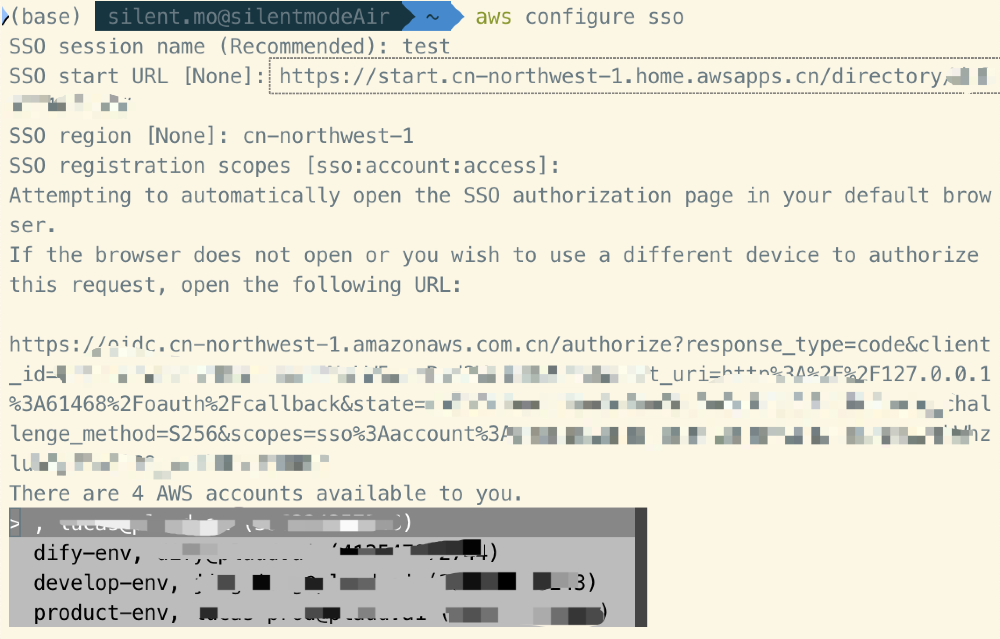
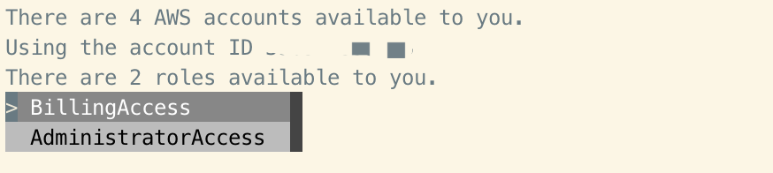
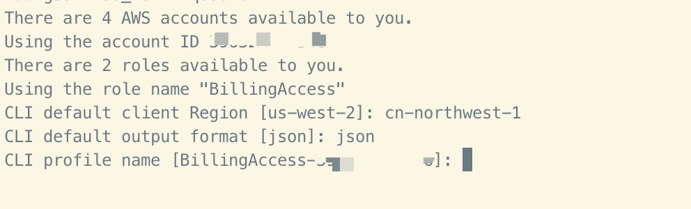
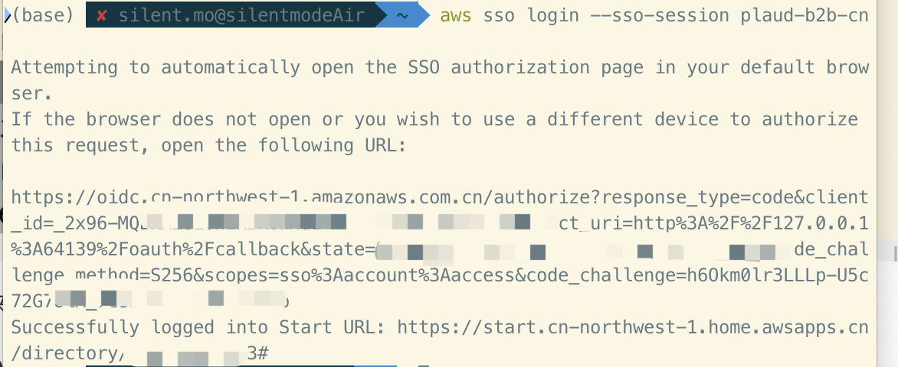
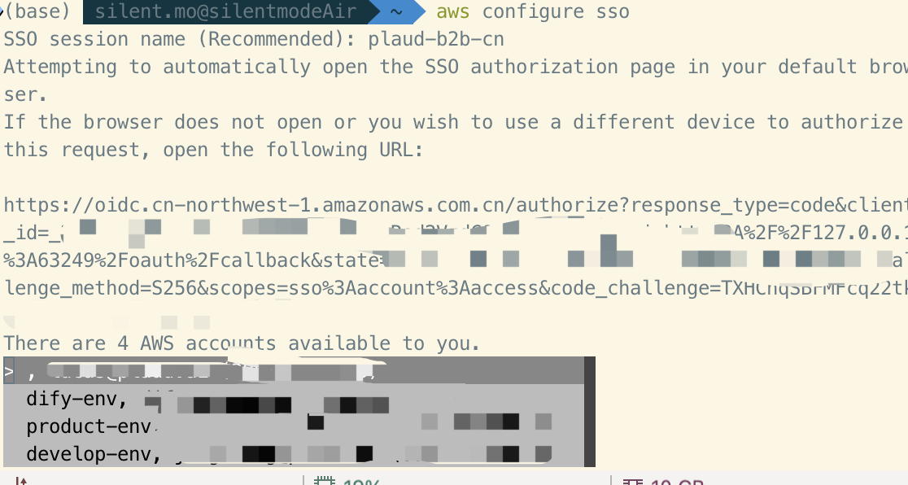

# IAM Identity Center

## 概念

IAM Identity Center 是一项基于云的 IAM 服务，属于 AWS 的 SSO。通过与现有身份提供者（IdP）集成，可简化多个 Amazon Web Services 账户、SDK 和工具的用户访问管理。它通过集中式用户门户实现安全的单点登录、权限管理和审计，从而简化了组织的身份和访问管理。

IAM Identify Center 提供一个独立的用户界面, 授权的用户可以通过这个独立的 URL 登陆到 SSO 界面。授权用户通过点击已授权的账号角色登陆到对应账号下



## 为什么要使用 IAM Identitiy Center

IAM Identity Center 是 AWS 推荐的访问管理解决方案，相比直接使用 IAM 具有以下优势：

1. **集中化的身份管理** - 允许从单一位置管理对多个 AWS 账户和云应用程序的访问，无需在每个账户中单独配置。

2. **单点登录体验** - 为员工提供单一用户门户，可以使用同一凭证访问所有已分配的 AWS 账户和应用程序，提高用户体验和工作效率。

3. **临时权限** - 提供临时访问权限，与 IAM User 的 AKSK 不一样，IAM Identity Center 提供的是临时的 AKSK+Token 方式，安全性更高，更大程度的避免了 AKSK 的泄漏。并且在本地使用时，是无需配置 AKSK 的，详细配置请看下文或 [官方文档](https://docs.amazonaws.cn/cli/latest/userguide/cli-configure-sso.html)

4. **简化的权限管理** - 通过权限集（Permission Sets）简化了对多账户环境的权限管理，可以基于常见的工作职能分配用户权限，并根据特定安全需求进行自定义。

5. **基于属性的访问控制 (ABAC)** - 支持从身份源选择用户属性（如成本中心、职位或地区），并将其用于基于属性的访问控制，简化访问管理。

6. **与身份提供商的简便集成** - 可以轻松连接现有的身份源（如 Microsoft Active Directory、Okta、Microsoft Entra ID 等），用户可以使用现有的企业凭证登录。

7. **增强的审计能力** - 与 AWS CloudTrail 集成，提供对 AWS 账户和启用 SAML 的云应用程序的单点登录访问的集中审计，增强安全性和合规性。

8. **预配置的应用程序集成** - 包含与多种 AWS 应用程序和企业应用（如 Salesforce、Box 和 Microsoft 365）的内置集成。

随着 AWS 账户数量的增加，IAM Identity Center 为管理用户访问所有云应用程序提供了一种可扩展的解决方案，大大减少了管理复杂性。


# Amazon CLI 配置 IAM Identity Center

## 前提条件

1. 已安装 Amazon CLI。未安装，请参考[安装或更新最新版本的 Amazon CLI](https://docs.amazonaws.cn/cli/latest/userguide/getting-started-install.html)
2. 已拥有 IAM Identity Center 中的 SSO 权限

## 配置过程: Step by Step


### Step 1: 首次配置

> [!NOTE]
>
> 一个组织配置一次 sso-session 即可

1. 终端执行 `aws configure sso`
   ```shell
   SSO session name (Recommended): my-sso # 自行命名，记住即可
   SSO start URL [None]: https://my-sso-portal.awsapps.com/start # SSO 的登陆 URL
   SSO region [None]: us-east-1 # SSO 默认的 region 
   SSO registration scopes [None]: sso:account:access # 就选择这个即可
   ```

   

   Start URL 和 SSO Region 获取，在登陆的 SSO 界面，选择账号的下拉箭头 -> 点击"访问密钥"
   

   在弹出的界面查看对应的 URL 和 区域
   

2. 浏览器允许访问，在终端正确配置 `aws configure sso` 后，会在默认浏览器自动打开一个确认页面。

   > 如果没有自动弹出，可以自己拿终端的URL，打开浏览器

   

3. 在上一步确认后，多账号会出现账号的选择。如果只有一个授权账号，Amazon CLi 会自动选择该账号并跳过提示。
   

4. 选择账号后，多个角色也需要选择。如果只有一个角色，会自动选择并跳过提示
   

5. 接下来，需要填写当前选择账号和角色  Profile 的 默认 region，输出格式，以及 profile 名称
   

**最终体现**

在配置完成 `aws configure sso` 后，它本质是自动修改 `~/.aws/config` 插入你选择的信息，示例：

```shell
$ cat ~/.aws/config
[profile b2b-cn-product]
sso_session = b2b-cn
sso_account_id = xxx # 你要登陆的账号
sso_role_name = AdministratorAccess # 授权的角色
region = cn-northwest-1
output = json

[sso-session plaud-b2b-cn]
sso_start_url = https://start.cn-northwest-1.home.awsapps.cn/directory/xx # sso 登陆 url
sso_region = cn-northwest-1
sso_registration_scopes = sso:account:access
```

### Step 2: 登陆 IAM Identity Center 或刷新凭证

1. 使用 `aws sso login --sso-session <your-session-name>` 登陆 sso，并刷行全部已配置的 profile。如果浏览器不会自动打开，自行在浏览器打开 url

   > 身份验证令牌缓存到 `~/.aws/sso/cache` 目录下的磁盘上，其文件名基于 `sso_start_url`

   

### Step 3: 使用 IAM Identity Center 访问资源

1. 前面配置完成后，以及登陆 sso 刷新凭据

2. 使用 `--profile <profile-name>` 访问指定账户资源，如果忘记 profile 名称，查看 `~/.aws/config`

   > [!CAUTION]
   >
   > - 如果只有一个授权账号，也可以直接在 SSO 登陆接口获取临时的 AKSK 写入到环境变量中，这样稍微麻烦一些。但是对代码无修改
   > - 本地调试时指定 profile后，再提及到线上代码需要注释掉 profile 部分

   - Amazon cli
     ```shell
     aws s3 ls --profile <your-profile-name>
     ```

   - golang, 
     ```golang
     cfg, err := config.LoadDefaultConfig(
     		context.TODO(),
     		config.WithRegion("cn-northwest-1"),          // AWS 区域
     		config.WithSharedConfigProfile("cn_test_s3"), // 指定 profile 文件
     		//config.WithBaseEndpoint("https://s3.cn-northwest-1.amazonaws.com.cn"), // 使用 S3 加速域名
     	)
     ```

   - python
     ```shell
     session = boto3.Session(profile_name='plaud-b2b-cn-manager')  # 使用Session创建带配置文件的会话
     s3_client = session.client(
         's3',
         region_name='cn-northwest-1',  # 宁夏区域
         endpoint_url='https://s3.cn-northwest-1.amazonaws.com.cn'
     )
     ```

## 新增或变更

### 新增配置

1. 终端输入 `aws configure sso`, 在终端输入你之前配置了的 `sso session` name，如果忘记，查看 `~/.aws/config` 文件。

   - 正确输入并回车后，默认浏览器会自动打开 URL，已登陆过 SSO 的无需登陆
   - 未登陆 SSO 的，需要先登陆

2. 输入正确的 sso session name 后，会让你选择账号配置

   

3. 接下来，按照首次配置的第四-五步配置即可

### config 文件手动配置

1. 修改 `~/.aws/config` 文件，按照下面格式填写即可。去掉里面的注释
   ```shell
   $ vi ~/.aws/config
   [profile b2b-cn-product] # profile 账号和角色一一对应
   sso_session = b2b-cn
   sso_account_id = xxx # 你要登陆的账号
   sso_role_name = AdministratorAccess # 授权的角色
   region = cn-northwest-1
   output = json
   
   [sso-session plaud-b2b-cn] # sso session 一般一个组织一个即可
   sso_start_url = https://start.cn-northwest-1.home.awsapps.cn/directory/xx # sso 登陆 url
   sso_region = cn-northwest-1
   sso_registration_scopes = sso:account:access
   ```

   

