# IAM Role Anywhere
## 概念

IAM Roles Anywhere 使用了 CreateSession API 来提供临时凭据, 云外设备通过请求该 API, 传递 trust anchor, profile, assumed role, 证书, 以及使用证书私钥对该请求生成的 SigV4 签名等参数。

当 IAM Roles Anywhere 收到请求后, 它首先使用证书公钥验证签名, 然后验证证书是由先前在账户中配置的 trust anchor 颁发的。 两项验证成功后, 应用程序现在已通过身份验证, IAM Roles Anywhere 将通过调用 AWS Security Token Service (AWS STS) 为请求中指定的角色创建新角色会话, 以获取临时安全凭证。

CreateSession 本质上是一个围绕 AssumeRole API 的 x509 wrapper, 目前并没有包含在任何的 SDK 中。详细的认证信息请参考 [IAM Roles Anywhere](https://docs.aws.amazon.com/rolesanywhere/latest/userguide/authentication.html) 认证。

所以在本例中需要使用 IAM Roles Anywhere 提供的一个 credential helper 工具,  该工具兼容各种编程语言 SDK 中的 credential_process 功能。目前该工具支持 Linux, Windows 和 Darwin(MacOS 别称) 这三种平台。

基本术语: 
- Trust anchors: 一个 Trust anchors 代表 IAM Roles Anywhere 和你的一个 CA 证书之间的信任关系。设备使用 CA 颁发的 x509 证书和 trust anchors 进行认证以获取临时的 IAM 凭据。
- Roles: 具有特定权限的 IAM 角色, 该角色必须信任 IAM Roles Anywhere 服务。Trust anchors 通过 `aws:SourceArn` 条件键与 IAM 角色绑定
- Profiles: 用于指定IAM Roles Anywhere可以assume的一些角色, 从而获取临时凭据。同时我们也可以在profile里面使用会话策略限制该临时会话的权限。

## 使用场景

- IoT 设备访问云端服务, 如上传应用日志到亚马逊云科技S3
- 机房设备数据备份到S3
- 混合云部署中机房的机器访问云端资源
- 一些离谱, 不合理不符合最佳实践的需求。比如: 初创公司, 研发想要本地访问 S3, 老板又着急, 同意的

# 配置过程: Step by Step
## Step 0: 前置条件
1. 设备已安装 [AWS CLI](https://docs.aws.amazon.com/cli/latest/userguide/getting-started-install.html)
2. 设备已下载 [Credential-helper](https://docs.aws.amazon.com/zh_cn/rolesanywhere/latest/userguide/credential-helper.html)。 并可执行程序放在 `~/.aws/` 目录下, 可以其他目录, 记住路径和该文件有执行权限就行。
    > Darwin 为 MacOS
## Step 1: Root CA 配置

首先需要拥有一个 Root CA, 如果已经有 PKI 基础设施的话, 可跳过, 这里使用 AWS Private Certificate Authority 来管理 PKI 基础设施。 更多信息: [What is AWS Private CA?](https://docs.aws.amazon.com/privateca/latest/userguide/PcaWelcome.html)

当然也可以自己维护一套或兼容已有 PKI 基础设施, 如使用 OpenSSL 或 EasyRSA 生成自管理的 PKI 基础设施。 

AWS IAM Roles Anywhere 也支持外部的 CA 证书。

下面是 AWS Private Certificate Authority 配置过程: 
1. 登陆 AWS Private Certificate Authority
2. 点击 Create a private CA 
3. 在创建页面, Mode options 选择 General-purpose, CA type options 选择 Root; 填写对应Subject distinguished name options信息, 下拉到最后点击创建
    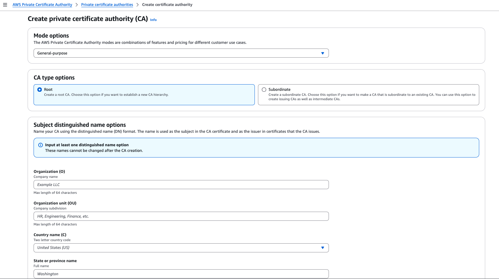

## Step 2: 创建 Trust anchors
1. 登陆 IAM Console, 点击 Roles, 找到 Roles Anywhere
    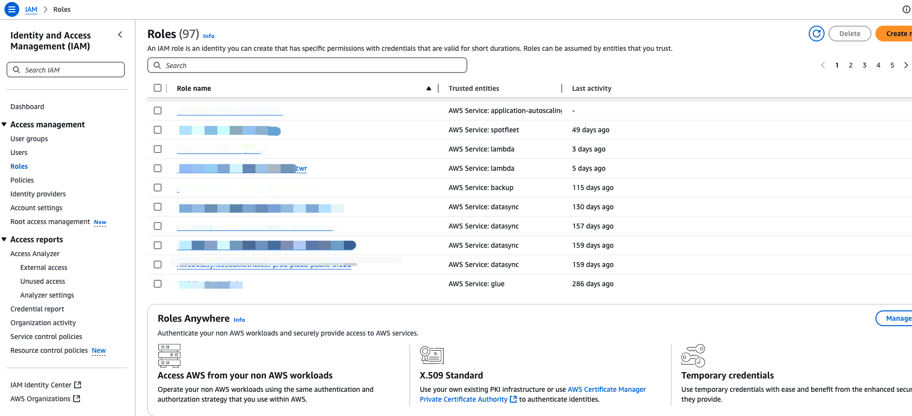
2. 点击管理, 然后点击 Create a trust anchor
    
    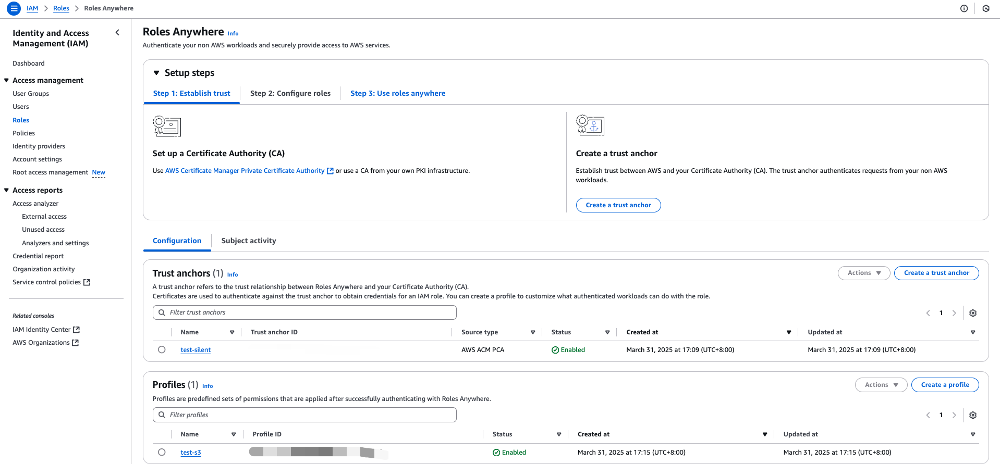
3. 在创建页面, 选择对应的 CA 
    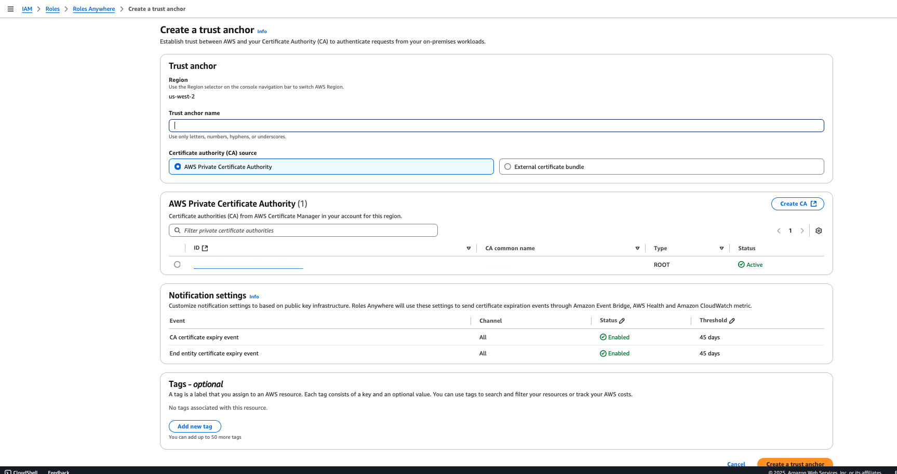

## Step 3: 创建 IAM roles
1. 在 IAM Console 创建一个角色, 使用 Roles Anywhere 案例
    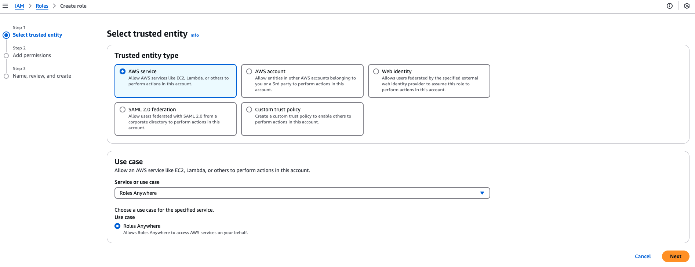
2. 在 Add permissions 页面, 选择对应的权限。这里示例使用 AmazonS3FullAccess
    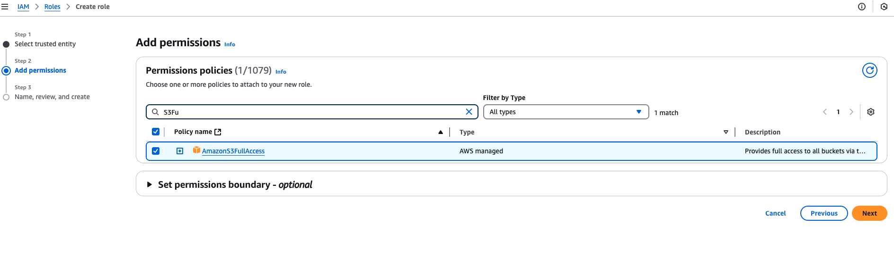
3. 最后, 输入 Role name, 点击 Create role

## Step 4: 生成设备证书
1. 在 AWS Certificate Manager 请求一个私有证书
    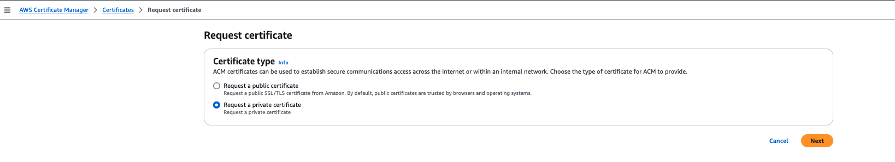
    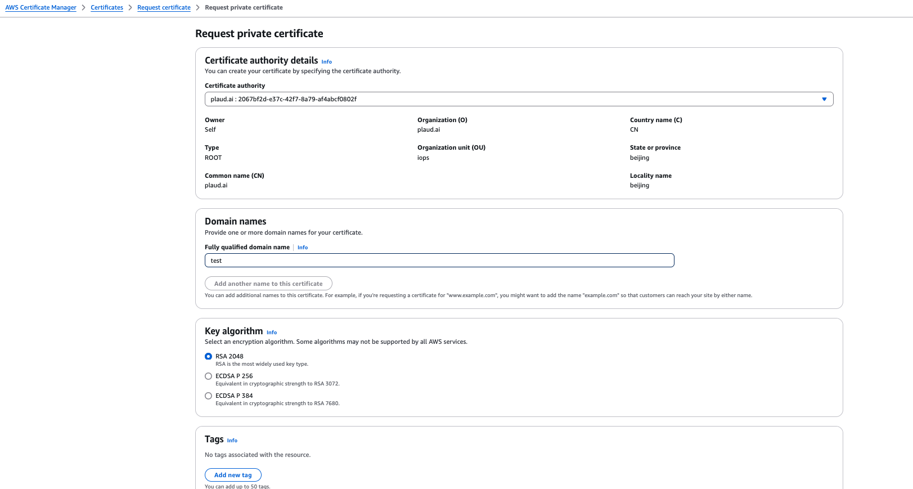
2. 查看前面生成的证书详细信息, 点击 Export, 导出证书(需要设置密码)
    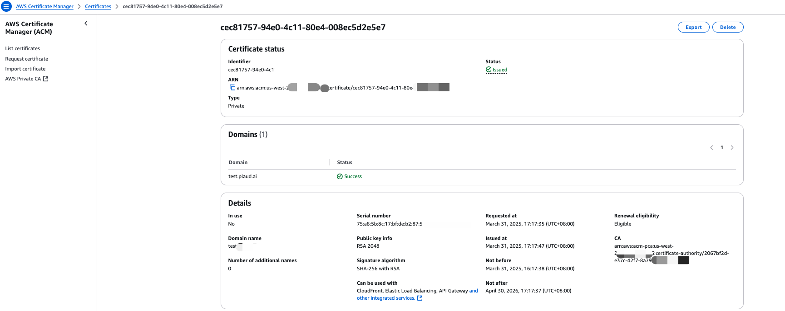
    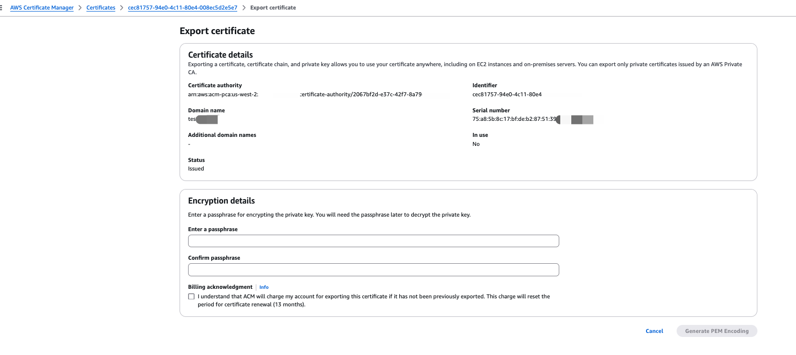
3. 导出证书后, 下载 Certificate body 作为 `device.crt` 文件, 下载 Certificate private key 作为 `device-pass.key` 文件
    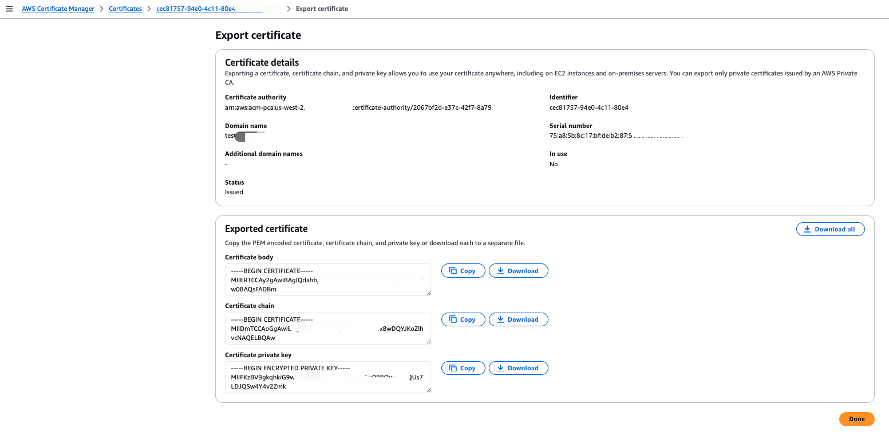
4. 本地终端解密私钥文件
    ```shell
    openssl rsa -in device-pass.key -out device.key
    ```

## Step 5: 配置 aws config
1. 编辑配置文件 `vi ~/.aws/config`, 参数详情请看后面的 **Config文件参数说明**
    ```shell
    [profile test-role-anywhere]
    region = us-east-1
    credential_process = /home/mile/.aws/aws_signing_helper credential-process \
    --certificate /app/device.crt --private-key /app/device.key \
    --trust-anchor-arn arn:aws:rolesanywhere:<region>:<account>:trust-anchor/<TA_ID> \
    --profile-arn arn:aws:rolesanywhere:<region>:<account>:profile/<PROFILE_ID> \
    --role-arn arn:aws:iam::<account>:role/<role-name> 
    ```
2. 测试
    ```shell
    aws s3 ls
    ```
    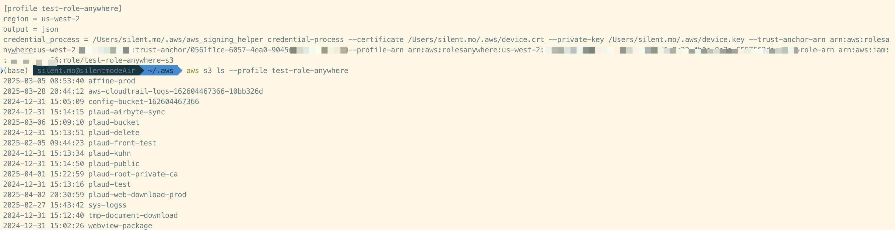

**Config 文件参数说明**

1. credential_process: credential-helper 可执行文件路径   
2. --certificate: 前面 crt 文件
3. --private-key: 解密后的私钥文件
4. --trust-anchor-arn: Trust anchor 的 arn
    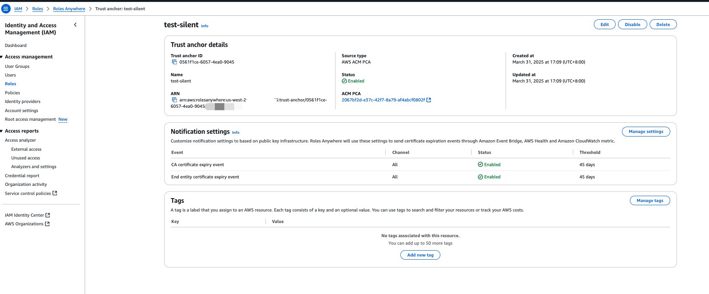
5. --profile-arn: Roles anywhere 的 arn
    
6. --role-arn: IAM  Role 的 arn


# 参考
[1] [AWS Blogs-利用亚马逊云科技 IAM Roles Anywhere 授权云外设备访问AWS资源](https://aws.amazon.com/cn/blogs/china/use-amazon-cloud-technology-iam-roles-anywhere-to-authorize-off-cloud-devices-to-access-aws-resources/?utm_source=chatgpt.com)
[2] [Get temporary security credentials from IAM Roles Anywhere](https://docs.aws.amazon.com/zh_cn/rolesanywhere/latest/userguide/credential-helper.html)