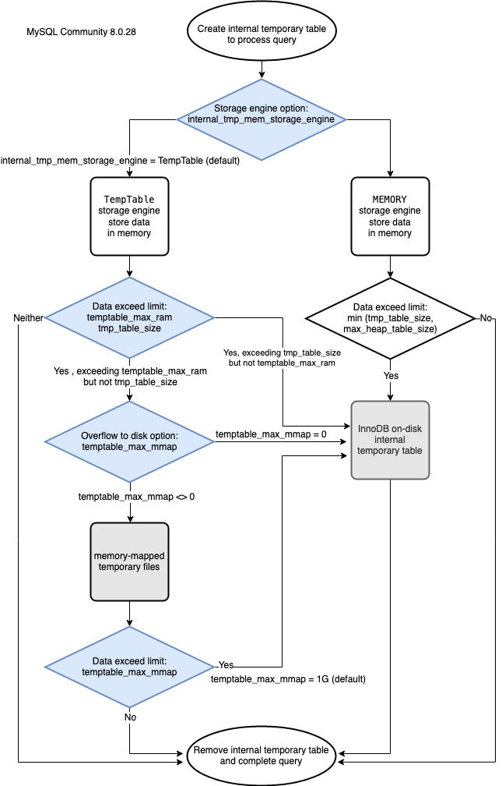
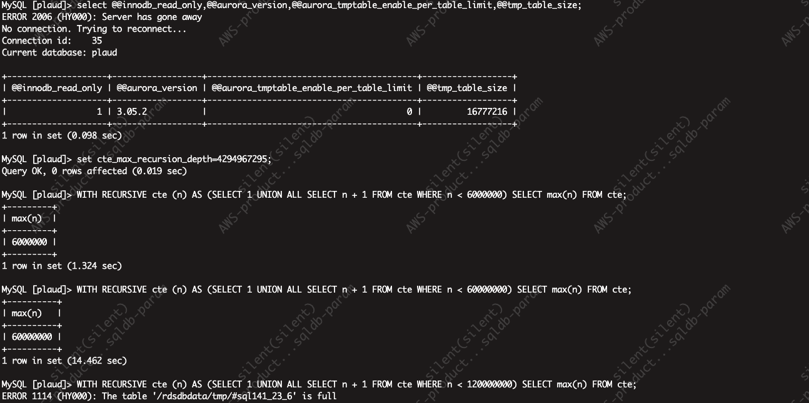
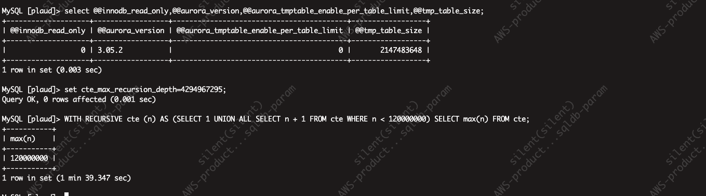

# Aurora Mysql8.0 临时表空间原理详解

## 介绍

在一次执行 mysql 查询时，报了一个临时表的错误`ERROR 1114 (HY000): The table '/rdsdbdata/tmp/#sqlxx_xxx' is full`。就查了一下，应该怎么解决这个错误。问了 GPT，Gemini，Deepseek R1，都是让进入到数据库里面调整临时表的配置。但是我使用的是 AWS Aurora Mysql，并且是 Serverless 的。配置应该是 Aurora 数据库参数调整才对，AWS Aurora 文档其实也有说明。

当然不能就是按照文档调整就很容易了，还是要花时间了解临时表存储的原理的。并且官方文档也没那么容易理解

## 适用性

- 解决方法：AWS Aurora Mysql and Aurora Mysql Serverless
- 原理：Mysql 8.0 

## Aurora Mysql 版本 3 新临时表行为

Aurora Mysql 版本 3 可以创建两种类型的临时表，继承自 Mysql 8.0 社区版：

- 内部(隐式)临时表 - 由 Aurora Mysql 引擎处理，以处理诸如对聚合、派生表或公用表表达式 (CTE) 进行排序等操作。

  - 本文的报错就是因为内部临时表导致的
    ```shell
    ERROR 1114 (HY000): The table '/rdsdbdata/tmp/#sqlxx_xxx' is full
    ```

- 用户创建的（或*显式*）临时表 – 使用 `CREATE TEMPORARY TABLE` 语句时由 Aurora MySQL 引擎创建

### 内部(隐式)临时表的存储引擎

> Mysql 8.0 引入了 TempTable 作为新的默认内部临时表存储引擎，以加快查询处理速度。在 8.0 之前使用的是 Memory 存储引擎，8.0 也支持切换回 MEMORY 存储引擎选项。
>
> 两者的区别：
>
> | 特性       | TempTable                                                    | Memory                                       |
> | ---------- | ------------------------------------------------------------ | -------------------------------------------- |
> | 创建方式   | Mysql 自动创建，根据查询语句<br />或通过 `CREATE TEMPORARY TABLE` 显式创建） | 需要显式指定 `ENGINE=MEMORY` 创建            |
> | 使用场景   | 中间结果缓存、复杂查询的临时数据处理                         | 高速缓存、会话中临时数据、快速查找等         |
> | 数据存储   | 初始可能在内存中，超限时自动转为磁盘存储                     | 永远存储在内存中                             |
> | 数据持久性 | 仅在当前会话有效，关闭会话后数据自动销毁                     | 表结构永久（但数据不持久，服务器重启后丢失） |

TempTable 对使用此引擎的所有临时表使用公用内存池，而不是每个表的最大内存限制。公用内存池由 [temptable_max_ram](https://dev.mysql.com/doc/refman/8.0/en/server-system-variables.html#sysvar_temptable_max_ram) 参数指定，对于具有 16 GiB 或更多内存的数据库实例，默认为 1 GiB; 而对于内存小于 16 GiB 的数据库实例，默认设置为 16 MB。

在某些情况下，使用 `TempTable` 存储引擎时，临时数据回超出内存池的大小，Aurora Mysql 会使用辅助机制存储溢出的数据。可以设置 [temptable_max_mmap](https://dev.mysql.com/doc/refman/8.0/en/server-system-variables.html#sysvar_temptable_max_mmap) 来选择数据时溢出到内存映射到临时文件，还是磁盘的 Inno DB 内部临时表。

Aurora Mysql 版本 3 通过以下方式存储溢出数据：

- 在写入器数据库实例上，溢出到 InnoDB 内部临时表或内存映射临时文件的数据驻留在实例上的本地存储中
- 在读取器数据库实例上，溢出数据始终驻留在本地存储上的内存映射临时文件中
- 只读实例无法在 Aurora 集群卷上存储任何数据

与内部临时表相关的配置参数对集群中的写入器和读取器实例的应用方式不同：

- 在读取器实例上，Aurora MySQL 始终使用 `TempTable` 存储引擎。
- 对于写入器和读取器实例，`temptable_max_mmap` 的大小都默认设置为 1GiB，无论数据库实例内存大小如何。可以在写入器实例和读取器实例上调整此值。
- 将 `temptable_max_mmap` 设置为 `0` 可禁止在写入器实例上使用内存映射的临时文件。
- 您无法在读取器实例上将 `temptable_max_mmap` 设置为 `0`

### 配置参数差异

TempTable 存储引擎的四个参数的行为：



- `internal_tmp_mem_storage_engine` 定义内存内部临时表的存储引擎，允许值为 TempTable（默认）或 MEMORY。此参数是在 MySQL [8.0.2](https://dev.mysql.com/doc/relnotes/mysql/8.0/en/news-8-0-2.html) 中引入 TempTable 存储引擎时添加的。
- `temptable_max_ram`，也是在 MySQL [8.0.2](https://dev.mysql.com/doc/relnotes/mysql/8.0/en/news-8-0-2.html) 中引入的，定义了 TempTable 存储引擎可以使用的最大内存量。
- `temptable_max_mmap` [在 MySQL 8.0.23](https://dev.mysql.com/doc/relnotes/mysql/8.0/en/news-8-0-23.html)中引入，定义了 TempTable 存储引擎允许为内存映射临时文件分配的最大磁盘存储量。将其设置为 0 可禁用内存映射临时文件的使用，从而使溢出转到 InnoDB 磁盘上的内部临时表。
- [tmp_table_size](https://dev.mysql.com/doc/refman/8.0/en/server-system-variables.html#sysvar_tmp_table_size) 定义 TempTable 存储引擎创建的各个内部临时表的最大大小（从 MySQL [0.28](https://dev.mysql.com/doc/relnotes/mysql/8.0/en/news-8-0-28.html)开始）

**Aurora 副本限制**：

- `internal_tmp_mem_storage_engine` 内部设置为 TempTable 存储引擎，无法修改。如果您尝试在参数组中将其设置为 MEMORY 存储引擎，则更改不会生效。
- `temptable_use_mmap` 内部设置为 1，无法修改。如果您在参数组中应用不同的值，则更改不会生效。
- `temptable_max_mmap` 不能设置为 0。如果您尝试在参数组中将其设置为 0，它会在内部重置为默认值 1 GB。
- `tmp_table_size` 从 Aurora MySQL 3.04.0 版本开始可用于 TempTable 存储引擎，但您需要启用另一个 Aurora 特定参数 `aurora_tmptable_enable_per_table_limit` 才能使其有效。
  - 当`aurora_tmptable_enable_per_table_limit`设置为 0 时，`tmp_table_size`对 Aurora 主（写入器）数据库实例或副本数据库实例均无影响。这是默认设置。
  - 当`aurora_tmptable_enable_per_table_limit`设置为 1 时，`tmp_table_size`可以限制 Aurora 主（写入器）数据库实例和 Aurora 副本数据库实例上的内部临时表分配的最大内存大小。默认值为 16M。当内部临时表大小超出 Aurora 副本数据库实例上的 tmp_table_size 限制时，查询将失败并显示错误消息


### 限制内部内存中临时表的大小

如上，可以通过设置全局参数 `temptable_max_ram` 和 `temptable_max_mmap` 调整临时表资源。

还可以使用 `tmp_table_size` 数据库参数，来限制任何一个内部内存中临时表的大小。防止各个查询消耗过量的全局临时表资源，这可能会影响需要这些资源的并发查询的性能。

在 Aurora MySQL 版本 3.04 及更高版本中，`tmp_table_size` 还定义了当 `aurora_tmptable_enable_per_table_limit` 数据库参数设置为 `ON` 时，`TempTable` 存储引擎创建的临时表的最大大小。默认情况下，此行为处于禁用状态（`OFF`），这与 Aurora MySQL 版本 3.03 及更低版本中的行为相同。

- 当 `aurora_tmptable_enable_per_table_limit` 为 `OFF` 时，不考虑将 `tmp_table_size` 用于由 `TempTable` 存储引擎创建的内部内存中临时表。

  但是，全局 `TempTable` 资源限制仍然适用。当达到全局 `TempTable` 资源限制时，Aurora MySQL 会出现以下行为：

  - 写入器数据库实例 – Aurora MySQL 自动将内存中临时表转换为 InnoDB 磁盘上临时表。

  - 读取器数据库实例 - 查询结束时出现错误。

    ```
    ERROR 1114 (HY000): The table '/rdsdbdata/tmp/#sqlxx_xxx' is full
    ```

- 当 `aurora_tmptable_enable_per_table_limit` 为 `ON` 时，如果达到 `tmp_table_size` 限制，Aurora MySQL 会出现以下行为：

  - 写入器数据库实例 – Aurora MySQL 自动将内存中临时表转换为 InnoDB 磁盘上临时表。

  - 读取器数据库实例 - 查询结束时出现错误。

    ```
    ERROR 1114 (HY000): The table '/rdsdbdata/tmp/#sqlxx_xxx' is full
    ```

    全局 `TempTable` 资源限制和每个表的限制都适用于这种情况。


> [!CAUTION]
>
> 当 [internal_tmp_mem_storage_engine](https://dev.mysql.com/doc/refman/8.0/en/server-system-variables.html#sysvar_internal_tmp_mem_storage_engine) 设置为 `MEMORY` 时，`aurora_tmptable_enable_per_table_limit` 参数不起作用。在这种情况下，内存中临时表的最大大小由 [tmp_table_size](https://dev.mysql.com/doc/refman/8.0/en/server-system-variables.html#sysvar_tmp_table_size) 或 [max_heap_table_size](https://dev.mysql.com/doc/refman/8.0/en/server-system-variables.html#sysvar_max_heap_table_size) 值定义，以较小者为准。

### 读库调整 tmp_table_size 测试结果

- Default: 16MB
  ```sql
  select @@innodb_read_only,@@aurora_version,@@aurora_tmptable_enable_per_table_limit,@@tmp_table_size;
  set cte_max_recursion_depth=4294967295;
  WITH RECURSIVE cte (n) AS (SELECT 1 UNION ALL SELECT n + 1 FROM cte WHERE n < 120000000) SELECT max(n) FROM cte;
  ```

  

- 2 GB

  ```shell
  select @@innodb_read_only,@@aurora_version,@@aurora_tmptable_enable_per_table_limit,@@tmp_table_size;
  set cte_max_recursion_depth=4294967295;
  WITH RECURSIVE cte (n) AS (SELECT 1 UNION ALL SELECT n + 1 FROM cte WHERE n < 120000000) SELECT max(n) FROM cte;
  ```

  


## 参考

[1] [Increasing the tmp_table size in Aurora MySQL](https://repost.aws/questions/QUbroQlNmzR9C9N8fKB9fhSg/increasing-the-tmp-table-size-in-aurora-mysql)

[2] [Aurora MySQL 版本 3 中的新临时表行为](https://docs.aws.amazon.com/zh_cn/AmazonRDS/latest/AuroraUserGuide/ams3-temptable-behavior.html)

[3] [Use the TempTable storage engine on Amazon RDS for MySQL and Amazon Aurora MySQL](https://aws.amazon.com/cn/blogs/database/use-the-temptable-storage-engine-on-amazon-rds-for-mysql-and-amazon-aurora-mysql/)

[4] [Internal Temporary Table Use in MySQL](https://dev.mysql.com/doc/refman/8.0/en/internal-temporary-tables.html)