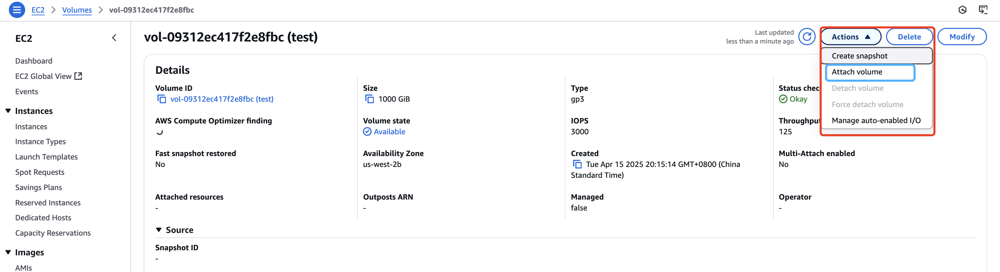

# 介绍

在 AWS EC2 上, 只会自动挂载系统盘。数据盘不管是在创建 EC2 时添加, 还是后面附加, 都不会自动挂载。并且在首次创建的 EBS 卷中是没有文件系统的, 因此需要格式化 EBS 并挂载卷。

**操作系统**

Ubuntu Server 22.04 LTS (HVM), SSD Volume Type

# 配置过程: Step by step
## (Optional) Step 0: 附加数据卷

> 这一步是在已经存在的 EC2 上没有数据卷, 或新增卷才这样做。如果是在 EC2 创建过程中, 可以直接添加多个 EBS 卷

1. 在 EBS Console 创建一个 EBS 卷
    > 注意卷的可用区需要跟实例同一个

    
    
2. 进入上一步创建出来的 EBS 详情页, 点击 Action -> Attach volum。附加卷到 EC2 上
    
3. 附加卷页面, 选择要附加的实例和设备名称, 然后点击 Attach Volume 即可成功附加
    


## Step 1: 格式卷
1. 使用 `lsblk` 查看卷在机器上的名称。 下面示例中看到, nvme1n1 这个卷是没有挂载的, 完整的卷名为: `/dev/nvme1n1`
    ```shell
    ubuntu@ip-172-31-24-182:~$ lsblk
    NAME         MAJ:MIN RM  SIZE RO TYPE MOUNTPOINTS
    loop0          7:0    0 26.3M  1 loop /snap/amazon-ssm-agent/9881
    loop1          7:1    0 63.7M  1 loop /snap/core20/2496
    loop2          7:2    0 73.9M  1 loop /snap/core22/1748
    loop3          7:3    0 89.4M  1 loop /snap/lxd/31333
    loop4          7:4    0 44.4M  1 loop /snap/snapd/23545
    nvme1n1      259:0    0 1000G  0 disk 
    nvme0n1      259:1    0  100G  0 disk 
    ├─nvme0n1p1  259:2    0 99.9G  0 part /
    ├─nvme0n1p14 259:3    0    4M  0 part 
    └─nvme0n1p15 259:4    0  106M  0 part /boot/efi
    ```
2. 使用 `sudo file -s /dev/nvme1n1` 确认卷是否存在文件系统(第一次创建的都不会有, 如果是快照恢复的就会有)
    - 下面示例表示没有文件系统
        ```shell
        ubuntu@ip-172-31-24-182:~$ sudo file -s /dev/nvme1n1
        /dev/nvme1n1: data  
        ```
    - 下面示例说明存在文件系统
        ```shell
        ubuntu@ip-172-31-24-182:~$ sudo file -s /dev/nvme1n1
        /dev/nvme1n1: SGI XFS filesystem data (blksz 4096, inosz 512, v2 dirs)
        ```

3. (如果上一步不存在文件系统) 使用 `mkfs -t` 创建一个文件系统
    ```shell
    ubuntu@ip-172-31-24-182:~$ sudo mkfs -t xfs /dev/nvme1n1
    meta-data=/dev/nvme1n1           isize=512    agcount=32, agsize=8192000 blks
            =                       sectsz=512   attr=2, projid32bit=1
            =                       crc=1        finobt=1, sparse=1, rmapbt=0
            =                       reflink=1    bigtime=0 inobtcount=0
    data     =                       bsize=4096   blocks=262144000, imaxpct=25
            =                       sunit=1      swidth=1 blks
    naming   =version 2              bsize=4096   ascii-ci=0, ftype=1
    log      =internal log           bsize=4096   blocks=128000, version=2
            =                       sectsz=512   sunit=1 blks, lazy-count=1
    realtime =none                   extsz=4096   blocks=0, rtextents=0
    ```
    如果出现 `mkfs.xfs is not found`, 则使用下面命令安装
    ```shell
    sudo apt install xfsprogs
    ```
## Step 2: 挂载卷
1. 创建一个空目录挂载, 这里使用 `/data`
    ```shell
    sudo mkdir /data
    ```
2. 挂载卷
    - 临时挂载, 如果系统重启了挂载会不在, 通过 `df -h` 查看挂载
        ```shell
        sudo mount /dev/nvme1n1 /data
        ```
    - 重启后自动挂载
        - 复制一份 `/etc/fstab`, 用于恢复
            ```shell
            sudo cp /etc/fstab /etc/fstab.orig
            ```
        - 修改 `/etc/fstab`
            ```shell
            sudo vi /etc/fstab
            ```
        - 在文件最后添加下面一行内容后, 保存修改并退出
            > 这里使用了设备名称作为挂载, 还可以使用设备 UUID 作为挂载, 查看 UUID 命令 `sudo blkid`
            ```shell
            /dev/nvme1n1  /data xfs defaults,nofail  0  2
            ```
        - 卸载之前挂载 `sudo umount /data`, 重新通过 `/etc/fstab` 挂载 `sudo mount -a`
            ```shell
            ubuntu@ip-172-31-24-182:~$ sudo umount /data
            ubuntu@ip-172-31-24-182:~$ df -h
            Filesystem       Size  Used Avail Use% Mounted on
            /dev/root         97G  1.7G   96G   2% /
            tmpfs             16G     0   16G   0% /dev/shm
            tmpfs            6.2G  920K  6.2G   1% /run
            tmpfs            5.0M     0  5.0M   0% /run/lock
            efivarfs         128K  3.9K  120K   4% /sys/firmware/efi/efivars
            /dev/nvme0n1p15  105M  6.1M   99M   6% /boot/efi
            tmpfs            3.1G  4.0K  3.1G   1% /run/user/1000
            ubuntu@ip-172-31-24-182:~$ sudo mount -a
            ubuntu@ip-172-31-24-182:~$ df -h
            Filesystem       Size  Used Avail Use% Mounted on
            /dev/root         97G  1.7G   96G   2% /
            tmpfs             16G     0   16G   0% /dev/shm
            tmpfs            6.2G  920K  6.2G   1% /run
            tmpfs            5.0M     0  5.0M   0% /run/lock
            efivarfs         128K  3.9K  120K   4% /sys/firmware/efi/efivars
            /dev/nvme0n1p15  105M  6.1M   99M   6% /boot/efi
            tmpfs            3.1G  4.0K  3.1G   1% /run/user/1000
            /dev/nvme1n1    1000G  7.1G  993G   1% /data
            ```

3. 查看挂载信息 `df -h`
    ```shell
    root@ip-172-31-24-182:/data# df -h
    Filesystem       Size  Used Avail Use% Mounted on
    /dev/root         97G  1.7G   96G   2% /
    tmpfs             16G     0   16G   0% /dev/shm
    tmpfs            6.2G  920K  6.2G   1% /run
    tmpfs            5.0M     0  5.0M   0% /run/lock
    efivarfs         128K  3.9K  120K   4% /sys/firmware/efi/efivars
    /dev/nvme0n1p15  105M  6.1M   99M   6% /boot/efi
    tmpfs            3.1G  4.0K  3.1G   1% /run/user/1000
    /dev/nvme1n1    1000G  7.1G  993G   1% /data
    ```