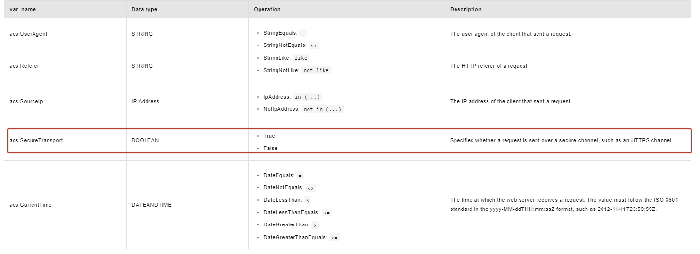
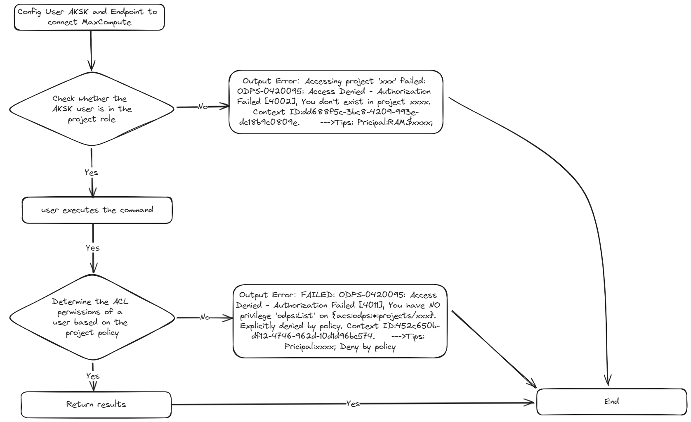
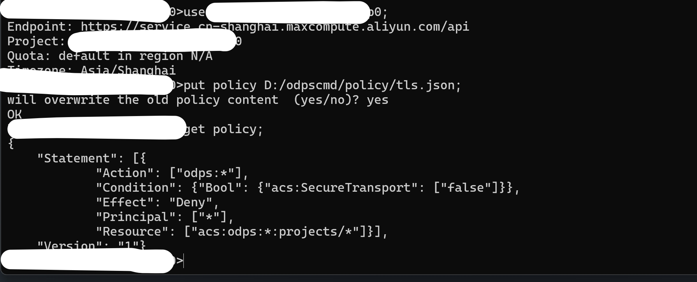
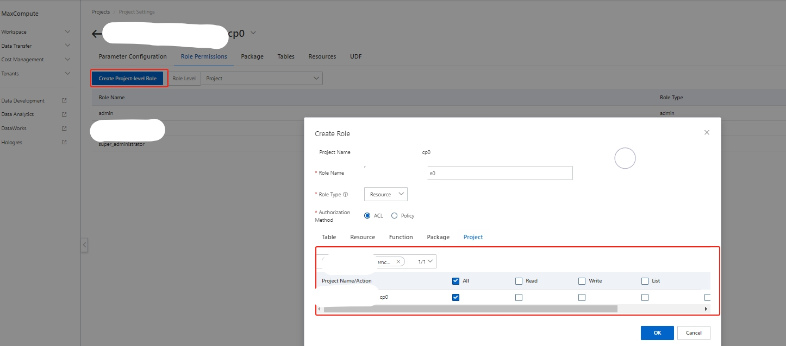
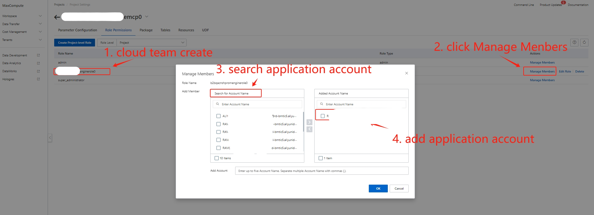
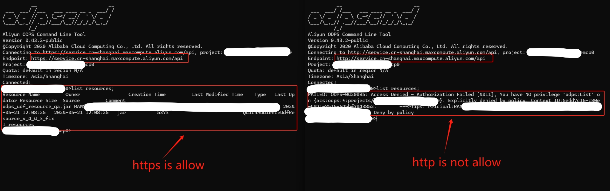

# MaxCompute 仅 https 访问方案

## 应用场景

出于网络安全需求，禁止应用在网络中使用 http 协议，仅允许使用 https 协议。

MaxCompute 对连接协议是否安全的判断⽀持控制到项⽬级（porject），使⽤ project policy  的 “acs:SecureTransport” 条件禁⽌http仅限https访问，配置后对 Endpoint 和 Tunnel Endpoint 同时⽣效。

> 注：Project Policy 仅对非 super_admin, admin 角色生效，即只对用户自定义角色生效

[MaxCompute 连接地址](https://help.aliyun.com/zh/maxcompute/user-guide/endpoints?spm=a2c4g.11186623.0.i2)

[MaxCompute ACL 权限控制](https://help.aliyun.com/zh/maxcompute/user-guide/acl-based-access-control?spm=a2c4g.11186623.0.i29)



## MaxCompute Authentication Process




## 配置过程(交付标准)

1. 下载和配置 odpscmd: [安装并配置 MaxCompute 客户端](https://help.aliyun.com/zh/maxcompute/user-guide/maxcompute-client?spm=a2c4g.11186623.0.0.70794d4b686ZM8#section-vd2-4me-7uu)

2. 创建 Policy 配置文件： https.json

   ```json
   {
       "Statement":[
           {
               "Effect":"Deny",
               "Principal":"*",
               "Action":"odps:*",
               "Resource":"acs:odps:*:projects/*",
               "Condition":{
                   "Bool": {
                       "acs:SecureTransport":"false"
                   }
               }
           }
       ],
       "Version":"1"
   }
   ```

3. 在 opdscmd 客户端输入下面命令为项目设置 Policy

   ```shell
   # 切换到待设置项⽬
   use b2bqacnshpromenginemcp0;
   # 设置Policy，将“/path/to/https.json”更改为正确的⽂件路径
   put policy /path/to/https.json;
   # 查看当前项⽬的policy设置
   get policy
   ```

   

4. Console 创建自定义角色

   进入到对应的 MaxCompute 项目管理中，点击 Role Permissions 标签页，点击 Create Project-level Role 按钮
   

5. 添加应用账号到自定义角色中
   

6. 使用应用账号测试 http 连接，会出现权限错误。https 连接能够正常访问

   

