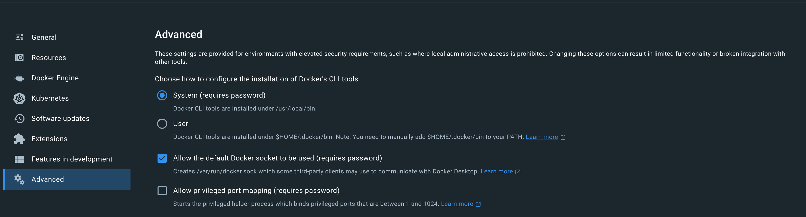
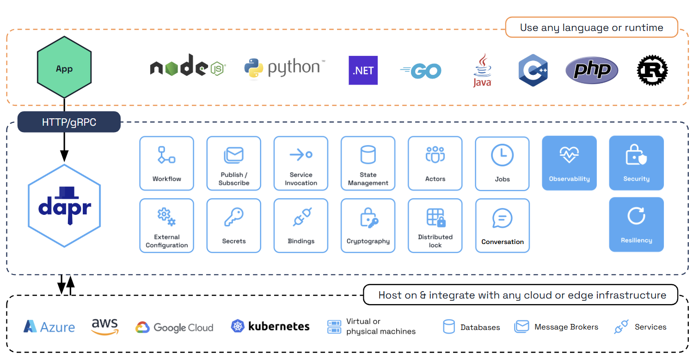
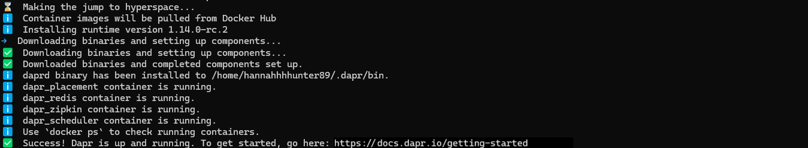

[TOC]

# Requirement

1. Python 3.9 or later

2. Docker or Kubernetes

   - In Docker Desktop’s advanced options, verify you’ve allowed the default Docker socket to be used. 

     - Navigate to **Docker Desktop** > **Settings** > **Advanced**.
     - Select the **Allow the default Docker socket to be used (requires password)** checkbox.

     


# What is Dapr?

Dapr is a portable, event-driven runtime that makes it easy for any developer to build resilient, stateless, and stateful applications that run on the cloud and edge and embraces the diversity of languages and developer frameworks. For more information, see the [Dapr overview](https://docs.dapr.io/concepts/overview/).




# Set up your local Dapr environment

Here are only the installation steps for macOS. For other systems, please refer to [install-dapr-cli](https://docs.dapr.io/getting-started/install-dapr-cli/).


## Install the Dapr CLI 

### Install from Terminal

Install the latest Darwin Dapr CLI to `/usr/local/bin`:

```bash
curl -fsSL https://raw.githubusercontent.com/dapr/cli/master/install/install.sh | /bin/bash
```

**Installing a specific CLI version**

The following example shows how to install CLI version `1.15.1`. You can also install release candidates by specifying the version (for example, `1.10.0-rc.3`).

```bash
curl -fsSL https://raw.githubusercontent.com/dapr/cli/master/install/install.sh | /bin/bash -s 1.15.1
```

**For ARM64 Macs:**

When installing from the terminal, native ARM64 binaries are available.

To install Rosetta emulation:

```bash
softwareupdate --install-rosetta
```

### Install from Homebrew

Install via [Homebrew](https://brew.sh/):

```bash
brew install dapr/tap/dapr-cli
```

**For ARM64 Macs:**

For ARM64 Macs, Homebrew 3.0 and higher versions are supported. Update Homebrew to 3.0.0 or higher and then run the command below:

```bash
arch -arm64 brew install dapr/tap/dapr-cli
```


## Init Dapr locally

> [!TIP]
>
> The most convenient situation for beginners to use Dapr is to install all the components and directly use the `dapr init` command. This at least requires docker. You can also install [Podman](https://podman.io/) in place of Docker. Read more about [initializing Dapr using Podman](https://docs.dapr.io/reference/cli/dapr-init/).
>
> 
>
> If containers are not used, the `dapr init --slim` command can be employed.  In slim init mode, no default components (such as Redis) are installed for state management or pub/sub. This means that, aside from [service invocation](https://docs.dapr.io/developing-applications/building-blocks/service-invocation/service-invocation-overview/), no other building block functionality is available “out-of-the-box” on install. Instead, you can set up your own environment and custom components.

Dapr runs as a sidecar alongside your application. In self-hosted mode, this means it is a process on your local machine. By initializing Dapr, you:

- Fetch and install the Dapr sidecar binaries locally.
- Create a development environment that streamlines application development with Dapr.

Dapr initialization includes:

1. Running a **Redis container instance** to be used as a local state store and message broker.
2. Running a **Zipkin container instance** for observability.
3. Creating a **default components folder** with component definitions for the above.
4. Running a **Dapr placement service container instance** for local actor support.
5. Running a **Dapr scheduler service container instance** for job scheduling.

### Run the init CLI command by default 

> [!TIP]
>
> This command pulls binary packages from github and images from docker hub. If there is a problem with your network, you can choose to pull the binary and docker hub images to your local device first.

**Install the latest Dapr runtime binaries**:

```bash
dapr init
```

**Expected output:**！



### Run Dapr in an offline or airgap environment with Docker

> [!NOTE]
>
> To emulate *online* Dapr initialization using `dapr init`, you can also run Redis and Zipkin containers as follows:
>
> ```shell
> docker run --name "dapr_zipkin" --restart always -d -p 9411:9411 openzipkin/zipkin
> docker run --name "dapr_redis" --restart always -d -p 6379:6379 redislabs/rejson
> ```

1. Download the [Dapr Installer Bundle](https://github.com/dapr/installer-bundle/releases) for the specific release version. For example: [daprbundle_darwin_arm64.tar.gz](https://github.com/dapr/installer-bundle/releases/download/v1.15.3/daprbundle_darwin_arm64.tar.gz)

2. Unpack it. 

3. Run the following command:
   ```shell
   dapr init --from-dir .
   ```

   The output should look similar to the following:

   ```bash
     Making the jump to hyperspace...
   ℹ️  Installing runtime version latest
   ↘  Extracting binaries and setting up components... Loaded image: daprio/dapr:$version
   ✅  Extracting binaries and setting up components...
   ✅  Extracted binaries and completed components set up.
   ℹ️  daprd binary has been installed to $HOME/.dapr/bin.
   ℹ️  dapr_placement container is running.
   ℹ️  Use `docker ps` to check running containers.
   ✅  Success! Dapr is up and running. To get started, go here: https://aka.ms/dapr-getting-started
   ```


# Uninstall Dapr in a self-hosted environment

The following CLI command removes the Dapr sidecar binaries and the placement container:

```bash
dapr uninstall
```

The above command will not remove the Redis or Zipkin containers that were installed during `dapr init` by default, just in case you were using them for other purposes. To remove Redis, Zipkin, Actor Placement container, as well as the default Dapr directory located at `$HOME/.dapr` or `%USERPROFILE%\.dapr\`, run:

```bash
dapr uninstall --all
```

> [!NOTE]
>
> For MacOS users, if you run your docker cmds with sudo or the install path is `/usr/local/bin`(default install path), you need to use `sudo dapr uninstall` to remove dapr binaries and/or the containers.

