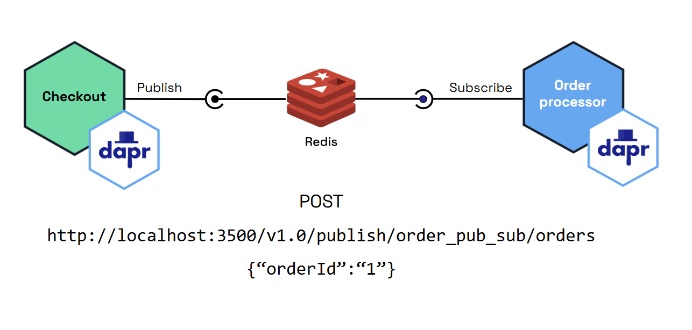

[TOC]

# Pre-requisite

Dapr must have been installed and initialized.  If not, please refer to the previous article (**Dapr Python Quickstarts for macOS – Part 1: Environment Setup**) for installation and initialization instructions.


# Quickstart: Publish and Subscribe

> [!NOTE]
>
> The example below uses Redis, you can use RabbitMQ, Kafka, etc.

In this Quickstart, you will run a publisher microservice and a subscriber microservice to demonstrate how Dapr enables a Pub/sub pattern.



## Use the official demo(http) to run one application at a time

> [!TIP]
>
> The official demo uses the flask framework to implement the subscription of information.

### Runing the http demo

**Step 1: Clone the official repo**

```shell
git clone https://github.com/dapr/quickstarts.git
```

**Step2: Subscribe to topics**

In a terminal window, from the root of the Quickstarts clone directory navigate to the `order-processor` directory.

```bash
cd pub_sub/python/sdk/order-processor
```

Install the dependencies:

```bash
pip3 install -r requirements.txt
```

Run the `order-processor` subscriber service alongside a Dapr sidecar.

```bash
dapr run --app-id order-processor --resources-path ../../../components/ --app-port 6002 -- python3 app.py
```

In the `order-processor` subscriber, we’re subscribing to the Redis instance called `orderpubsub` [(as defined in the `pubsub.yaml` component)](https://docs.dapr.io/getting-started/quickstarts/pubsub-quickstart/#pubsubyaml-component-file) and topic `orders`. This enables your app code to talk to the Redis component instance through the Dapr sidecar.

**Step3: Publish a topic**

In a new terminal window, navigate to the `checkout` directory.

```bash
cd pub_sub/python/sdk/checkout
```

Install the dependencies:

```bash
pip3 install -r requirements.txt
```

Run the `checkout` publisher service alongside a Dapr sidecar.

```bash
dapr run --app-id checkout --resources-path ../../../components/ -- python3 app.py
```

In the `checkout` publisher, we’re publishing the orderId message to the Redis instance called `orderpubsub` [(as defined in the `pubsub.yaml` component)](https://docs.dapr.io/getting-started/quickstarts/pubsub-quickstart/#pubsubyaml-component-file) and topic `orders`. As soon as the service starts, it publishes in a loop.

**Step 4: View the Pub/sub outputs**

The publisher sends orders to the Dapr sidecar while the subscriber receives them.

Publisher output:

```
== APP == INFO:root:Published data: {"orderId": 1}
== APP == INFO:root:Published data: {"orderId": 2}
== APP == INFO:root:Published data: {"orderId": 3}
== APP == INFO:root:Published data: {"orderId": 4}
== APP == INFO:root:Published data: {"orderId": 5}
== APP == INFO:root:Published data: {"orderId": 6}
== APP == INFO:root:Published data: {"orderId": 7}
== APP == INFO:root:Published data: {"orderId": 8}
== APP == INFO:root:Published data: {"orderId": 9}
== APP == INFO:root:Published data: {"orderId": 10}
```

Subscriber output:

```
== APP == INFO:root:Subscriber received: {"orderId": 1}
== APP == INFO:root:Subscriber received: {"orderId": 2}
== APP == INFO:root:Subscriber received: {"orderId": 3}
== APP == INFO:root:Subscriber received: {"orderId": 4}
== APP == INFO:root:Subscriber received: {"orderId": 5}
== APP == INFO:root:Subscriber received: {"orderId": 6}
== APP == INFO:root:Subscriber received: {"orderId": 7}
== APP == INFO:root:Subscriber received: {"orderId": 8}
== APP == INFO:root:Subscriber received: {"orderId": 9}
== APP == INFO:root:Subscriber received: {"orderId": 10}
```

### How the http code works

**order-processor application** 

```python
# Register Dapr pub/sub subscriptions
@app.route('/dapr/subscribe', methods=['GET'])
def subscribe():
    subscriptions = [{
        'pubsubname': 'orderpubsub',
        'topic': 'orders',
        'route': 'orders'
    }]
    print('Dapr pub/sub is subscribed to: ' + json.dumps(subscriptions))
    return jsonify(subscriptions)


# Dapr subscription in /dapr/subscribe sets up this route
@app.route('/orders', methods=['POST'])
def orders_subscriber():
    event = from_http(request.headers, request.get_data())
    print('Subscriber received : %s' % event.data['orderId'], flush=True)
    return json.dumps({'success': True}), 200, {
        'ContentType': 'application/json'}


app.run(port=app_port)
```

`/dapr/subscribe`

- **Purpose:** Registers the app’s topic subscriptions with Dapr.

- **Called by:** Dapr sidecar (automatically on app startup).

  > [!TIP]
  >
  > When the Dapr Sidecar starts the application, it will automatically query the /dapr/subscribe interface to obtain which pub/sub topics your application has subscribed to.

- **What it does:** Returns a list of pub/sub subscriptions in JSON format, telling Dapr which topics this app wants to receive messages from and which routes (e.g., `/orders`) should handle them.

 `/orders`

- **Purpose:** Handles messages received from the `orders` topic via Dapr.
- **Called by:** Dapr sidecar whenever a message is published to the `orders` topic.
- **What it does:** Parses the CloudEvent payload from Dapr and processes the message (e.g., prints the `orderId` or performs business logic).
- **Type:** HTTP POST endpoint that acts as the message consumer/handler.

**Checkout application**

```python
with DaprClient() as client:
    for i in range(1, 10):
        order = {'orderId': i}
        # Publish an event/message using Dapr PubSub
        result = client.publish_event(
            pubsub_name='orderpubsub',
            topic_name='orders',
            data=json.dumps(order),
            data_content_type='application/json',
        )
        logging.info('Published data: ' + json.dumps(order))
        time.sleep(1)
```

This script simulates a publisher that sends 9 JSON-formatted order messages (with incrementing `orderId`s) to the `orders` topic via Dapr pub/sub, at 1-second intervals.

**Workflow Between the Two Code Demo**

1. The order-processor application starts ➜ Dapr sidecar starts alongside it

2. Dapr sidecar sends a GET request to /dapr/subscribe ➜ retrieves the app’s subscription configuration (e.g., subscribes to 'orders' topic)

3. The checkout application starts ➜ uses Dapr SDK to simulate a publisher that sends order messages to the 'orders' topic via pubsub component 'orderpubsub'

4. Dapr receives each published message ➜ checks its subscription table ➜ finds that the order-processor app subscribes to the 'orders' topic

5. Dapr forwards the message to the /orders endpoint of the order-processor application

6. The Flask /orders endpoint is triggered ➜ processes the message (e.g., logs or handles orderId)

## Use the gRPC protocol to run one application at atime

### Runing the gRPC demo

**Step 1: Clone the official repo**

```shell
git clone https://github.com/dapr/quickstarts.git
```

**Step2: Subscribe to topics**

In a terminal window, from the root of the Quickstarts clone directory navigate to the `order-processor` directory.

```bash
cd pub_sub/python/sdk/order-processor
```

Install the dependencies:

```bash
pip3 install -r requirements.txt
```

Install the new dependecies:

```shell
pip3 install dapr-ext-grpc
```

Modify the code of app.py to the following code:

```python
from dapr.ext.grpc import App
from dapr.clients.grpc._response import TopicEventResponse
import json

app = App()

@app.subscribe(pubsub_name='orderpubsub', topic='orders')
def process_orders_queue(event):
    try:
        print("start process")
        if hasattr(event, 'data'):
            if isinstance(event.data, (str, bytes)):
                data = json.loads(event.data)
            else:
                data = event.data
        else:
            data = {}
        
        print('Subscriber received : %s' % data['orderId'], flush=True)
        
        return TopicEventResponse('success')
        
    except Exception as e:
        print(f"Error: {e}")
        return TopicEventResponse('drop')
    
if __name__ == "__main__":
    app.run(app_port=6002,listen_address="0.0.0.0")
```

Run the `order-processor` subscriber service alongside a Dapr sidecar.

> [!IMPORTANT]
>
> The `--app-port` flag in `dapr run` must match the port specified in `app.run(app_port=6002)` because it tells Dapr which port your application is listening on for incoming messages.

```bash
dapr run --app-id order-processor --resources-path ../../../components/ --app-port 6002 --app-protocol grpc -- python3 app.py
```

**Step3: Publish a topic**

In a new terminal window, navigate to the `checkout` directory.

```bash
cd pub_sub/python/sdk/checkout
```

Install the dependencies:

```bash
pip3 install -r requirements.txt
```

Run the `checkout` publisher service alongside a Dapr sidecar.

```bash
dapr run --app-id checkout --resources-path ../../../components/ -- python3 app.py
```

In the `checkout` publisher, we’re publishing the orderId message to the Redis instance called `orderpubsub` [(as defined in the `pubsub.yaml` component)](https://docs.dapr.io/getting-started/quickstarts/pubsub-quickstart/#pubsubyaml-component-file) and topic `orders`. As soon as the service starts, it publishes in a loop.

**Step 4: View the Pub/sub outputs**

The publisher sends orders to the Dapr sidecar while the subscriber receives them.

Publisher output:

```
== APP == INFO:root:Published data: {"orderId": 1}
== APP == INFO:root:Published data: {"orderId": 2}
== APP == INFO:root:Published data: {"orderId": 3}
== APP == INFO:root:Published data: {"orderId": 4}
== APP == INFO:root:Published data: {"orderId": 5}
== APP == INFO:root:Published data: {"orderId": 6}
== APP == INFO:root:Published data: {"orderId": 7}
== APP == INFO:root:Published data: {"orderId": 8}
== APP == INFO:root:Published data: {"orderId": 9}
== APP == INFO:root:Published data: {"orderId": 10}
```

Subscriber output:

```
== APP == INFO:root:Subscriber received: {"orderId": 1}
== APP == INFO:root:Subscriber received: {"orderId": 2}
== APP == INFO:root:Subscriber received: {"orderId": 3}
== APP == INFO:root:Subscriber received: {"orderId": 4}
== APP == INFO:root:Subscriber received: {"orderId": 5}
== APP == INFO:root:Subscriber received: {"orderId": 6}
== APP == INFO:root:Subscriber received: {"orderId": 7}
== APP == INFO:root:Subscriber received: {"orderId": 8}
== APP == INFO:root:Subscriber received: {"orderId": 9}
== APP == INFO:root:Subscriber received: {"orderId": 10}
```

### How the gRPC code works

**new order-processor application** 

```python
@app.subscribe(pubsub_name='orderpubsub', topic='orders')
def process_orders_queue(event):
    try:
        print("start process")
        if hasattr(event, 'data'):
            if isinstance(event.data, (str, bytes)):
                data = json.loads(event.data)
            else:
                data = event.data
        else:
            data = {}
        
        print('Subscriber received : %s' % data['orderId'], flush=True)
        
        return TopicEventResponse('success')
        
    except Exception as e:
        print(f"Error: {e}")
        return TopicEventResponse('drop')
```

 It listens for messages published to a Redis-backed pub/sub topic named orders via a pub/sub component called orderpubsub. When a message is sent to the `orders` topic of `orderpubsub`, it automatically executes the `process_orders_queue` function.

Summary:

- Uses **gRPC Dapr runtime**
- Listens for messages on the topic `"orders"`
- Parses the message, logs the `orderId`, and responds to Dapr with success or failure

It's meant to work with a **Dapr sidecar**, and needs to be run with the correct `--app-port` and `--app-protocol grpc` flags.

**new workflow**

1. The order-processor application starts ➜ initializes the gRPC Dapr app (on port 6002)

2. Dapr sidecar starts alongside the app ➜ automatically detects the gRPC app and reads its topic subscriptions (no need for /dapr/subscribe route)

3. The checkout application (publisher) starts ➜ uses Dapr SDK to send order messages to the 'orders' topic via pubsub component 'orderpubsub'

4. Dapr sidecar receives each published message (e.g., through Redis or other pubsub backend)

5. Dapr checks the registered subscriptions ➜ finds that the order-processor app is subscribed to the 'orders' topic

6. Dapr forwards the message to the order-processor app via gRPC ➜ triggers the `process_orders_queue` handler

7. The handler processes the message (e.g., parses orderId, logs output) ➜ returns a `TopicEventResponse('success')` to acknowledge receipt

## `pubsub.yaml` component file

> [!IMPORTANT]
>
> The `metadata.name` in the component file must exactly match the `pubsub_name` used in the code to ensure Dapr correctly links your application to the specified pub/sub component.
>
> Dapr identifies specific component instances through metadata.name. Only when the names are consistent can Dapr correctly find the corresponding Redis (or other) pub/sub component and complete the publication and subscription operations of messages

When you run `dapr init`, Dapr creates a default Redis `pubsub.yaml` and runs a Redis container on your local machine, located: `~/.dapr/components/pubsub.yaml`

With the `pubsub.yaml` component, you can easily swap out underlying components without application code changes.

The Redis `pubsub.yaml` file included for this Quickstart contains the following:

```yaml
apiVersion: dapr.io/v1alpha1
kind: Component
metadata:
  name: orderpubsub
spec:
  type: pubsub.redis
  version: v1
  metadata:
  - name: redisHost
    value: localhost:6379
  - name: redisPassword
    value: ""
```

In the YAML file:

- `metadata/name` is how your application talks to the component.
- `spec/metadata` defines the connection to the instance of the component.
- `scopes` specify which application can use the component.
