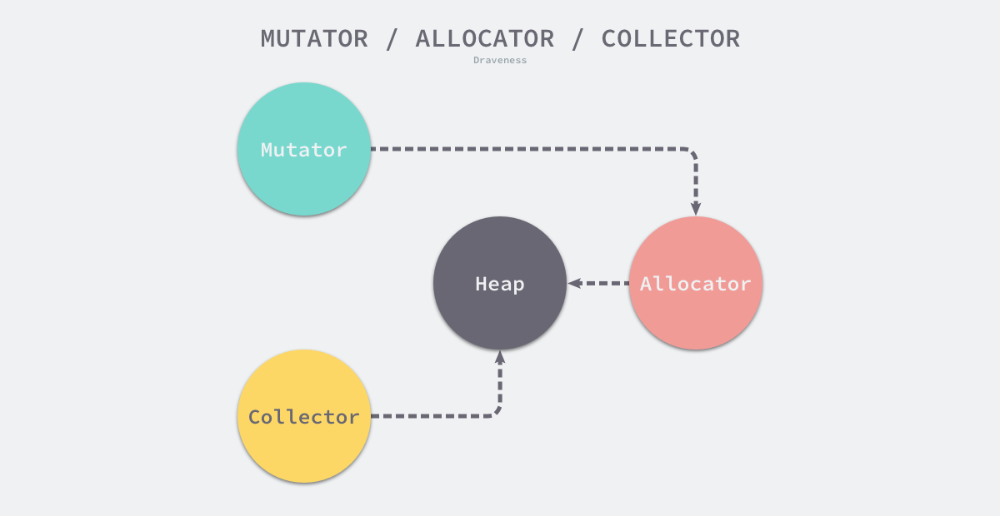
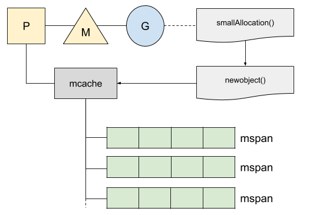
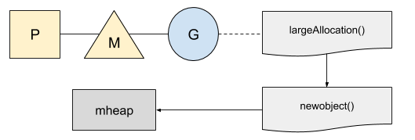
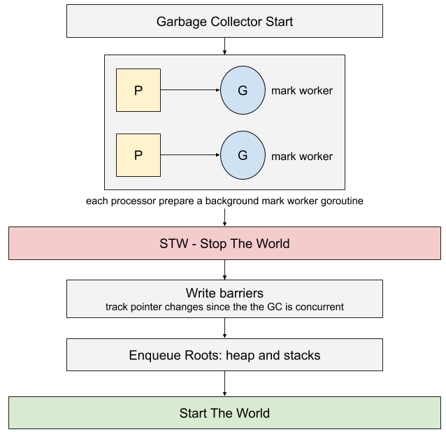

# Go 语言中的垃圾回收机制 GC 详解

> Author mogd 2022-04-29 
> Update mogd 2022-05-05
> Adage `Be as you wish to seem`

在计算机科学中，垃圾回收 (Garbage Collection 简称 GC) 是一种自动管理内存的机制，垃圾回收器会去尝试回收程序不再使用的对象及占用的内存
> 程序员受益于 GC，无需操心、也不再需要对内存进行手动的申请和释放操作，GC 在程序运行时自动释放残留的内存
> GC 对程序员几乎不可见，仅在程序需要进行特殊优化时，通过提供可调控的 API，对 GC 的运行时机、运行开销进行把控的时候才得以现身

在计算中，内存空间包含两个重要的区域：栈区 (Stack) 和堆区 (Heap)；栈区一般存储了函数调用的参数、返回值以及局部变量，不会产生内存碎片，由编译器管理，无需开发者管理；而堆区会产生内存碎片，在 Go 语言中堆区的对象由内存分配器分配并由垃圾收集器回收

通常，垃圾回收器的执行过程划分为两个半独立的组件：
- 用户程序 (Mutator)：用户态代码，对于 GC 而言，用户态代码仅仅只是在修改对象之间的引用关系
- 收集器 (Colletor)：负责执行垃圾回收的代码

## 一、内存管理和分配

当内存不再使用时，Go 内存管理由其标准库自动执行，即从内存分配到 Go 集合。内存管理一般包含三个不同的组件，分别是用户程序 (Mutator)、分配器 (Allocator) 和收集器 (Collector)，当用户程序申请内存时，它会通过内存分配器申请新内存，而分配器会负责从堆中初始化相应的内存区域



### 1.1 内存分配器的分配方法

在编程语言中，内存分配器一般有两种分配方法：
1. 线性分配器 (Sequential Allocator，Bump Allocator)
2. 空闲链表分配器 (Free-List Allocator)  

**线性分配器**

线性分配 (Bump Allocator) 是一种高效的内存分配方法，但是有较大的局限性。当用户使用线性分配器时，只需要在内存中维护一个指向内存特定位置的指针，如果用户程序向分配器申请内存，分配器只需要检查剩余的空闲内存、返回分配的内存区域并修改指针在内存中的位置；

虽然线性分配器有较快的执行速度以及较低的实现复杂度，但线性分配器无法在内存释放后重用内存。如下图，如果已经分配的内存被回收，线性分配器无法重新利用红色的内存


因此线性分配器需要与适合的垃圾回收算法配合使用
1. 标记压缩 (Mark-Compact)
2. 复制回收 (Copying GC)
3. 分代回收 (Generational GC)
   
以上算法可以通过拷贝的方式整理存活对象的碎片，将空闲内存定期合并，这样就能利用线性分配器的效率提升内存分配器的性能了

**空闲链表分配器**

空闲链表分配器 (Free-List Allocator) 可以重用已经被释放的内存，它在内部会维护一个类似链表的数据结构。当用户程序申请内存时，空闲链表分配器会依次遍历空闲的内存块，找到足够大的内存，然后申请新的资源并修改链表


空闲链表分配器常见有四种策略：
- 首次适应 (First-Fit) — 从链表头开始遍历，选择第一个大小大于申请内存的内存块
- 循环首次适应 (Next-Fit) — 从上次遍历的结束位置开始遍历，选择第一个大小大于申请内存的内存块
- 最优适应 (Best-Fit) — 从链表头遍历整个链表，选择最合适的内存块
- 隔离适应 (Segregated-Fit) — 将内存分割成多个链表，每个链表中的内存块大小相同，申请内存时先找到满足条件的链表，再从链表中选择合适的内存块

其中第四中策略与 Go 语言中使用的内存分配策略相似


该策略会将内存分割成由 4、8、16、32 字节的内存块组成的链表，当我们向内存分配器申请 8 字节的内存时，它会在上图中找到满足条件的空闲内存块并返回。隔离适应的分配策略减少了需要遍历的内存块数量，提高了内存分配的效率

### 1.2 Go 中的内存分配

一张图展示内存分配组成：


在 Go 语言中，堆上的所有对象都会通过调用 [runtime.newobject](https://github.com/golang/go/blob/master/src/runtime/malloc.go) 函数分配内存，该函数会调用 [runtime.mallocgc](https://github.com/golang/go/blob/master/src/runtime/malloc.go) 分配指定大小的内存空间，这也是用户程序向堆上申请内存空间的必经函数

```go
func mallocgc(size uintptr, typ *_type, needzero bool) unsafe.Pointer {
	mp := acquirem()
	mp.mallocing = 1

	c := gomcache()
	var x unsafe.Pointer
	noscan := typ == nil || typ.ptrdata == 0
	if size <= maxSmallSize {
		if noscan && size < maxTinySize {
			// 微对象分配
		} else {
			// 小对象分配
		}
	} else {
		// 大对象分配
	}

	publicationBarrier()
	mp.mallocing = 0
	releasem(mp)

	return x
}
```

从代码中可以看出 `runtime.mallocgc` 根据对象的大小执行不同的分配逻辑，根据对象大小将它们分成微对象、小对象和大对象
- 微对象 `(0, 16B)` — 先使用微型分配器，再依次尝试线程缓存、中心缓存和堆分配内存
- 小对象 `[16B, 32KB]` — 依次尝试使用线程缓存、中心缓存和堆分配内存
- 大对象 `(32KB, +∞)` — 直接在堆上分配内存


**小分配**

对于小于 32kb 的小分配，Go 会尝试从 `mcache` 的本地缓存中获取内存，该缓存处理一个跨度列表 (32kb 的内存块) `mspan`



每个线程 M 都分配给一个处理器 P，一次最多处理一个 `goroutine`。在分配内存时，当前的 `goroutine` 将使用其当前的本地缓存 P 来查找 `span` 列表中第一个可用的空闲对象

**大分配**
Go 不使用本地缓存管理大型分配。这些大于 32kb 的分配被四舍五入到页面大小，页面直接分配到堆中



## 二、垃圾回收

在 Go 语言中，垃圾回收器实现的算法是一个并发的三色标记和扫描收集器

垃回收器与 Go 程序同时运行，因此需要通过一种[写屏障](https://en.wikipedia.org/wiki/Write_barrier)算法来检测内存中的潜在变化。启动写屏障的唯一条件是在短时间内停止程序，即 "Stop the World"



> 写屏障的目的是允许收集器在收集期间保持堆上的数据完整性

### 2.1 实现原理

Go 语言的垃圾收集可以分成清除终止、标记、标记终止和清除四个不同的阶段，其中两个阶段会产生 Stop The World (STW)


**清除终止阶段**
- 暂停程序，所有的处理器在这时会进入安全点（Safe point）
- 如果当前垃圾收集循环是强制触发的，我们还需要处理还未被清理的内存管理单元

**标记阶段 (STW)**
1. 将状态切换至 `_GCmark`、开启写屏障、用户程序协助（Mutator Assists）并将根对象入队
2. 恢复执行程序，标记进程和用于协助的用户程序会开始并发标记内存中的对象，写屏障会将被覆盖的指针和新指针都标记成灰色，而所有新创建的对象都会被直接标记成黑色
3. 开始扫描根对象，包括所有 Goroutine 的栈、全局对象以及不在堆中的运行时数据结构，扫描 Goroutine 栈期间会暂停当前处理器
4. 依次处理灰色队列中的对象，将对象标记成黑色并将它们指向的对象标记成灰色
5. 使用分布式的终止算法检查剩余的工作，发现标记阶段完成后进入标记终止阶段

**标记终止阶段 (STW)**
- 暂停程序、将状态切换至 `_GCmarktermination` 并关闭辅助标记的用户程序
- 清理处理器上的线程缓存

**清理阶段**
1. 将状态切换至 `_GCoff` 开始清理阶段，初始化清理状态并关闭写屏障
2. 恢复用户程序，所有新创建的对象会标记成白色
3. 后台并发清理所有的内存管理单元，当 Goroutine 申请新的内存管理单元时就会触发清理

### 2.2 三色标记法

三色标记算法将程序中的对象分成白色、黑色和灰色三类：

- 白色对象 — 潜在的垃圾，其内存可能会被垃圾收集器回收
- 黑色对象 — 活跃的对象，包括不存在任何引用外部指针的对象以及从根对象可达的对象
- 灰色对象 — 活跃的对象，因为存在指向白色对象的外部指针，垃圾收集器会扫描这些对象的子对象

三色标记垃圾收集器的工作原理很简单，可以将其归纳成以下几个步骤：

1. 从灰色对象的集合中选择一个灰色对象并将其标记成黑色
2. 将黑色对象指向的所有对象都标记成灰色，保证该对象和被该对象引用的对象都不会被回收
3. 重复上述两个步骤直到对象图中不存在灰色对象


## 参考
[1] [GC 的认识](https://www.bookstack.cn/read/qcrao-Go-Questions/GC-GC.md)
[2] [深入解析 Go](https://www.gitbook.com/book/tiancaiamao/go-internals)
[3] [Go 语言设计与实现](https://draveness.me/golang/)
[4] [Go: How Does the Garbage Collector Mark the Memory?](https://medium.com/a-journey-with-go/go-how-does-the-garbage-collector-mark-the-memory-72cfc12c6976)