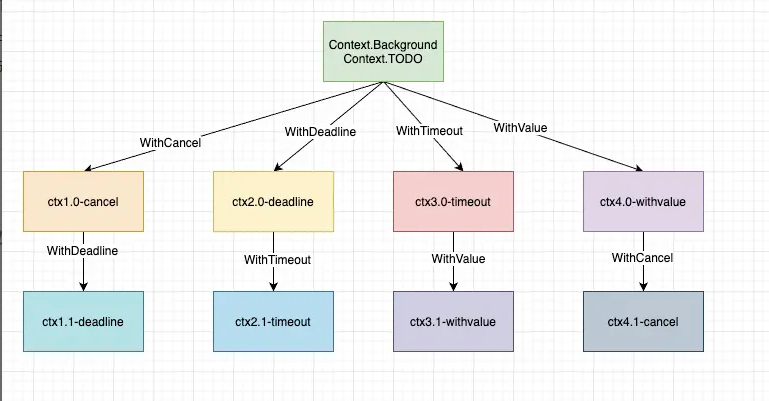

# GO 语言中 Context 包详解

> Author mogd 2022-06-28
> Update mogd 2022-07-04
> Adage `Rreality is merely an illusion, albeit a very persistent one.`

## 前言

不知道有没有小伙伴跟我一样，在学习 go 语言基础的时候，遇到需要 `context` 信息的，都是直接传入 `context.TODO()`，并没有深入研究 `Context`

让笔者深入了解到 `Context` 包是因为自己在写一个 K8S CMDB 平台时，想到需要对数据初始化（就是创建 admin 用户，和测试用户，以及分配对应的 Casbin 权限）

因为 user 模块参考了 [gin-vue-admin](https://github.com/flipped-aurora/gin-vue-admin.git)，并且在 `GVA` 中也有数据初始化部分，这部分代码中使用了 `Context`

仔细阅读下，才对 `Context` 包有了更深刻的理解

埋头苦学往往只是知其形而不知其意，只有实际做项目才能够真正的掌握一门语言
> 笔者自己写的一个 K8S CMDB平台后端接口，[gin-kubernetes](https://gitee.com/MoGD/gin-kubernetes.git)
> 这个刚开始写，写的很简单，感兴趣的可以看看；也希望大佬们提提建议
> user 模块参考的 [gin-vue-admin](https://github.com/flipped-aurora/gin-vue-admin.git)

## 一、Context 介绍

### 1.1 Context 是什么？

`Context` 在 `Go1.7` 之后加入到 `Go` 语言标准库中，是 `Goroutine` 的上下文，包含 `Goroutine` 的运行状态、环境、现场等信息

> In Go servers, each incoming request is handled in its own goroutine. Request handlers often start additional goroutines to access backends such as databases and RPC services. The set of goroutines working on a request typically needs access to request-specific values such as the identity of the end user, authorization tokens, and the request’s deadline. When a request is canceled or times out, all the goroutines working on that request should exit quickly so the system can reclaim any resources they are using.
> At Google, we developed a context package that makes it easy to pass request-scoped values, cancellation signals, and deadlines across API boundaries to all the goroutines involved in handling a request
> \
> `Go` 的服务中，每个请求都会有独立的 `goroutine` 处理，每个 `goroutine` 通常会启动新的 `goroutine` 执行一些额外的工作，比如进行数据库或 `RPC` 服务的访问。同请求内的 `goroutine` 需能共享请求数据访问，比如，用户认证，授权 `token`，以及请求截止时间。如果请求取消或发生超时，请求范围内的所有 `goroutine` 都应立刻退出，进行资源回收
> 在 `Google`，我们开发了一个 `context` 的包，通过它，我们可以非常方便地在请求内的 `goroutine` 之间传递请求数据、取消信号和超时信息

从官方的介绍来看，`Context` 包作用于 `goroutine` 之间传递信息。这跟我们在 `goroutine` 之间使用 `channel` 很像，但又不同。因为在不同的 `goroutine` 之间只传递 `done channel` 包含的信息量太少了

并且随着 `Context` 包的引入，标准库的很多接口加上了 `Context` 参数，`Context` 几乎成为了并发控制和超时控制的标准做法

**Context 使用场景**
- 上下文信息传递 （request-scoped），比如处理 http 请求、在请求处理链路上传递信息
- 控制子 goroutine 的运行
- 超时控制的方法调用
- 可以取消的方法调用

### 1.2 Context 接口
`context` 的核心是 `Context` 类型

```go
// A Context carries a deadline, cancellation signal, and request-scoped values
// across API boundaries. Its methods are safe for simultaneous use by multiple
// goroutines.
type Context interface {
    // Done returns a channel that is closed when this Context is canceled
    // or times out.
    Done() <-chan struct{}

    // Err indicates why this context was canceled, after the Done channel
    // is closed.
    Err() error

    // Deadline returns the time when this Context will be canceled, if any.
    Deadline() (deadline time.Time, ok bool)

    // Value returns the value associated with key or nil if none.
    Value(key interface{}) interface{}
}
```

- `Done` 方法返回的是一个 `channel`，它可用于接收 `context` 的取消信号。当 `channel` 关闭，监听 `Done` 信号的函数会立刻放弃当前正在执行的工作并返回
- `Err` 方法返回一个 `error` 变量，从它之中可以知道 `context` 为什么被取消。[pipeline and cancelation](https://go.dev/blog/pipelines) 一文对 `Done channel` 作了详细介绍
- `Deadline` 方法可以让函数决定是否需要启动工作，如果剩余时间太短，那么启动工作就不值得了。在代码中，我们可以通过 `deadline` 为 IO 操作设置超时时间
- `Value` 方法可以让 `context` 在 `goroutine` 之间共享请求范围内的数据，这些数据需要是协程并发安全的

> 如果 `Done` 没有被 `close`，`Err` 方法返回 `nil`；如果 `Done` 被 `close`，`Err` 方法会返回 `Done` 被 `close` 的原因

## 二、Context 的使用

> 在 `Google`，对于接收或发送请求类的函数，我们要求必须要将 `Context` 作为首个参数进行传递。如此，即使不同团队的 `Go` 代码也可以工作良好。`Context` 非常便于 `goroutine` 的超时与取消控制，以及确保重要数据的安全传递，比如安全凭证

`context` 包主要提供了两种方法创建 `Context`

- context.Background()
- context.TODO()

这两个函数互为别名，没有差别，官方定义：

- `context.Background` 是上下文的默认值，所有其他的上下文都应该从其衍生 (Derived) 出来
- `context.TODO()` 应该只在不确定使用哪种上下文时使用

这两种方式创建的 `context`，不具备任何功能，其实现是依靠 `context` 包提供的 `with` 系列进行派生

```go
func WithCancel(parent Context) (ctx Context, cancel CancelFunc)
func WithDeadline(parent Context, deadline time.Time) (Context, CancelFunc)
func WithTimeout(parent Context, timeout time.Duration) (Context, CancelFunc)
func WithValue(parent Context, key, val interface{}) Context
```

一个项目对 `Context` 的使用，通过这四个派生函数，形成一颗 `Context` 数。树的每一个节点都可以有任意多个子节点，节点层级可以有任意多个，每个子节点都依赖于父节点



### 2.1 WithValue 携带数据、Value 获取数据

这里以开源项目 `GVA` 中的数据初始化部分代码作为例子，删除了部分判断和数据代码，只保留了 `context` 部分


```go
// InitDB 创建数据库并初始化 总入口
func (initDBService *InitDBService) InitDB(conf request.InitDB) (err error) {
	ctx := context.TODO()

	var initHandler TypedDBInitHandler
	
	initHandler = NewMysqlInitHandler()
	ctx = context.WithValue(ctx, "dbtype", "mysql")
	
	ctx, _ = initHandler.EnsureDB(ctx, &conf)
	
	db := ctx.Value("db").(*gorm.DB)
	global.GVA_DB = db

	if err = initHandler.WriteConfig(ctx); err != nil {
		return err
	}
	if err = initHandler.InitTables(ctx, initializers); err != nil {
		return err
	}
	if err = initHandler.InitData(ctx, initializers); err != nil {
		return err
	}

	return nil
}

// EnsureDB 创建数据库并初始化 mysql
func (h MysqlInitHandler) EnsureDB(ctx context.Context, conf *request.InitDB) (next context.Context, err error) {
	if s, ok := ctx.Value("dbtype").(string); !ok || s != "mysql" {
		return ctx, ErrDBTypeMismatch
	}
	c := conf.ToMysqlConfig()
	next = context.WithValue(ctx, "config", c)
	next = context.WithValue(next, "db", db)
}


// WriteConfig mysql回写配置
func (h MysqlInitHandler) WriteConfig(ctx context.Context) error {
	c, _ := ctx.Value("config").(config.Mysql)

	global.GVA_CONFIG.Mysql = c
	return global.GVA_VP.WriteConfig()
}
```

这里基于 `context.TODO()` 创建了一个 `ctx`，通过 `context.WithValue` 将 `dbtype`, `config` 和 `db` 写入 `context`，然后通过 `context` 树传递，从派生的任何 `context` 都能够获取这三个信息

代码中 `context` 过程：

1. `InitDB` 写入 `dbtype`，`EnsureDB` 通过 `Value` 获取 `dbtype` 判断数据库类型是否正确
2. `EnsureDB` 写入 `config` 和 `db` 信息
3. `WriteConfig` 获取 `config` 内容回写到配置文件
4. `InitDB` 获取 `db` 信息，赋值给全局变量，得到 `gorm.DB` 客户端

对于 `withValue` 的使用有四个注意事项：
- 不建议使用 `context` 值传递关键参数，关键参数应该显示的声明出来，不应该隐式处理
- 携带 `value` 也是 `key`、`value` 的形式，为了避免 `context` 因多个包同时使用 `context` 而带来冲突，`key` 建议采用内置类型
- 获取键值对时，应先从当前 `context` 中查找，没有找到会在从父 `context` 中查找该键对应的值直到在某个父 `context` 中返回 `nil` 或者查找到对应的值
- `context` 传递的数据中 `key`、`value` 都是 `interface` 类型，这种类型编译期无法确定类型，所以不是很安全，所以在类型断言时别忘了保证程序的健壮性

### 2.2 WithCancel 取消控制

日常业务开发中往往为了完成一个复杂的需求会开多个 `goroutine` 去做一些事情，这就导致我们会在一次请求中开了多个 `goroutine` 确无法控制他们，这时我们就可以使用 `withCancel` 来衍生一个 `context` 传递到不同的 `goroutine` 中，当想让这些 `goroutine` 停止运行，就可以调用 `cancel` 来进行取消

这里的例子是上文的后续 `InitTables` 和 `InitData` 部分

```go
func (h MysqlInitHandler) InitTables(ctx context.Context, inits initSlice) error {
	return createTables(ctx, inits)
}
// createTables 创建表（默认 dbInitHandler.initTables 行为）
func createTables(ctx context.Context, inits initSlice) error {
	next, cancel := context.WithCancel(ctx)
	defer func(c func()) { c() }(cancel)
    return nil
}

func (h MysqlInitHandler) InitData(ctx context.Context, inits initSlice) error {
	next, cancel := context.WithCancel(ctx)
	defer func(c func()) { c() }(cancel)
    return nil
}
```

不过 `GVA` 的这部分例子其实不是多 `goroutine` 的，更多的是展示 `context` 上下文信息传递

因此取消控制，看下一个例子更能展示 `context` 控制 `goroutine`

```go
func main()  {
    ctx,cancel := context.WithCancel(context.Background())
    go CancelText(ctx)
    time.Sleep(10*time.Second)
    cancel()
    time.Sleep(1*time.Second)
}

func CancelText(ctx context.Context)  {
    for range time.Tick(time.Second){
        select {
        case <- ctx.Done():
            fmt.Println("stop time")
            return
        default:
            fmt.Println("start time")
        }
    }
}
```

使用 `WithCancel` 创建一个基于 `Background` 的 `ctx`; `main` 函数主协程调用 `CancelText` 子协程，子协程不断打印 `start time`，直到 ctx.Done() 成功关闭

主协程在 10s 后执行 cancel，CancelText 子协程检测到取消信号后退出

## 参考
[1] [Go Concurrency Patterns: Context](https://go.dev/blog/context)
[2] [小白也能看懂的context包详解：从入门到精通](https://segmentfault.com/a/1190000040917752)