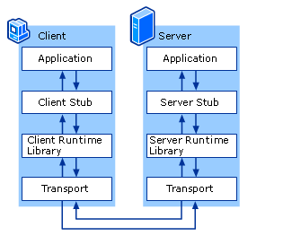

# Go 语言中 RPC 使用步骤
本文首先介绍一下RPC，然后展示一下RPC开发服务端和客户端的主要代码示例。
## RPC 介绍
### RPC 定义
> A remote procedure call (RPC) is when a computer program causes a procedure (subroutine) to execute in a different address space (commonly on another computer on a shared network), which is coded as if it were a normal (local) procedure call, without the programmer explicitly coding the details for the remote interaction.This is a form of client–server interaction (caller is client, executor is server), typically implemented via a request–response message-passing system
>
以上是维基百科对RPC的定义。
远程过程调用（Remote Procedure Call，缩写 RPC）是一个[请求-响应](https://en.wikipedia.org/wiki/Request%E2%80%93response)协议，允许允许于一台计算机的程序调用另一台计算机的子程序，而无需开发人员额外地为这个交互作用编程。RPC 是一个客户端-服务端（C/S）的例子，总是由客户端对服务器发出一个执行若干过程请求，并携带服务端所需的参数；服务端使用客户端提供的参数处理请求，将执行结果返回给客户端。
### RPC模型

服务的调用流程：
1. client调用client stub，本地过程调用，参数以正常方式压入堆栈
2. client stub 将参数打包成一个消息，然后发送这个消息。这个打包过程也称为marshalling
3. client所在的操作系统将消息发送给server
4. server所在的操作系统将收到的包传给server stub
5. server stub解包得到参数。解包也称作unmarshalliing
6. 最后server stub执行服务程序。反方向同样步骤将结果返回给客户端
## 示例
Go 官方提供一个标准 [RPC库](https://golang.org/pkg/net/rpc/): `net/rpc`。
Golang 的 rpc 支持三个级别的 RPC: TCP、HTTP、JSONRPC。但 Go 的 RPC 包只支持 Go 开发的服务器与客户端之间的交互，因为内部采用 Gob 来编码。
Go RPC 服务端通过注册对象，使用对象的类型名暴露服务。服务端可以注册多个不同类型的对象，不能注册相同类型的多个对象。并且对象的方法需要被远程访问，必须满足以下的条件：

- 方法的类型是可输出的 (the method’s type is exported)
- 方法本身也是可输出的 （the method is exported）
- 方法必须由两个参数，必须是输出类型或者是内建类型 (the method has two arguments, both exported or builtin types)
- 方法的第二个参数必须是指针类型 (the method’s second argument is a pointer)
- 方法返回类型为 error (the method has return type error)
  
标准的 RPC 方法格式：
```go
func (t *T) MethodName(argType T1, replyType *T2) error
```
### 服务端

1. 定义传入参数的数据结构
   ```go
    package server
    type Args struct {
        A, B int
    }
   ```
2. 定义服务对象和对象方法
   ```go
    type Arith int
    func (t *Arith) Multiply(args *Args, reply *int) error {
        *reply = args.A * args.B
        return nil
    }
   ```
3. 注册 RPC 服务对象。给对象绑定方法（1.定义类， 2.绑定类方法）
   ```go
    // RPC 注册方法
    func (s *Server) Register(rcvr interface{}, metadata string) error
    func (s *Server) RegisterName(name string, rcvr interface{}, metadata string) error
    // 示例
    rpc.Register(new(Arith)) // Register 生成的服务名就是对象的类型名
    rpc.RegisterName("Arith", new(Arith)) // RegisterName 生成的对象名是 name 这个参数
   ```
4. 创建监听器
   ```go
    listener, err := net.Listen()
   ```
5. 建立连接,绑定 RPC 服务
   ```go
    conn, err := listener.Accept()
    rpc.ServeConn(conn)
   ```

### 客户端
1. 定义传入参数的数据结构
   ```go
    package server
    type Args struct {
        A, B int
    }
   ```
2. 用 RPC 连接服务器
   ```go
    conn, err := rpc.Dial()
   ```
3. 调用远程函数
   ```go
    // conn.Call("服务名.方法名", 传入参数, 传出参数)
    conn.Call("Arith.Multiply", args, &reply)
   ```

## 完整的官方示例
https://pkg.go.dev/net/rpc