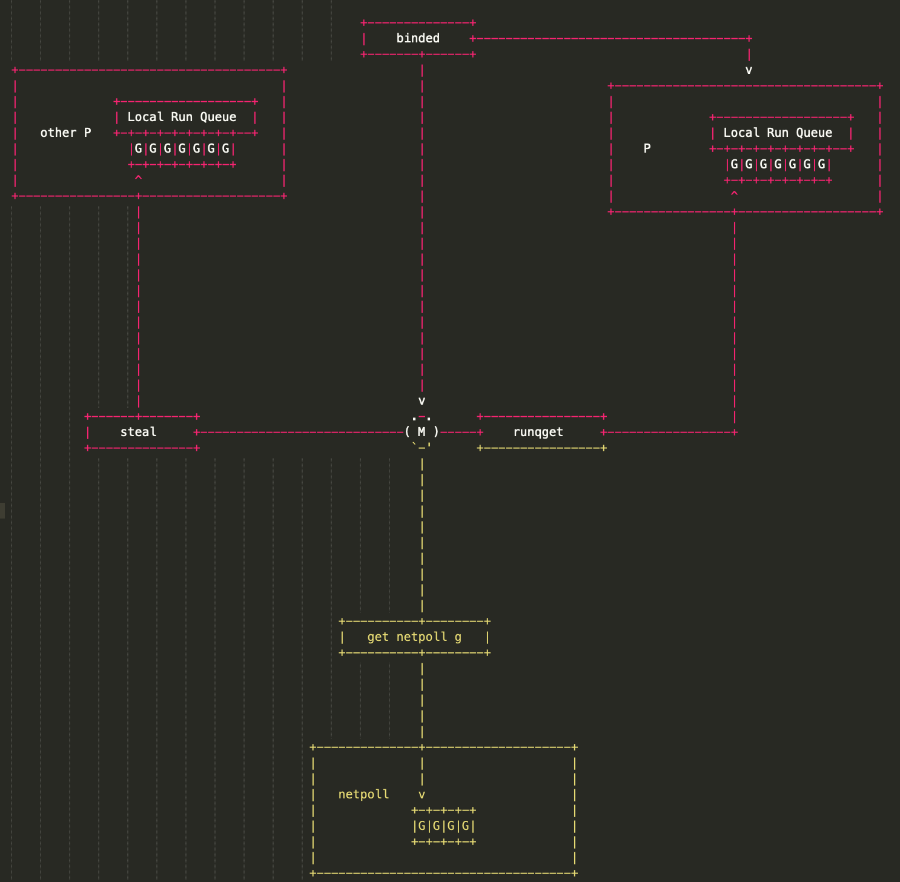
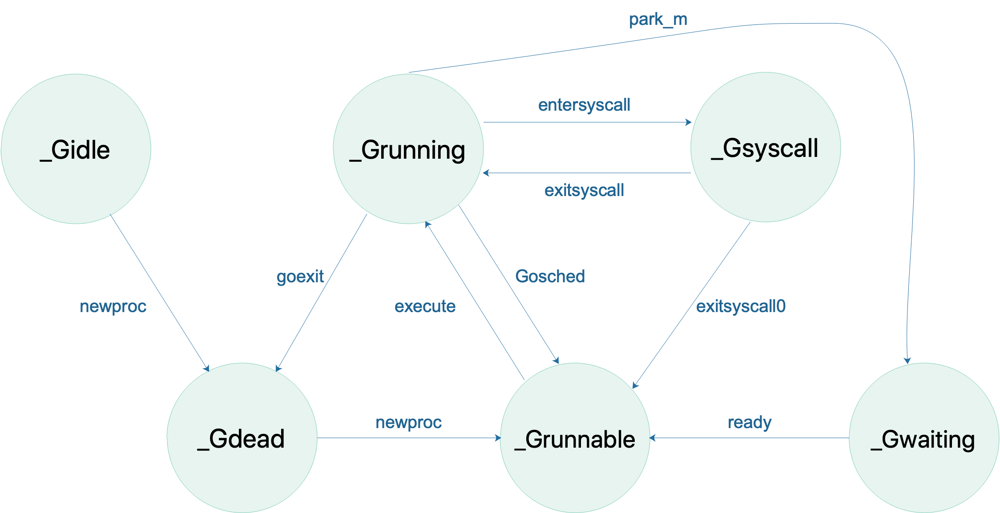

# 深入理解 Go 调度模型 GPM
> Author mogd 2022-04-28
> Update mogd 2022-04-28
> Adage `Be content with what you have; rejoice in the way things are.  When you realize there is nothing lacking, the whole world belongs to you.`

Go 语言中最大的一个特性就是天生支持并发，而这一功能体现的就是其调度模型 GPM，那么在了解 Go 调度模型 GPM 之前，需要先了解一下并发 (concurrency) 与并行 (parallesim) 的区别

## 前言

并发和并行最开始都是操作系统中的概念，表示的是CPU执行多个任务的方式，但这是两个不同的概念

并发：在操作系统中，是指一个时间段中有几个程序都处于已启动运行到运行完毕之间，且这几个程序都是在同一个处理机上运行

并行：当系统有一个以上CPU时，当一个CPU执行一个进程时，另一个CPU可以执行另一个进程，两个进程互不抢占CPU资源，可以同时进行，这种方式我们称之为并行(Parallel)

这里有一个很重要的一个点，并行是需要系统有多个 CPU 才会出现

举个例子：
> 你同时跟多名女生聊天，在这个过程**看似同时**完成的，但是其实你是在不同的聊天之间来回切换的
> 反过来，多名女生同时跟你聊天，多个女生之间可以在同一个**时间点**发信息，之间是互不影响的

并发其实是**一段时间**内宏观上多个程序同时运行，而并行是指**同一时刻**，多个任务真的在同时运行

**总结**

并发指定是多个事情，在同一个时间段内同时发生了，多个任务之间是互相抢占资源的

并行是指多个事情，在同一个时间点同时发生了，任务之间不互相抢占资源

## 一、调度模型 GPM

G、P、M 是 Go 调度器的三个核心组件，是 Go 语言天然支持高并发的内在动力

### 1.1 什么是 GPM

G 是 `goroutine` 的缩写，保存 `goroutine` 的一些状态信息 (执行的函数指令及参数，G 保存的任务对象，线程上下文切换，现场保护和现场恢复) 以及 CPU 的一些寄存器的值，相当于操作系统中的进程控制块

> 当 `goroutine` 被调离 CPU 时，调度器负责把 CPU 寄存器的值保存在 g 对象的成员变量之中
> 当 `goroutine` 被调度起来运行时，调度器又负责把 g 对象的成员变量所保存的寄存器值恢复到 CPU 的寄存器

M 是 `machine` 的缩写，是一个线程。所有的 M 有线程栈，每一个 M 对应着一条操作系统的物理线程，承载着 G 的队列

> G 要调度到 M 上才能运行，M 必须关联 P 才可以执行 Go 代码，但当处理阻塞或系统调用中时，可以不需要关联 P

P 是 `processor` 的缩写，只是一个抽象的概念，并不是真正的物理 CPU。P 为 M 的执行提供 "上下文"，保存 M 执行 G 时的一些资源
> P/M 需要进行绑定，构成一个执行单元
> P 决定了同时可以并发任务的数量，通过 `GOMAXPROCS` 限制同时执行用户级任务的操作系统线程,可以通过 `runtime.GOMAXPROCS` 进行指定

GPM 三者相互依赖，G 需要在 M 上才能运行，M 依赖 P 提供资源，P 持有待运行的 G；三者的关系图：

M 会从与之绑定的 P 本地队列获取可运行的 G，也会从 network poller 获取可运行的 G，还会从其他 P 偷取 G

宏观上看一下 GPM 的状态流转

G 状态流转 (省略了一些垃圾回收状态)：

P 状态流转：

> 通常情况下（在程序运行时不调整 P 的个数），P 只会在上图中的四种状态下进行切换。 当程序刚开始运行进行初始化时，所有的 P 都处于 `_Pgcstop` 状态， 随着 P 的初始化（`runtime.procresize`），会被置于 `_Pidle`
> \
> 当 M 需要运行时，会 `runtime.acquirep` 来使 P 变成 `Prunning` 状态，并通过 `runtime.releasep` 来释放。
> \
> 当 G 执行时需要进入系统调用，P 会被设置为 `_Psyscall`， 如果这个时候被系统监控抢夺（`runtime.retake`），则 P 会被重新修改为 `_Pidle`。
> \
> 如果在程序运行中发生 GC，则 P 会被设置为 `_Pgcstop`， 并在 `runtime.startTheWorld` 时重新调整为 `_Prunning`

M 状态流转：

> M 只有自旋和非自旋两种状态。自旋的时候，会努力找工作；找不到的时候会进入非自旋状态，之后会休眠，直到有工作需要处理时，被其他工作线程唤醒，又进入自旋状态

### 1.2 M 工作过程

第一步，从工作线程本地运行队列中寻找 `goroutine`

第二步，从全局运行队列中寻找 `goroutine`。为了保证调度的公平性，每个工作线程每经过 61次调度就需要优先尝试从全局运行队列中找出一个 `goroutine` 来运行，这样才能保证位于全局运行队列中的 `goroutine` 得到调度的机会。全局运行队列是所有工作线程都可以访问的，所以在访问它之前需要加锁

第三部，从其它工作线程的运行队列中偷取 `goroutine`。如果上一步也没有找到需要运行的 `goroutine`，则调用 `findrunnable` 从其他工作线程的运行队列中偷取 `goroutine`，`findrunnable` 函数在偷取之前会再次尝试从全局运行队列和当前线程的本地运行队列中查找需要运行的 `goroutine`

### 1.3 抢占式调度

## 参考
[1] [面试必考的：并发和并行有什么区别](https://cloud.tencent.com/developer/article/1424249)
[2] [深入Golang调度器之GMP模型](https://www.cnblogs.com/sunsky303/p/9705727.html)
[3] [goroutine 调度器](https://www.bookstack.cn/read/qcrao-Go-Questions/goroutine.md)
