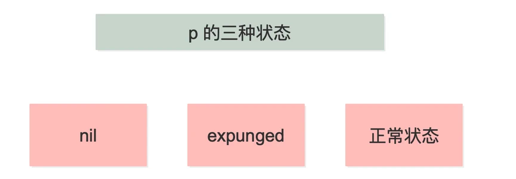
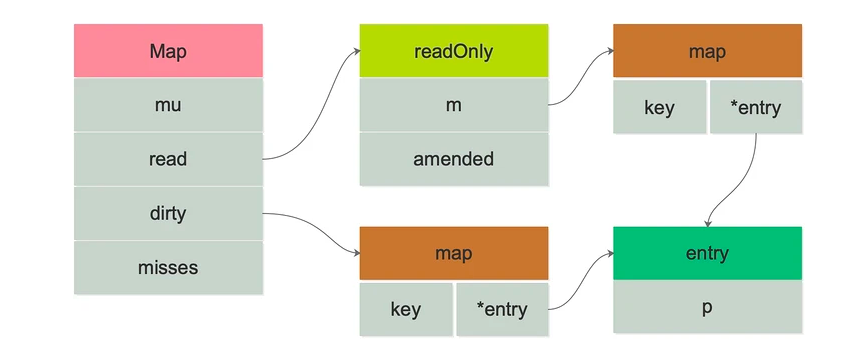

# Golang sync.Map 详解
原生的 Go Map 在并发读写场景下经常会遇到 panic 的情况。造成的原因是 map 是非线性安全的，并发读写过程中 map 的数据会被写乱。

而一般情况下，解决并发读写 map 的思路是加锁，或者把一个 map 切分成若干个小 map，对 key 进行哈希。
在业界中使用最多并发指出的模式分别是：
- 原生 map + 互斥锁 或者 读写锁
- 标准库 sync.Map (Go 1.9 及之后)
## 简单的介绍一下 Golang Map
Go 语言中 map 是一个 key（索引）和 value（值）形式的无序集合，也可以称为关联数组或字典；Golang中的 map 所有的 key 都是不同，通过给定的 key 可以在常数时间复杂度内检索、更新或删除对应的 value。

Golang map 的 key 是任何可以使用 `==` 进行比较的数据类型，如 `int、string、bool` 等，value 可以是任意类型。

Map是一种无序的数据结构，因此 map 的迭代顺序是不确定的，并且不同的哈希函数实现可能导致不同的遍历顺序。

### Map 使用
```go
// 声明
var mapName map[keyType]valueType
// 创建
mapName = make(map[keyType]valueType, len) // 需要声明
mapName := make(map[keyType]valueType, len) // 声明+创建
// 循环遍历
for key, value := range mapName{
}
// 删除
delete(mapName, "Key")
```
## sync.Map
### sync.Map 是什么
Go 语言原生 map 是非线性安全的，对 map 进行并发读写操作时，需要加锁。在 Go 1.9 引入 sync.map，一种并发安全的 map。
> sync.map 是线性安全的，读取、插入、删除都保持常数级的时间复杂度。
> sync.map 的零值是有效的，并且零值是一个空的 map。在第一次使用之后，不允许被拷贝。

接着看一下在 [Go 官方文档](https://pkg.go.dev/sync#Map)中明确指出 sync.Map 类型的一些建议：

> Map is like a Go map[interface{}]interface{} but is safe for concurrent use by multiple goroutines without additional locking or coordination. Loads, stores, and deletes run in amortized constant time.
>
> The Map type is specialized. Most code should use a plain Go map instead, with separate locking or coordination, for better type safety and to make it easier to maintain other invariants along with the map content.
>
> The Map type is optimized for two common use cases: (1) when the entry for a given key is only ever written once but read many times, as in caches that only grow, or (2) when multiple goroutines read, write, and overwrite entries for disjoint sets of keys. In these two cases, use of a Map may significantly reduce lock contention compared to a Go map paired with a separate Mutex or RWMutex.
>
> The zero Map is empty and ready for use. A Map must not be copied after first use.

- 多个 goroutine 的并发使用是安全的，不需要额外的锁或协程（coordination 直译协调，但笔者认为翻译为协程更符合）
- 大多数代码应该使用原生的 map，而不是单独的锁或协程控制，以获得更好的类型安全性和维护性

同时 Map类型，还针对以下场景进行了性能优化：
1. 当一个 key 只被写入一次但被多次读取时，例如在只会增长的缓存中，就存在这种业务场景
2. 当多个 goroutines 读取、写入和覆盖不相干的 key 时 

这两种情况与 Go map 搭配单独的 Mutex 或 RWMutex 相比较，使用 sync.Map 类型可以大大减少锁的争夺。

### sync.Map 使用
[官方的 API 接口](https://pkg.go.dev/sync#Map)
示例代码
```go
package main

import (
    "fmt"
    "sync"
)

func main()  {
    var m sync.Map
    // 1. 写入
    m.Store("test", 18)
    m.Store("mo", 20)

    // 2. 读取
    age, _ := m.Load("test")
    fmt.Println(age.(int))

    // 3. 遍历
    m.Range(func(key, value interface{}) bool {
        name := key.(string)
        age := value.(int)
        fmt.Println(name, age)
        return true
    })

    // 4. 删除
    m.Delete("test")
    age, ok := m.Load("test")
    fmt.Println(age, ok)

    // 5. 读取或写入
    m.LoadOrStore("mo", 100)
    age, _ = m.Load("mo")
    fmt.Println(age)
}
```
<font color=Orchid>sync.map</font> 适用于读多写少的场景。对于写多的场景，会导致 read map 缓存失效，需要加锁，导致冲突变多；而且由于未命中 read map 次数过多，导致 dirty map 提升为 read map，这是一个 O(N) 的操作，会进一步降低性能。

### sync.Map 剖析
sync.Map 类型的底层数据结构如下：
```go
type Map struct {
 mu Mutex
 read atomic.Value // readOnly
 dirty map[interface{}]*entry
 misses int
}
 
// Map.read 属性实际存储的是 readOnly。
type readOnly struct {
 m       map[interface{}]*entry
 amended bool
}
```
- mu: 互斥锁，保护 read 和 dirty
- read: 只读数据，指出并发读取 (atomic.Value 类型) 。如果需要更新 read，需要加锁保护数据安全。
  - read 实际存储的是 readOnly 结构体，内部是一个原生 map，amended 属性用于标记 read 和 dirty 的数据是否一致
- dirty: 读写数据，非线性安全的原生 map。包含新写入的 key，并且包含 read 中所有未被删除的 key。
- misses: 统计有多少次读取 read 没有被命中。每次 read 读取失败后，misses 的计数加 1。

在 read 和 dirty 中，都涉及到的结构体：
```go
type entry struct {
 p unsafe.Pointer // *interface{}
}
```
其中包含一个 p 指针，用于指向用户存储的元素（key）所指向的 value 值。看来，read 和 dirty 各自维护一套 key，key 指向的都是同一个 value。也就是说，只要修改了这个 entry，对 read 和 dirty 都是可见的。这个指针的状态有三种：

p 的三种状态

当 p == nil 时，说明这个键值对已被删除，并且 m.dirty == nil，或 m.dirty[k] 指向该 entry。

当 p == expunged 时，说明这条键值对已被删除，并且 m.dirty != nil，且 m.dirty 中没有这个 key。

其他情况，p 指向一个正常的值，表示实际 interface{} 的地址，并且被记录在 m.read.m[key] 中。如果这时 m.dirty 不为 nil，那么它也被记录在 m.dirty[key] 中。两者实际上指向的是同一个值。

当删除 key 时，并不实际删除。一个 entry 可以通过原子地（CAS 操作）设置 p 为 nil 被删除。如果之后创建 m.dirty，nil 又会被原子地设置为 expunged，且不会拷贝到 dirty 中。

如果 p 不为 expunged，和 entry 相关联的这个 value 可以被原子地更新；如果 p == expunged，那么仅当它初次被设置到 m.dirty 之后，才可以被更新。

### sync.map 整体结构

sync.Map 的两个 map，当从 sync.Map 类型中读取数据时，其会先查看 read 中是否包含所需的元素：

- 若有，则通过 atomic 原子操作读取数据并返回。
- 若无，则会判断 read.readOnly 中的 amended 属性，他会告诉程序 dirty 是否包含 read.readOnly.m 中没有的数据；因此若存在，也就是 amended 为 true，将会进一步到 dirty 中查找数据。
  
sync.Map 的读操作性能如此之高的原因，就在于存在 read 这一巧妙的设计，其作为一个缓存层，提供了快路径（fast path）的查找。

同时其结合 amended 属性，配套解决了每次读取都涉及锁的问题，实现了读这一个使用场景的高性能。

## 参考
1. [年度最佳【golang】sync.Map详解](https://segmentfault.com/a/1190000023879083)
2. [sync.Map](https://pkg.go.dev/sync#Map)