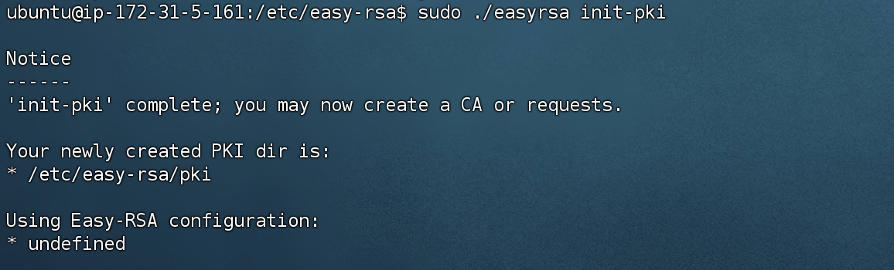
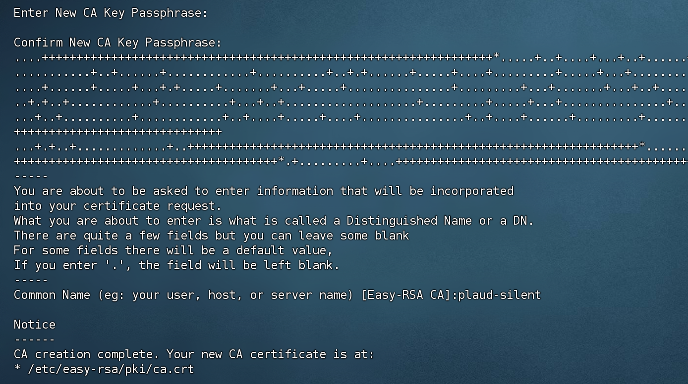
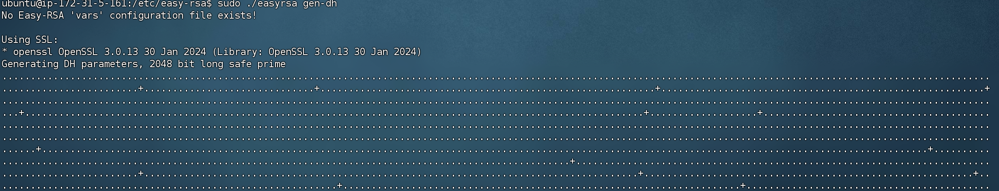
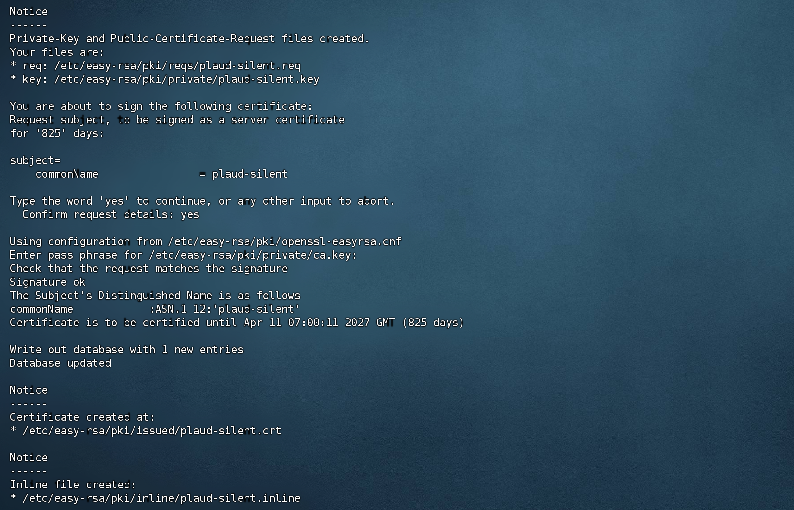
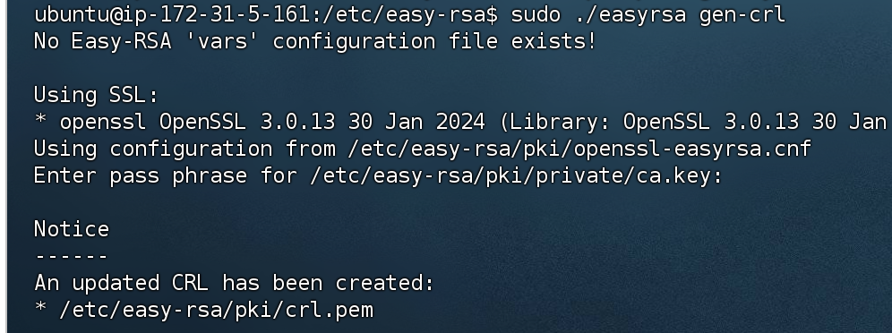
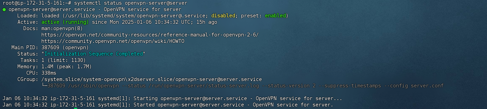
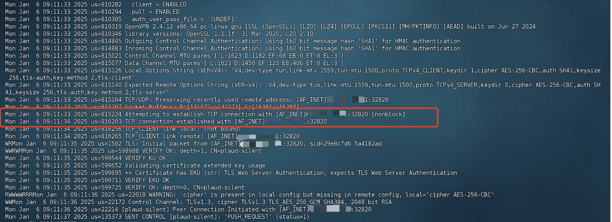

# Ubuntu 24.04 install Private OpenVPN Server

## Background

出于成本考虑，小型公司或创业公司一般不会搭专线让本地网络和云服务器可以使用内网访问，所以这就需要用到 VPN 技术了。当然 VPN 有很多种方案，这里不做对比。所以本文介绍了 OpenVPN 的搭建过程(不一定是最简单的，作者看到过有一键脚本)，实现本地机器访问到云上的内网资源。

## Introduction

本文是在Ubuntu 24.04 系统中，安装私有 OpenVPN 服务的设置和配置全过程。OpenVPN是一个基于SSL的开源VPN解决方案，它通过在SSL/TLS通道上创建虚拟私有网络来实现安全远程访问。

##  System Information

### server

系统：Ubuntu 22.04 或以上

网络：必须有公网 IP

### Client

系统：Ubuntu 20.04 LTS (windows wsl)

网络：可内网，只要能通过公网访问到 server 即可

## Procedure  

### Server 

#### Step 1: Install OpenVPN and Easy-RSA

```shell
# 更新apt
sudo apt update 
# 安装 openvpn
sudo apt install openvpn
# 安装 Easy-RSA 
sudo apt install easy-rsa
```

#### Step 2: Initialize the Easy-RSA PKI

安装好Easy-RSA 后，需要初始化OpenVPN 所需要的公钥基础架构。

```shell
# 备份 Easy-RSA 配置目录到 /etc, 避免升级导致。并在改目录只想生成密钥操作
sudo cp -r /usr/share/easy-rsa /etc/
# 进入 /etc/easy-rsa 目录，初始化 pki
cd  /etc/easy-rsa/
sudo ./easyrsa init-pki
```



#### Step 3: Generate the certificate authority

生成证书颁发机构证书和密钥

```shell
sudo ./easyrsa build-ca
```



#### Step 4: Generate Diffie-Hellman parameters

使用 Diffie-Hellman 密钥，建立强加密的安全连接, 也就是 tls

```shell
sudo ./easyrsa gen-dh
```



#### Step 5: Generate OpenVPN server certificate and key

生成OpenVPN 服务端证书

```shell
sudo ./easyrsa build-server-full server nopass
# 这里的 server 是服务端的名称，可以按需修改，用于客户端识别服务器，作者用的名称是：plaud-silent
# nopass 表示禁用密码保护，客户端和服务端不需要使用密码认证
```



#### Step 6: Generate HMAC key

TLS/SSL 预共享身份验证密钥在每个 SSL/TLS 握手数据包上都包含一个 HMAC 签名，从而增加了一层额外的安全性，用于防止 DoS 攻击和 UDP 端口泛滥。可选的操作，但是建议执行。

```shell
sudo openvpn --genkey secret /etc/easy-rsa/pki/ta.key
```

#### Step 7: Generate OpenVPN revocation certificate

生成撤销证书以使先前签名的证书无效。

> [!TIP]
>
> 第一次的话，可以不做。用不到这个证书文件

```shel
sudo ./easyrsa gen-crl
```



#### Step 8: Copy server certificates and keys

将前面生成的服务器证书和密钥全部复制到 OpenVPN 到 `server` 目录下

```shell
sudo cp -rp /etc/easy-rsa/pki/{ca.crt,dh.pem,ta.key,crl.pem,issued,private} /etc/openvpn/server/
```

#### Step 9: Configure OpenVPN server

先复制一份官方提供的 sample 中的 `server.conf`  到 OpenVPN 的 `server` 目录下

```shell
sudo cp /usr/share/doc/openvpn/examples/sample-config-files/server.conf /etc/openvpn/server/
```

修改前面复制的 `server.conf`

```shell
sudo vi /etc/openvpn/server/server.conf
```

需要修改下面的内容

```shell
port 1194 # 端口好，按自己放开的改 
proto tcp # 启用 tcp，把 udp 注释掉 
dev tun  
ca ca.crt  # CA
cert issued/server.crt # 服务端证书文件,如果前面server改名字了，要改一下
key private/server.key # 服务端密钥, 如果前面server改名字了，要改一下
dh dh.pem  
##### 都是默认的，取消注释就好
topology subnet  
server 10.8.0.0 255.255.255.0  
ifconfig-pool-persist /var/log/openvpn/ipp.txt  
push "redirect-gateway def1 bypass-dhcp"  
push "dhcp-option DNS 208.67.222.222"  
push "dhcp-option DNS 208.67.220.220"  
client-to-client  
duplicate-cn # 客户端证书复用，如果不打开，一个证书只允许一个人连接
keepalive 10 120  
#######
tls-auth ta.key 0 # 这里就是前面步骤六生成的tls key了
##### 都是默认的
persist-key  
persist-tun  
status /var/log/openvpn/openvpn-status.log  
log-append /var/log/openvpn/openvpn.log  
verb 3  # 设置 OpenVPN 日志的详细程度
explicit-exit-notify 1  
#####
```

#### Step 10: Enable IP forwarding and configure the firewall

要开启 ipv4 的 ip 转发

```shell
sudo sed -i 's/#net.ipv4.ip_forward=1/net.ipv4.ip_forward=1/' /etc/sysctl.conf
sudo sysctl -p
```

#### Step 11: Start the OpenVPN server

> [!NOTE]
>
> 这里的 `@server` server 是前面步骤9 `server.conf` 文件的文件名，如果有改文件名，那需要改这里

```shell
sudo systemctl start openvpn-server@server
sudo systemctl status openvpn-server@server

# 开机自启
sudo systemctl enable openvpn-server@server
```



#### Step 12: Generate OpenVPN client certificates and keys

客户端的证书也需要在当前服务器生成，然后再给到客户端使用。

```shell
# 进入生成证书的目录
cd /etc/easy-rsa
sudo ./easyrsa build-client-full client nopass # 这里的clinet 一样可以改名字，作者使用windows-wsl
```

生成完成后，需要将`/etc/easy-rsa/pki/{ca.crt,ta.key,issued/client.crt,private/client.key}` 这几个文件给到客户端

> [!CAUTION]
>
> 这里要注意，如果改了 client 的名字，那 `issued` 和 `private` 目录中的证书名字是修改后的名字

### Client 

#### Step 1: Install OpenVPN

客户端也需要下载 openvpn 

```shell
sudo apt update
sudo apt install openvpn
```

#### Step 2: Copy Client certificates and keys

从服务端的机器上复制证书到客户端机器，可以通过下面命令，也可以在服务端压缩下载，再上传到客户端

```shell
sudo scp -rp /etc/easy-rsa/pki/{ca.crt,ta.key,issued/client.crt,private/client.key} root@<pubilc_ip>:/etc/openvpn/client/
```

#### Step 3:  Configure OpenVPN Client

跟 `server` 端一样，复制一份官方的 sample

```shell
cp /usr/share/doc/openvpn/examples/sample-config-files/client.conf /etc/openvpn/client.ovpn
```

修改 `client` 配置文件

```shell
vi /etc/openvpn/client.ovpn
```

只需要改下面内容

```shell
client
dev tun
# udp 改为tcp
proto tcp
# OpenVPN服务器的外网IP和端口
remote <Public_ip> 1194
##### 默认，如果注释了，取消注释即可
resolv-retry infinite
nobind
persist-key
persist-tun
###############################
# ca cert key tls-auth 这四个注意证书文件位置和名字
ca client/ca.crt # ca, 看步骤二文件复制在那里。当前配置文件在 /etc/openvpn/ 目录，ca.crt 复制在 /etc/openvpn/client/ 目录
cert client/client.crt # 客户端证书
key client/client1.key # 客户端的密钥
ns-cert-type server
# 去掉前面的注释，注意文件位置
tls-auth client/ta.key 1
log-append /var/log/openvpn/openvpn.log  # 日志位置
verb 3 # 设置 OpenVPN 日志的详细程度，跟 server 端对其
```

#### Step 4: Start the OpenVPN Client

> [!NOTE]
>
> 因为本文测试使用的是 wsl ubuntu，所以不能使用 systemctl 命令执行

```shell
# systemctl 
sudo systemctl start openvpn@client
# openvpn cli
cd /etc/openvpn && openvpn --config client.ovpn # 直接执行，Ctrl+C 会退出
openvpn --daemon --cd /etc/openvpn --config client.ovpn & # 后台执行
```

查看客户端连接日志

```shell
cat /var/log/openvpn/openvpn.log
```

出现 `TCP connection established with xxxx` 说明连接成功了，如图：



接下来可以使用一开始配置的内网 IP 进行访问，默认为： `10.8.0.0/24` 

#### Step 5: Add net that need to go through the OpenVPN

在客户端配置需要走 openvpn 的路由，特别是内网地址

```shell
route add -net 172.31.0.0/20 gw 10.8.0.1 
```

`172.31.0.0/20` 是 server 端的内网网段(不是openvpn 隧道网段)

`10.8.0.1` 是 openvpn 的网关地址，也就是 server 端的地址

除此之外，还可以直接在 `client.ovpn` 文件中添加

```shell
# 将所有流量路由到 VPN
push "route 0.0.0.0 255.255.255.255"
# 只将某个网段流量路由到 vpn
push "route 172.31.0.0 255.255.240.0"
```

## Reference

[1] [How to Install a Private OpenVPN Server on Ubuntu 22.04 [Step-by-Step]](https://www.cherryservers.com/blog/install-openvpn-server-ubuntu#step-12-configure-openvpn-server)

[2] [How to install and use OpenVPN](https://ubuntu.com/server/docs/how-to-install-and-use-openvpn)
