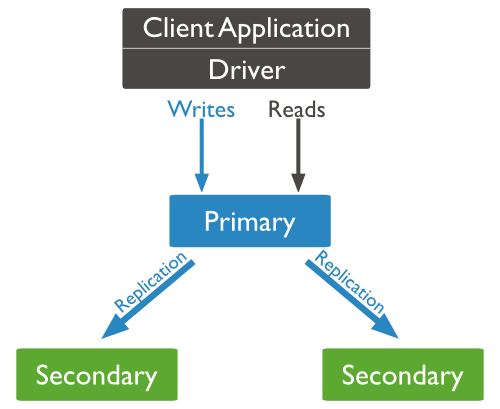

# MongoDB 主从 (副本集) 和分片集群的搭建
> Author mogd 2022-04-27
> Update mogd 2022-04-27

`MongoDB` 是一个基于分布式文件存储的开源数据库系统，更类似 MySQL；其是面向文档存储的数据库，而 Redis 是键值对数据库

## 一、MongoDB 主从复制 (副本集)

MongoDB 复制是将数据同步在多个服务器的过程，复制提供了以下保障：
- 保障数据的安全性
- 数据高可用性 (24*7)
- 灾难恢复
- 无需停机维护（如备份，重建索引，压缩）
- 分布式读取数据

### 1.1 MongoDB 复制原理

`mongodb` 的复制至少需要两个节点，如果节点在 3 个以上，当主节点异常时可以自动切换；其中一个是主节点，负责处理客户端请求，其余的都是从节点，负责复制主节点上的数据

主节点记录在其上的所有操作 `oplog`，从节点定期轮询主节点获取这些操作，然后对自己的数据副本执行这些操作，从而保证从节点的数据与主节点一致

**副本集的特点：**
- N 个节点的集群
- 任何节点可作为主节点
- 所有写入操作都在主节点上
- 自动故障转移
- 自动恢复

## 二、MongoDB 分片
