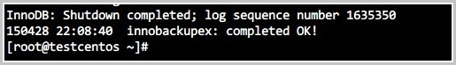

# 阿里云 RDS MySQL 物理备份文件恢复到自建数据库

官方文档：https://help.aliyun.com/document_detail/41817.html?spm=5176.19908310.help.dexternal.50491450PdfgVF#section-hsj-c4u-w40

## 前提条件
1. RDS 实例版本为 MySQL 8.0、5.7、5.6、5.5 高可用版（本地盘）
2. RDS 实例中的表未通过TDE加密
3. RAM 账号需要具备下载备份文件的权限。如需为 RAM 账号授权，请参见[添加下载备份文件权限给只读子账号](https://help.aliyun.com/document_detail/100043.htm?spm=a2c4g.11186623.0.0.278f622ekKxuik#concept-qmt-zxm-cgb)
4. MySQL 自建库版本与 RDS MySQL 版本相同（例如都是5.7）
5. 自建库所在服务器中已安装 Percona XtraBackup
   -  对于 MySQL 5.7、5.6 或 5.5 实例：安装 [Percona XtraBackup 2.4](https://www.percona.com/doc/percona-xtrabackup/2.4/installation.html?spm=a2c4g.11186623.0.0.278f622ekKxuik)
   -  对于 MySQL 8.0 实例，安装 [Percona XtraBackup 8.0](https://www.percona.com/doc/percona-xtrabackup/8.0/installation.html?spm=a2c4g.11186623.0.0.278f622ekKxuik)
6. 自建库所在服务器中已安装解压工具 qpress
    ```bash
    wget "http://docs-aliyun.cn-hangzhou.oss.aliyun-inc.com/assets/attach/183466/cn_zh/1608011575185/qpress-11-linux-x64.tar"
    tar xvf qpress-11-linux-x64.tar
    chmod 775 qpress
    cp qpress /usr/bin
    ```
7. 获取 master 信息
   ```bash
   select * from mysql.slave_master_info;
   change master to master_host='xxxx',master_port=3306,master_user='rep',master_password='xxxx',master_auto_position=1;
   ```
## 一、下载备份
1. 访问 [RDS 实例列表](https://rdsnext.console.aliyun.com/rdsList/basic?spm=a2c4g.11186623.0.0.278f622ekKxuik)，在上方选择地域，然后单击目标实例ID
2. 在左侧导航栏中，单击**备份恢复**
3. 在**数据备份**页签，单击目标备份集右侧**操作**列的**实例备份下载**
4. 在**常规下载**页面，您可通过**下载地址**，或页面下方提供的下载按钮下载备份数据
5. 在自建的 linux 服务器上
    ```bash
    # 查看磁盘存储空间
    df -h /usr/local/mysql/3308/data/
    # 查看对应的磁盘路径，建立临时文件夹，下载备份文件
    axel -n 20 -q 'url'  文件名
    ```
## 二、解压和恢复备份文件
1. 在 Linux 服务器上磁盘存储目录下，创建一个目录（例如/data/mysql/data）用于存放解压后的文件
   ```bash
   mkdir -p /data/mysql/data
   ```
2. 解压压缩包。根据压缩包的后缀选择解压命令
   | 备份文件类型  | 解压命令    | 
   |:--------:| -------------|
   | tar 压缩包 （.tar.gz 后缀） | `tar -izxvf test1.tar.gz -C /home/mysql/data` | 
   | xbstream 压缩包 （.xb.gz 后缀） | `gzip -d -c test1.xb.gz | xbstream -x -v -C /home/mysql/data` | 
   | xbstream 文件包（_qp.xb 后缀） | 先解包<br>`cat test1_qp.xb | xbstream -x -v -C /home/mysql/data`<br>然后解压<br>对于 MySQL 5.6/5.7<br>`innobackupex --decompress --remove-original /home/mysql/data` <br> 对于 MySQL 8.0<br>`xtrabackup --decompress --remove-original --target-dir=/home/mysql/data` | 
   | xbstream qpress压缩包（_xb.qp后缀） | `qpress -do  test1_xb.qp  | xbstream -x -v -C /home/mysql/data` |

3. 执行如下命令，查询解压后生成的文件
   ```bash
   ls -l /data/mysql/data
   ```
4. 删除 `qp，apply-log `
    ```bash
    find . -iname *.trg -delete
    find . -iname auto.cnf  -delete
    ```
> 因为云厂商托管的数据库其实对使用者是有现在的，所以需要删除掉 `trg`
> auto.cnf 删除从库的 gtid

5. 修改存储过程
    ```bash
    # 修改文件权限 `mysql.cnf`, 添加 `skip-grant-tables`
    # 重启 mysql
    systemctl restart mysqld@3306
    # 进入 mysql 命令行，修改存储过程
    mysql -uroot -S /tmp/mysql3306.sock

    use mysql;
    alter table proc engine=myisam;
    alter table event engine=myisam;
    alter table func engine=myisam;
    ```
> 因为云厂商的 mysql5.7 都是使用的 innodb 引擎，本地自建使用 myisam

6. 将解压的文件移到原本备份目录
    ```bash
    /bin/rm -rf /usr/local/mysql/3308/data/*
    mv /home/mysql/data /usr/local/mysql/3308/data/
    ```
7. 执行如下命令，恢复解压好的备份文件
   ```bash
   ## MySQL 5.6/5.7
   innobackupex --use-memory=4G --defaults-file=/home/mysql/data/backup-my.cnf --apply-log /home/mysql/data 

   ## MySQL 8.0
   xtrabackup --prepare --target-dir=/home/mysql/data
   xtrabackup --datadir=/var/lib/mysql --copy-back --target-dir=/home/mysql/data
   ```
   - 恢复时请耐心等待，若系统返回如下类似结果，则说明备份文件已成功恢复到自建数据库
    

## 三、开启从库同步并恢复权限

1. 开启从库同步
    ```
    SET GLOBAL gtid_purged='xxxx';

    change master to master_host='xxxx',master_port=3306,master_user='rep',master_password='xxxx',master_auto_position=1;
    ```

2. 还原 my.conf 权限
    ```bash
    mysqldump -u root -p -S /tmp/mysql3307.sock  --set-gtid-purged=off  mysql  tables_priv user  db > mysql.sql
    echo  'flush privileges;' >>  mysql.sql
    mysql -u root -p -S /tmp/mysql3306.sock mysql  <   mysql.sql
    ```