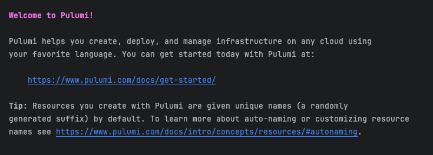
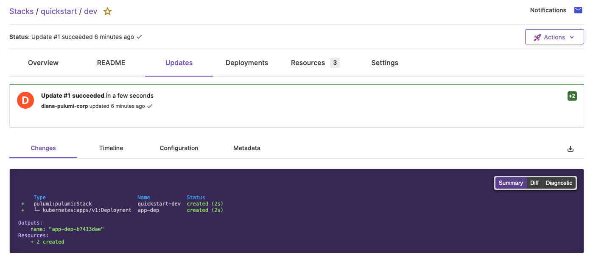

# Before begin

## Install Pulumi

#### Package

https://www.pulumi.com/docs/install/versions/

#### command line

**window (all in PowerShell)**

1. install choco： https://chocolatey.org/install

   ```shell
   Set-ExecutionPolicy Bypass -Scope Process -Force; [System.Net.ServicePointManager]::SecurityProtocol = [System.Net.ServicePointManager]::SecurityProtocol -bor 3072; iex ((New-Object System.Net.WebClient).DownloadString('https://community.chocolatey.org/install.ps1'))
   ```

2. install Pulumi

   ```shell
   choco install pulumi
   ```

3. When the installation completes, you can test it out by reading the current version:

   ```shell
   pulumi version
   ```

**Linux**

```shell
curl -fsSL https://get.pulumi.com | sh
```

**MacOS**

```shell
brew install pulumi/tap/pulumi
```

## Use Pulumi Cloud to configure Pulumi state Backend

> Pulumi supports two classes of state backends for storing your infrastructure state:
>
> - **Pulumi Cloud**: a managed cloud experience using the online or self-hosted Pulumi Cloud application
> - **DIY backend**: “Do it Yourself”- a manually managed object store, including AWS S3, Azure Blob Storage, Google Cloud Storage, any AWS S3 compatible server such as Minio or Ceph, or your local filesystem

1. create a Pulumi cloud account: https://app.pulumi.com/

2. create a Personal access tokens:
   

3. configure `PULUMI_ACCESS_TOKEN` environment variable

4. logging in Pulumi cloud

   ```shell
   >pulumi login
   Logging in using access token from PULUMI_ACCESS_TOKEN
   Logged in to pulumi.com as mo-silent (https://app.pulumi.com/mo-silent)
   ```

​	

## Use Pulumi to depoly example resources in AWS

### Requirements

1. Installed AWS CLI and Configure AWS  credentials

   > [aws installation configuretion](https://www.pulumi.com/registry/packages/aws/installation-configuration/)

2. Configure Pulumi State Backend

3. Installed Golang in your compute

### (Official) Quick Start

1. Create a Go project

   ```shell
   mkdir quickstart && cd quickstart
   pulumi new aws-go
   ```

   The [`pulumi new`](https://www.pulumi.com/docs/cli/commands/pulumi_new) command creates a new Pulumi project with some basic scaffolding based on the cloud and language specified. 

   After run the `pulumi new` command, you need to set  **project name**, **project description**, **stack name**. 

   Finally, you will be prompted for some configuration values for the stack. For AWS projects, you will be prompted for the AWS region. You can accept the default value or choose another value like `us-west-2`.

2. In the step 1, it will generate project files in your workspace. 

   > [!TIP]
   >
   > You can modify the contents of these files to meet your needs.

   - `Pulumi.yaml` defines the [project](https://www.pulumi.com/docs/concepts/projects/).

   - `Pulumi.dev.yaml` contains [configuration](https://www.pulumi.com/docs/concepts/config/) values for the [stack](https://www.pulumi.com/docs/concepts/stack/) you just initialized.

   - `main.go` is the Pulumi program that defines your stack resources.

     ```go
     package main
     
     import (
     	"github.com/pulumi/pulumi-aws/sdk/v6/go/aws/s3"
     	"github.com/pulumi/pulumi/sdk/v3/go/pulumi"
     )
     
     func main() {
         pulumi.Run(func(ctx *pulumi.Context) error {
             // Create an AWS resource (S3 Bucket)
             bucket, err := s3.NewBucketV2(ctx, "my-bucket", nil)
             if err != nil {
                 return err
             }
     
             // Export the name of the bucket
           	// This Pulumi program creates a new S3 bucket and exports the name of the bucket.
             ctx.Export("bucketName", bucket.ID())
             return nil
     	  })
     }
     ```

3. Run `pulumi up` command to deploy the example stack

   ```shell
   pulumi up
   ```

   This command evaluates your program and determines the resource updates to make. First, a preview is shown that outlines the changes that will be made when you run the update:

   ```shell
   Previewing update (dev):
   
        Type                 Name            Plan
    +   pulumi:pulumi:Stack  quickstart-dev  create
    +   └─ aws:s3:BucketV2   my-bucket       create
   
   Resources:
       + 2 to create
   
   Do you want to perform this update?
   > yes
     no
     details
   ```

   Once the preview has finished, you are given three options to choose from. Choosing `details` will show you a rich diff of the changes to be made. Choosing `yes` will create your new S3 bucket in AWS. Choosing `no` will return you to the user prompt without performing the update operation.

   ```shell
   Do you want to perform this update? yes
   Updating (dev):
   
        Type                 Name            Status
    +   pulumi:pulumi:Stack  quickstart-dev  created (4s)
    +   └─ aws:s3:BucketV2   my-bucket       created (2s)
   
   Outputs:
       bucketName: "my-bucket-58ce361"
   
   Resources:
       + 2 created
   
   Duration: 5s
   ```

4. Run `pulumi stack output <output_name>` to see your stack output. If you use pulumi cloud as pulumi state backend, you can see the `CLI` output in pulumi cloud. 
   

### (Optional)Managing AWS EKS clusters using the Pulumi CLI

## Pulumi CLI Command Explained

- [`pulumi new`](https://www.pulumi.com/docs/cli/commands/pulumi_new/): creates a new project using a template
- [`pulumi stack`](https://www.pulumi.com/docs/cli/commands/pulumi_stack/): manage your stacks (at least one is required to perform an update)
- [`pulumi config`](https://www.pulumi.com/docs/cli/commands/pulumi_config/): configure variables such as keys, regions, and so on
- [`pulumi up`](https://www.pulumi.com/docs/cli/commands/pulumi_up/): preview and deploy changes to your program and/or infrastructure
- [`pulumi preview`](https://www.pulumi.com/docs/cli/commands/pulumi_preview/): preview your changes explicitly before deploying
- [`pulumi destroy`](https://www.pulumi.com/docs/cli/commands/pulumi_destroy/): destroy your program and its infrastructure when you’re done
