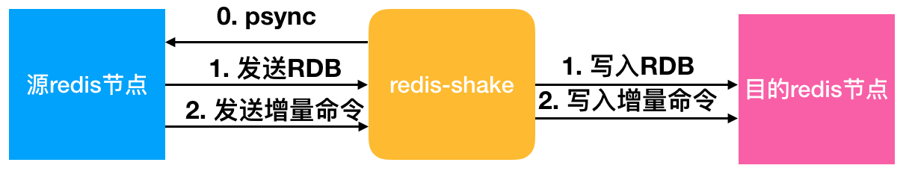

# Redis 缓存数据库使用 Redis-Shake 做数据同步

## Redis-shake 简介

redis-shake是阿里云Redis&MongoDB团队开源的用于redis数据同步的工具，[下载地址](https://github.com/alibaba/RedisShake/releases)

### Redis-Shake 同步的五种模式
- restore 恢复：将 RDB 文件恢复到目标 redis 数据库
- dump 备份：将源 redis 的全量数据通过 RDB 文件备份起来
- decode 解析：对 RDB 文件进行读取，并以 json 格式解析存储
- sync 同步：支持源redis和目的redis的数据同步，支持全量和增量数据的迁移，支持单节点、主从版、集群版之间的互相同步；如果源端是集群版，可以启动一个RedisShake，从不同的db结点进行拉取，同时源端不能开启move slot功能；对于目的端，如果是集群版，写入可以是1个或者多个db结点
- rump 同步：支持源redis和目的redis的数据同步，仅支持全量的迁移

### 基本原理


## 部署过程
### 同步模式
```bash
# 下载
mkdir -P /usr/local/src/redis-shake
wget -P /usr/local/src/redis-shake https://github.com/alibaba/RedisShake/releases/download/release-v2.1.2-20220329/release-v2.1.2-20220329.tar.gz
# 安装
cd /usr/local/src/redis-shake
tar -xvf release-v2.1.2-20220329.tar.gz
cp /usr/local/src/redis-shake/redis-shake.conf /usr/local/src/redis-shake/redis-shake.conf.backup
# 修改配置文件 /usr/local/src/redis-shake/redis-shake.conf
vi /usr/local/src/redis-shake/redis-shake.conf
# 主要更改以下内容
----------------
# 源 redis 类型，standalone 单机/主从，sentinel 哨兵，cluster 集群，proxy 代理 (只用于rump)
source.type: standalone
# 地址 
# standalone 单机填单个地址，主从填master或slave地址
# sentinel 填写 sentinel_master_name:master_or_slave@sentinel_cluster_address.sentinel_master_name
# cluster 填写集群全部地址 ; 号分割，例如： mymaster:master@127.0.0.1:26379;127.0.0.1:26380
# proxy 如果是阿里云redis的集群版，从proxy拉取/写入请选择proxy，从db拉取请选择cluster。正常cluster到cluster同步源端请选择cluster模式，proxy模式目前只用于 rump
source.address: 127.0.0.1:6379
# 密码
source.password_raw: 123456
# 目标 redis 类型，standalone 单机/主从，sentinel 哨兵，cluster 集群
target.type: standalone
target.address: 127.0.0.1:6380
target.password_raw: 123456
# 重复 key 执行的操作，当源目的有重复 key 时是否进行覆写；`restore`, `sync` and `rump`.
# 1. rewrite: 源端覆盖目的端
# 2. none: 一旦发生进程直接退出
# 3. ignore: 保留目的端key，忽略源端的同步 key. 该值在 rump 模式下不会生效.
key_exists = none
----------------
```

修改完配置文件后，运行命令
```bash
./redis-shake.linux -conf=redis-shake.conf -type=sync # sync or rump
```

`type` 为 `sync` 和 `rump` 模式需要同时配置 `source` 和 `target`

### restore 模式

如果为 restore 模式，配置 `rdb.input` 和 `target` 信息即可

```bash
# 输入的 rdb 文件，多个文件 ";" 号分割
source.rdb.input: local_dump.0;local_dump.1
target.type: standalone
target.address: 127.0.0.1:6380
target.password_raw: 123456
key_exists = none
```

### dump 模式

`dump` 模式，配置 `target.rdb.output` 和 `source` 信息即可

```bash
# 输出的 rdb 文件前缀，如果是多个 db，以数字编号后缀；如：${output_rdb}.0, ${output_rdb}.1, ${output_rdb}.2
target.rdb.output: local_dump
source.type: standalone
source.address: 127.0.0.1:6379
source.password_raw: 123456
```

### decode 模式

配置 `rdb.input` 和 `rdb.output` 即可

## 示例

### 单点到单点

```bash
source.type: standalone
source.address: 10.1.1.1:20441
source.password_raw: 12345
target.type: standalone
target.address: 10.1.1.1:20551
target.password_raw: 12345
```
### cluster 到 cluster

```bash
source.type: cluster
source.address: 10.1.1.1:20441;10.1.1.1:20443;10.1.1.1:20445
source.password_raw: 12345
target.type: cluster
target.address: 10.1.1.1:20551;10.1.1.1:20553;10.1.1.1:20555
target.password_raw: 12345
```

### cluster 到 proxy

```bash
source.type: cluster
source.address: 10.1.1.1:20441;10.1.1.1:20443;10.1.1.1:20445;10.1.1.1:20447
source.password_raw: 12345
target.type: proxy
target.address: 10.1.1.1:30331;10.1.1.1:30441;10.1.1.1:30551
target.password_raw: 12345
```

### standalone 到 cluster

```bash
source.type: standalone
source.address: 10.1.1.1:20441
source.password_raw: 12345
target.type: cluster
target.address: 10.1.1.1:30331;10.1.1.1:30441;10.1.1.1:30551
target.password_raw: 12345
```