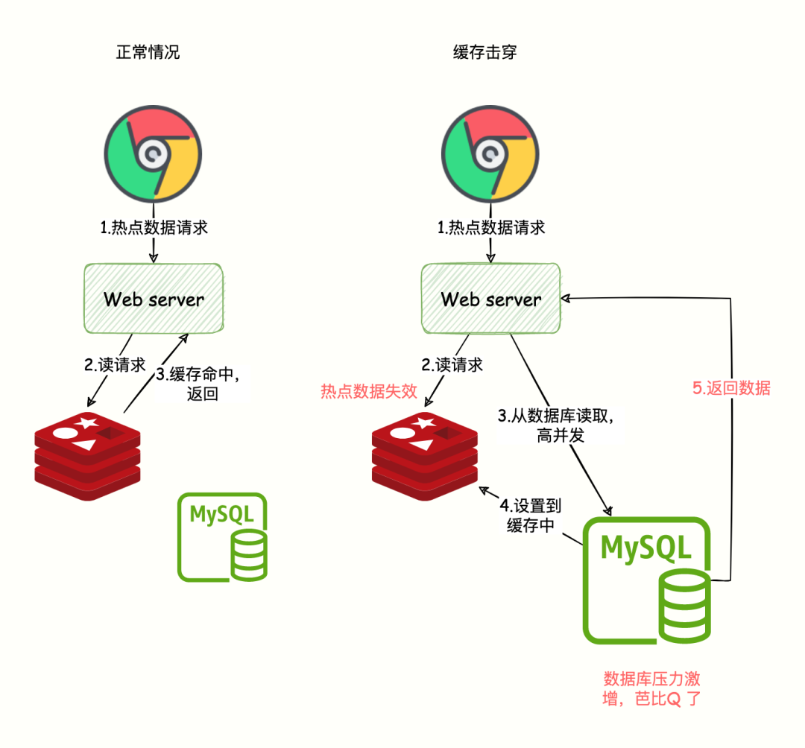
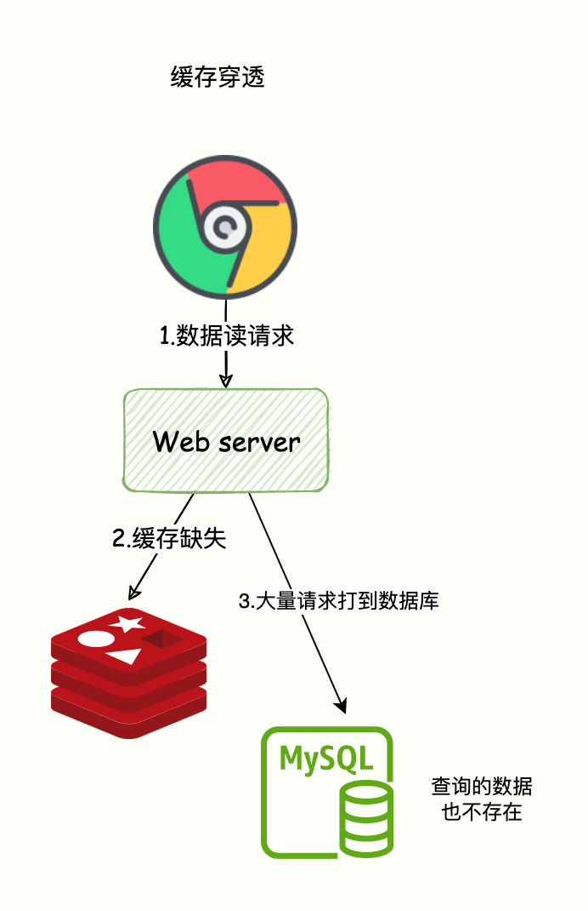
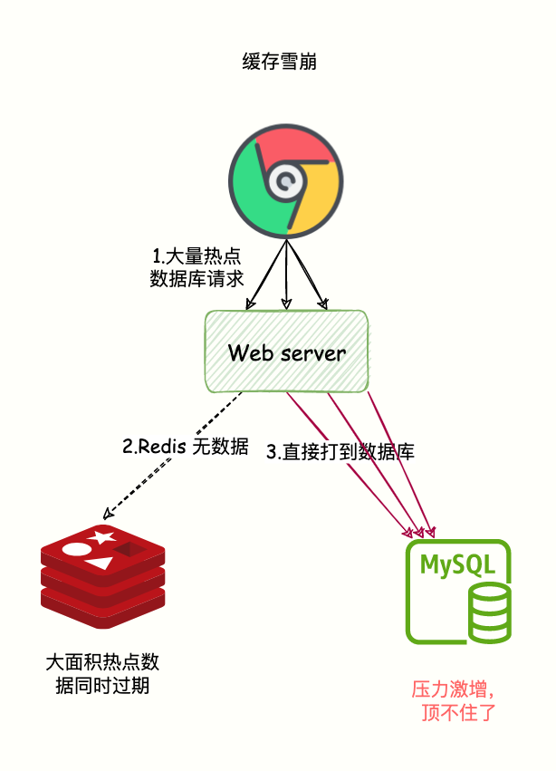
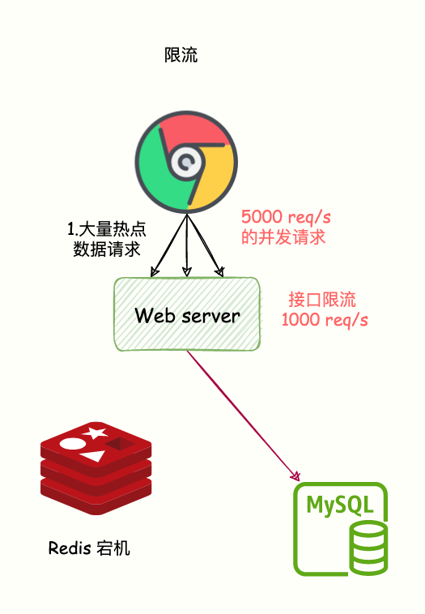

# Redis 经典问题处理-常见面试题

## Redis 连接数问题

`Redis` 服务器连接不上，应用程序无法获取连接。可能是以下的原因，以及对应解决的方案

### 1、最大连接数

**原因**
`Redis` 服务器默认设置的最大连接数 `maxclients` 是 10000，但是这个受服务器最大文件数影响，服务器默认最大文件数是 1024，所以 `redis` 最大连接数为 1024-32=992

**解决方案**
1. 首先查看当前连接数
   ```bash
    ./redis-cli –h host –p port info clients
   ```
2. 查看最大连接数
   ```bash
    ./redis-cli –h host –p port config get maxclients
   ```
3. 如果连接数远远小于最大连接数，就是服务器最大文件数的影响，修改对应的文件
   ```bash
    # 修改 /etc/security/limits.conf，添加下面内容
    *   soft    nofile    65536
    *   hard    nofile    65536
    # 重启服务生效后，使用 ulimit -a 查看
   ```
### 2、大量的长连接导致

**原因**
监控平台查看到 `redis` 客户端连接数过大，超过最大限制 1W
通过下面命令分析具体的连接信息
```bash
./redis-cli –h host –p port client list
```

如果存在大量的空闲连接，主节点 `cmd=null`，从节点 `cmd=readonly`，并且 `idle` 空闲时长太长，导致连接池维持了太多的连接。

默认情况下，如果客户端空闲了很多秒，Redis 的最新版本不会关闭与客户端的连接：连接将永远保持打开状态。

**解决方案**
1. 设置 `timeout`
   ```bash
    ./redis-cli –h host –p port CONFIG SET timeout 30
   ```
2. 设置 `tcp-keepalive` 
   ```bash
    # 用来定时向client发送tcp_ack包来探测client是否存活的
    ./redis-cli –h host –p port config set tcp-keepalive 300
   ```
3. 应用程序配置自动释放连接

## Redis CPU 问题

在 `Redis` 官方文档 [reids面试题](https://www.redis.com.cn/redis-interview-questions.html) 有这么一句话：CPU 基本不可能成为的 Redis 的瓶颈，通常 Redis 受限于内存或网络

然而在实际生产环境中，还是会遇到 `redis cpu` 占用过高的场景

### 1、高消耗命令导致 CPU 使用率过高

**原因**
高消耗命令 (慢查询 或 value 值过大) ：即时间复杂度为 O(N) 或更高的命令。通常情况下，命令的时间复杂度越高，在执行时会消耗较多的资源，从而导致 CPU 使用率上升

这是因为 `Redis` 是用 "单线程-多路复用io模型" 来实现高性能的内存数据服务的，这种机制避免了使用锁，但是同时这种机制在进行 sunion 之类的比较耗时的命令时会使 redis 的并发下降。因为单线程，所以耗时的命令会导致并发下降，读写并发都会下降，从而导致 CPU 使用率上升

**解决方案**
1. 评估并禁用高风险命令和高消耗命令
2. 优化业务程序，避免频繁执行数据排序操作
3. 调整 `redis` 架构为读写分离架构，对高消耗命令或应用进行分流

### 2、连接数过多导致 CPU 使用率过高
参考前面的 [Redis 连接数问题](#redis-连接数问题)

### 3、数据持久化 AOF

**原因**
`Redis` 提供两种持久化方式：RDB (默认) 和 AOF (阿里云默认)

RDB 是 Redis 默认的持久化方式。按照一定的时间将内存的数据以快照的形式保存到硬盘中，对应产生的数据文件为 dump.rdb。通过配置文件中的 save 参数来定义快照的周期

AOF 持久化(即 Append Only File 持久化)，则是将 Redis 执行的每次写命令记录到单独的日志文件中，当重启 Redis 会重新将持久化的日志中文件恢复数据

在 `Redis 4.0` 之后有混合持久化的功能，`bgsave` 的全量和 `aof` 的增量做了融合处理，这样既保证了恢复的效率又兼顾了数据的安全性。如果在 RDB 和 AOF 两个都配了优先加载 AOF

如果开启了 AOF，当服务器处于高负载状态时，频繁执行 AOF 会一定程度导致 CPU 使用率升高

**解决方案**
1. 在业务允许的前提下，可以考虑关闭 AOF
2. 提升机器配置

## Redis 内存问题

Redis 内存不足时，要么 Redis 被 Linux 内核 OOM 杀掉，抛出错误崩溃，要么就会卡顿。随着现代操作系统 malloc 方法通常都不返回 NULL，而是服务器开始交换，因此 Redis 性能降低，会出现错误；而 Redis 内置保护措施允许用户在配置文件中使用 `maxmemory` 选项，设置 Redis 最大占用内存。而达到最大限制，Redis 就会返回错误给写命令 (会继续接受读命令)

下面分析一下内存占用过高的场景

### 1、key 较多

key 较多，需要跟研发确认 key 是否有合理设置过期时间、若是数据都是永久数据不下线的话，就要考虑增加内存，这种是属于正常情况

### 2、Bigkey 过多

参考 [redis Bigkey 问题](#redis-bigkey-问题)

### 3、内存碎片

查看内存碎片
```bash
./redis-cli –h host –p port INFO memory
```
主要看 `mem_fragmentation_ratio` 字段

1. `>1&&<1.5`：合理的范围，说明操作系统分配的内存总是总是大于实际申请的空间，碎片不多
2. `>1.5`：内存碎片率已经超过50%，需要采取一些措施来降低碎片率
3. `<1`：实际分配的内存小于申请的内存了，很显然内存不足了，这样会导致部分数据写入到 Swap 中

> swap 对于操作系统来比较重要， 当物理内存不足时， 可以将一部分内存页进行 swap 操作， 以解燃眉之急
> swap 空间由硬盘提供， 对于需要高并发、 高吞吐的应用来说， 磁盘 IO 通常会成为系统瓶颈。当然内存达到了 Redis 的规则，会触发内存淘汰机制
> 之后 Redis 访问 Swap 中的数据时，延迟会变大，性能会降低

**内存碎片清理**

1. 重启 Redis ( redis 4.0之前，4.0 支持碎片清理功能)
2. 清理碎片
   - 自动清理
     ```bash
        # 查看
        ./redis-cli –h host –p port config get activedefrag 
        # 开启自动内存碎片整理(总开关) activedefrag yes
        ./redis-cli –h host –p port config set activedefrag yes
     ```
    - 手动清理
      ```bash
        127.0.0.1:6379> memory purge
      ``` 

**自动清理触发机制**
- active-defrag-ignore-bytes 100mb：默认值，碎片达到100MB时，开启清理
- active-defrag-threshold-lower 10：默认值，当碎片超过 10% 时，开启清理
- active-defrag-threshold-upper 100： 默认值，内存碎片超过 100%，则尽最大努力整理

## Redis Bigkey 问题

**影响**
- 客户端执行命令的时长变慢
- Redis 内存达到 maxmemory 参数定义的上限引发操作阻塞或重要的 Key 被逐出，甚至引发内存溢出（Out Of Memory）
- 集群架构下，某个数据分片的内存使用率远超其他数据分片，无法使数据分片的内存资源达到均衡
- 对大 Key 执行读请求，会使 Redis 实例的带宽使用率被占满，导致自身服务变慢，同时易波及相关的服务
- 对大 Key 执行删除操作，易造成主库较长时间的阻塞，进而可能引发同步中断或主从切换

**原因**

- 在不适用的场景下使用 Redis，易造成 Key 的 value 过大，如使用 String 类型的 Key 存放大体积二进制文件型数据；
- 业务上线前规划设计不足，没有对 Key 中的成员进行合理的拆分，造成个别 Key 中的成员数量过多；
- 未定期清理无效数据，造成如 HASH 类型 Key 中的成员持续不断地增加；
- 使用 LIST 类型 Key 的业务消费侧发生代码故障，造成对应 Key 的成员只增不减。

**解决方案**
1. 对大 Key 进行拆分
   - 对于字符串类型的 key，我们通常要在业务层面将 value 的大小控制在 10KB左右，如果 value 确实很大，可以考虑采用序列化算法和压缩算法来处理，推荐常用的几种序列化算法: Protostuff、Kryo 或者 Fst
   - 对于集合类型的 key，我们通常要通过控制集合内元素数量来避免 bigKey，通常的做法是将一个大的集合类型的 key 拆分成若干小集合类型的 key 来达到目的
2. 对大 Key 进行清理：将不适用 Redis 能力的数据存至其它存储，并在 Redis 中删除此类数据
3. 对过期数据进行定期清理：堆积大量过期数据会造成大 Key 的产生，例如在 HASH 数据类型中以增量的形式不断写入大量数据而忽略了数据的时效性。可以通过定时任务的方式对失效数据进行清理

## Redis 热 key 问题

**影响**
- 占用大量的 CPU 资源，影响其他请求并导致整体性能降低
- 集群架构下，产生访问倾斜，即某个数据分片被大量访问，而其他数据分片处于空闲状态，可能-引起该数据分片的连接数被耗尽，新的连接建立请求被拒绝等问题
- 在抢购或秒杀场景下，可能因商品对应库存 Key 的请求量过大，超出 Redis 处理能力造成超卖
- 热 Key 的请求压力数量超出 Redis 的承受能力易造成缓存击穿，即大量请求将被直接指向后端的存储层，导致存储访问量激增甚至宕机，从而影响其他业务

**解决方案**

1. 在 Redis 集群架构中对热 Key 进行复制；在 Redis 集群架构中，由于热 Key 的迁移粒度问题，无法将请求分散至其他数据分片，导致单个数据分片的压力无法下降。此时，可以将对应热 Key 进行复制并迁移至其他数据分片，例如将热 Key foo 复制出3个内容完全一样的 Key 并名为 foo2、foo3、foo4，将这三个Key迁移到其他数据分片来解决单个数据分片的热 Key 压力
2. 使用读写分离架构；如果热 Key 的产生来自于读请求，您可以将实例改造成读写分离架构来降低每个数据分片的读请求压力，甚至可以不断地增加从节点。但是读写分离架构在增加业务代码复杂度的同时，也会增加 Redis 集群架构复杂度。不仅要为多个从节点提供转发层（如 Proxy，LVS 等）来实现负载均衡，还要考虑从节点数量显著增加后带来故障率增加的问题。 Redis 集群架构变更会为监控、运维、故障处理带来了更大的挑战

## Redis 缓存击穿 (失效)

**原因**
高并发访问热 key，请求的数据在 DB 中存在，但是 Redis 缓存过期，后端会直接从 DB 中加载数据给前端，并且写入 Redis；高并发访问会导致 DB 压力急剧增大，导致服务不可用



**解决方案**

1. 过期时间 + 随机值
   - 对于热 key，不设置过期时间；但就会引起 Redis 内存占满问题
   - 过期时间 + 随机值；对于相同业务写缓存时，在基础的过期时间上，加一个随机过期时间，让数据错峰过期，避免瞬间全部过期，对 DB 造成巨大压力
2. 预热：提前把 热门数据提前写入 Redis 中，并设置过期时间最大值；可以用于一些已知一定会出现高并发的场景，如双十一、双十二、热点新闻、游戏活动等等
3. 使用锁：但缓存失效时，先获取分布式锁，获取锁成功才执行 DB 事务，否则等待一段时间再次获取锁
   ```java
      // 伪代码
      public Object getData(String id) {
          String desc = redis.get(id);
              // 缓存为空，过期了
              if (desc == null) {
                  // 互斥锁，只有一个请求可以成功
                  if (redis(lockName)) {
                      try
                          // 从数据库取出数据
                          desc = getFromDB(id);
                          // 写到 Redis
                          redis.set(id, desc, 60 * 60 * 24);
                      } catch (Exception ex) {
                          LogHelper.error(ex);
                      } finally {
                          // 确保最后删除，释放锁
                          redis.del(lockName);
                          return desc;
                      }
                  } else {
                      // 否则睡眠200ms，接着获取锁
                      Thread.sleep(200);
                      return getData(id);
                  }
              }
      }
   ```
4. 二级缓存：当我们的第一级缓存失效后，也可以设置一个二级缓存，二级缓存也可以拦截下，二级缓存可以是内存缓存也可以是其他缓存数据库
## Redis 缓存穿透

**原因**

缓存穿透：查询一个不存在的数据，即 Redis 和 DB 都不存在

导致每次请求都会 穿透 到 DB，缓存成了摆设，同样会对数据库造成很大压力影响性能



**解决方案**

1. 缓存空值：当请求的数据不存在 Redis 和 DB 时，设置一个缺省值（如：None）；后续再次查询就会直接返回空值或缺省值
2. 布隆过滤器： 在数据写入数据库的同时将这个 ID 同步到布隆过滤器，但请求的 id 不存在布隆过滤器中则说明该请求查询数据一定不存在数据库，就不需要去数据库查询了
3. 前端校验：某些情况，比如用户在自己的个人中心页面通过商品订单ID来搜索，前端可以判断下对于非法ID（如负数）的订单直接拦截
4. 后端校验：在接口的开始处，校验一些常规的正负数，比如负数的user_id直接返回报错
5. hash拦截：hash校验使用一些数据量不多的场景，比如店铺的商品信息，上架一个商品的时候，我们商品做下hash标记（map["商品ID"]=1），这样如果请求的商品id都不在hash表里，直接返回了
6. 位图标记：类似hash，但是使用比特位来标记
   
布隆过滤器的原理参考：https://developer.aliyun.com/article/773205

## Redis 缓存雪崩

**原因**

缓存雪崩是指大量请求无法被 Redis 处理，请求直接打到 DB，导致数据库压力剧增或宕机

两种原因：
1. 大量热数据同时过期，导致请求需要查询 DB 并写到 Redis
2. Redis 故障宕机

### 1、Redis 大量数据同时过期

<font color=red>缓存雪崩是发生在大量数据同时失效的场景，而缓存击穿 (失效) 是在某个热 key 失效的场景</font>



**解决方案**

1. 过期时间添加随机值；避免大量的数据同一时间失效
2. 接口限流；在请求后端 DB 查询方法加上接口限流包含，避免 DB 被打爆

限流指在业务系统的请求入口前端控制每秒进入系统的请求数，避免过多的请求被发送到数据库



### 2、Redis 故障宕机

**原因**

Redis 故障宕机，Redis 缓存直接不可用，所有请求都直接达到了 DB

**解决方案**

1. 服务熔断和接口限流；服务熔断就是当从缓存获取数据发现异常，则直接返回错误数据给前端，防止所有流量打到数据库导致宕机
2. 构建高可用 Redis 集群； 哨兵集群和 Cluster 集群

## 参考
[1] [Redis client handling](https://redis.io/docs/reference/clients/)
[2] [Redis 性能排查与调优](https://help.aliyun.com/document_detail/265988.html)
[3] [为什么 CPU 结构也会影响 Redis的性能？](http://betheme.net/news/txtlist_i232097v.html)
[4] [The Top 6 Free Redis Memory Analysis Tools](https://scalegrid.io/blog/the-top-6-free-redis-memory-analysis-tools/)
[5] [How to analyze and optimize memory usage in Redis](https://rdbtools.com/blog/redis-mem-analysis/)
[6] [Redis 缓存击穿（失效）、缓存穿透、缓存雪崩怎么解决？](https://mp.weixin.qq.com/s/5ox0qq1TMRCDBitpxuJyoA)