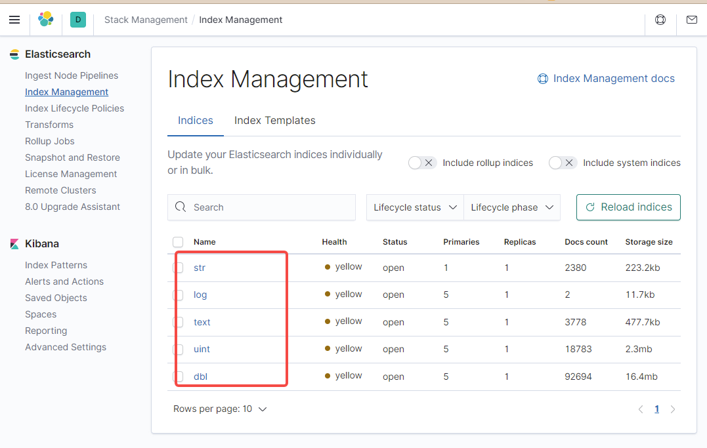
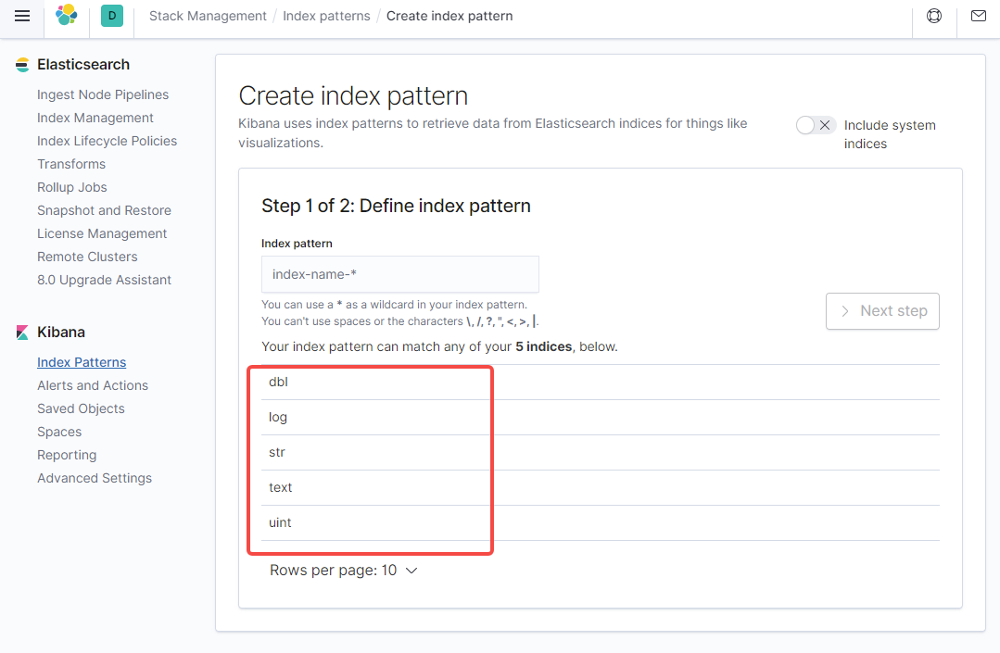

# zabbix 使用 elasticsearch 来存储历史数据

> Author mogd 2022-06-14
> Update mogd 2022-06-14
> Adage `Life is like riding a bicycle. To keep your balance you must keep moving.`

## 一、前言

**需求**

目前 zabbix 使用 mysql 作为存储，很占用数据盘，磁盘不易于扩容，并且数据量很大导致查找的效率不高。设想通过 elasticsearch 来展示监控图表，能够快速检索想要查看的信息

**坑点**

> 笔者是实验完才意识到的，其实这个坑点在认真阅读官方文档说明并且了解 zabbix 的历史数据表结构就很容易意识到
> [Elasticsearch setup](https://www.zabbix.com/documentation/current/en/manual/appendix/install/elastic_search_setup)

zabbix 支持使用 elasticsearch 替代数据库存储历史数据，但其他数据还是存储在数据库。

如果读者看过 zabbix 历史数据的表结果就会很快意识到：
- elasticsearch 只是存储了历史数据，那么索引记录的只是 itemid、clock、value 和 ns，这样在 Kibana 上做图表时，还是不清楚对应的 item 名称和 key，只是知道一个 itemid，反而更加不利于运维人员管理了
- elasticsearch 存储了历史数据后，数据库里面将不再存有历史数据，也就是 zabbix 前端的图表监控基本上都无法正常使用

**新方案**

1. 写一个转换程序，建立新索引，将 zabbix server 发送到 elasticsearch 的索引按指定格式重写到新索引
> 监控的主机成千上万台，一分钟的数据量都很大，重写索引，速度慢，会导致 Kibana 图表的数据不是最新的，而在停机维护时，需要很精确的数据来检测
2. zabbix 的监控项使用 Prometheus check
> 官方有说明，待测试，下一篇文章会整理部署过程、测试结果和一些坑点
3.  修改 zabbix_server 源码，将发送的格式更改为指定格式
> 指定格式: 主机名，item项，clock，value， ns
> 指定格式需要联合查询数据库，数据量太多，频繁查询数据库会加大数据库负担，并且多表查询也会导致延迟
> 源码是 C 语言写的，笔者不太熟悉，不好改，还不如重写

## 二、zabbix 配置

### 2.1 zabbix server

修改 zabbix server 的配置文件 `zabbix_server.conf`，修改完成后重启 zabbix server

```shell
### Option: HistoryStorageURL
# History storage HTTP[S] URL.
#
# Mandatory: no
# Default:
# HistoryStorageURL= 
### Option: HistoryStorageTypes
# Comma separated list of value types to be sent to the history storage.
#
# Mandatory: no
# Default:
# HistoryStorageTypes=uint,dbl,str,log,text
HistoryStorageURL=http://localhost:9200
HistoryStorageTypes=uint,dbl,str,log,text
```

索引跟数据库对应关系

| Item value type | Database table      |Elasticsearch type |
|:---------------| :------------------:|:-----------------:|
| Numeric (unsigned)	| history_uint	| uint| 
| Numeric (float)	| history	| dbl| 
| Character	| history_str	| str| 
| Log	| history_log	| log| 
| Text	| history_text	| text| 

### 2.2 Zabbix fronted (conf/zabbix.conf.php)

```php
// Official example
// Elasticsearch url (can be string if same url is used for all types).
// $HISTORY['url']   = [
//       'uint' => 'http://localhost:9200',
//       'text' => 'http://localhost:9200'
// ];
// Value types stored in Elasticsearch.
// $HISTORY['types'] = ['uint', 'text'];

$HISTORY['url']   = 'http://test.elasticsearch.lan:9200';
$HISTORY['types'] = ['str', 'text', 'log', 'uint', 'dbl'];
```

在 `zabbix.conf.php` 文件的开头添加全局变量

```php
// Zabbix GUI configuration file.
global $DB, $HISTORY;
```

修改完成后重启前端，`httpd` 或 `nginx`

## ElasticSearch 配置

> [Elasticsearch installation guide](https://www.elastic.co/guide/en/elasticsearch/reference/current/setup.html)
> 笔者使用的 docker 方式安装

在 elasticsearch 成功运行后，需要创建对应的类型映射，否则 zabbix server 会一直报错 

```shell
elasticsearch version is not compatible with zabbix server. _scroll_id tag is absent
```

创建映射 `text, uint, dbl, str, log`

```shell
curl -X PUT \
http://localhost:9200/text \
-H 'content-type:application/json' \
-d '{
    "settings": {
        "index": {
        "number_of_replicas": 1,
        "number_of_shards": 5
        }
    },
    "mappings": {
        "properties": {
        "itemid": {
            "type": "long"
        },
        "clock": {
            "format": "epoch_second",
            "type": "date"
        },
        "value": {
            "fields": {
                "analyzed": {
                    "index": true,
                    "type": "text",
                    "analyzer": "standard"
                }
            },
            "index": false,
            "type": "text"
        }
        }
    }
}'
```

创建 uint 模板 (其他类型类似)
> 创建模板建议在 Kibana 网页的开发工具执行

```shell
curl -X PUT \
http://localhost:9200/_template/uint_template \
-H 'content-type:application/json' \
-d '{
    "index_patterns": [
        "uint*"
    ],
    "settings": {
        "index": {
        "number_of_replicas": 1,
        "number_of_shards": 5
        }
    },
    "mappings": {
        "properties": {
        "itemid": {
            "type": "long"
        },
        "clock": {
            "format": "epoch_second",
            "type": "date"
        },
        "value": {
            "type": "long"
        }
        }
    }
}'
```

uint 索引创建管道

```shell
curl -X PUT \
http://localhost:9200/_ingest/pipeline/uint-pipeline \
-H 'content-type:application/json' \
-d '{
    "description": "daily uint index naming",
    "processors": [
        {
        "date_index_name": {
            "field": "clock",
            "date_formats": [
                "UNIX"
            ],
            "index_name_prefix": "uint-",
            "date_rounding": "d"
        }
        }
    ]
}'
```

## 三、结果截图



