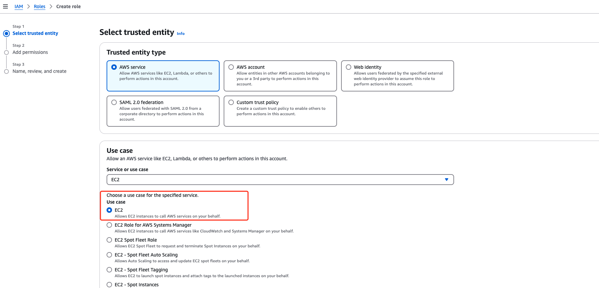
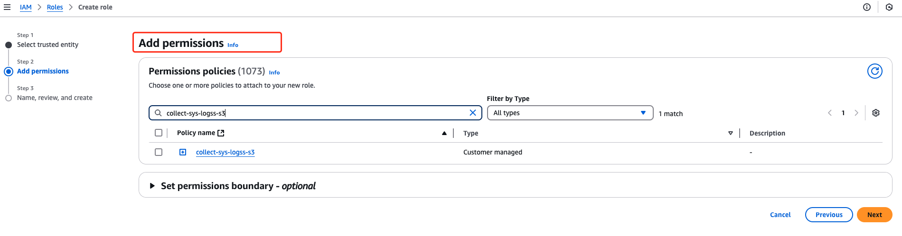

# Filebeat Application Load Balancer logs from Amazon S3 to Kafka

## Prerequisites

- The kafak cluster has been installed and the topic has been created
- A server that Filebeat is running in(This guide use Amazon EC2)
- An Amazon S3 Bucket which stores ALB Logs, see [Access logs for your Application Load Balancer](https://docs.aws.amazon.com/elasticloadbalancing/latest/application/load-balancer-access-logs.html)

## Step 1: Grant permissions

> [!TIP]
>
> Filebeat requires aws IAM permissions to access Amazon s3. 
>
> This guide uses IAM roles to authorize Filebeat to access Amazon s3.  Of course, you can also use the IAM user to authorize filebeat to access Amazon. 
>
> If your server isn't part of AWS, you must use IAM user. But if your server is Amazon EC2, I highly recommend using IAM roles.

1. Use the following example to create IAM policy, see [Create IAM policies (console)](https://docs.aws.amazon.com/IAM/latest/UserGuide/access_policies_create-console.html)
   Change `<your_bucket_name>` to Your s3 bucket name

   ```json
   {
       "Version": "2012-10-17",
       "Statement": [
           {
               "Sid": "VisualEditor0",
               "Effect": "Allow",
               "Action": [
                   "s3:Get*",
                   "s3:List*"
               ],
               "Resource": [
                   "arn:aws:s3:::<your_bucket_name>",
                 	"arn:aws:s3:::<your_bucket_name>/*"
               ]
           }
       ]
   }
   ```

   

2. Create An IAM role that delegates permissions to Amazon EC2 and attach the previously created IAM policy to the role, see [Creating a role for an AWS service (console)](https://docs.aws.amazon.com/IAM/latest/UserGuide/id_roles_create_for-service.html#roles-creatingrole-service-console)

   
   

3. Attach the previously created IAM Role to Aamzon EC2, see [Attach an IAM role to an instance](https://docs.aws.amazon.com/AWSEC2/latest/UserGuide/attach-iam-role.html)

   
   

## Step 2: Install Filebeat

> [!NOTE]
>
> This guide uses yum to install filebeat. For more installation information please see [Filebeat quick start: installation and configuration](https://www.elastic.co/guide/en/beats/filebeat/current/filebeat-installation-configuration.html)

1. Download and install the public signing key:

   ```sh
   sudo rpm --import https://artifacts.elastic.co/GPG-KEY-elasticsearch
   ```

2. Create a file with a `.repo` extension (for example, `elastic.repo`) in your `/etc/yum.repos.d/` directory and add the following lines:

   ```sh
   [elastic-8.x]
   name=Elastic repository for 8.x packages
   baseurl=https://artifacts.elastic.co/packages/8.x/yum
   gpgcheck=1
   gpgkey=https://artifacts.elastic.co/GPG-KEY-elasticsearch
   enabled=1
   autorefresh=1
   type=rpm-md
   ```

3. Your repository is ready to use. For example, you can install Filebeat by running:

   ```sh
   sudo yum install filebeat
   ```

## Step 3: Configure AWS S3 input

1. Use the followling example to modify `/etc/filebeat/filebeat.yml`. For more information please see [AWS S3 input](https://www.elastic.co/guide/en/beats/filebeat/current/filebeat-input-aws-s3.html)
   ```yaml
   filebeat.inputs:
   - type: aws-s3
     enabled: true
     bucket_arn: arn:aws:s3:::<your_bucket_name> 
     bucket_list_prefix: <prefix>
     number_of_workers: 1
     bucket_list_interval: 300s
     fields: 
       log_topic: 'lb-request-log'
   ```

   Some Explain:
   ```yaml
   bucket_arn: arn:aws:s3:::<your_bucket_name>, # Set your bucket name
   bucket_list_prefix: ` <prefix>`, # The directory you want to collect. If empty, it is the root directory
   fields: the kafka topic. # Optional fields that you can specify to add additional information to the output. 
   ```

2. Configure the file output to test whether the Filebeat is working properly
   ```yaml
   output.file:
     path: "/tmp/filebeat"
     filename: filebeat
   ```

3. Test the configuration
   ```shell
   filebeat test config
   ```

   If there are issues, the output will provide details to help you locate and fix them.

4. Run Filebeat

   ```shell
   systemctl restart filebeat
   ```

5. Check whether the output file is generated in the output path
   ```shell
   # ls /tmp/filebeat/
   filebeat-20250227-8998.ndjson  filebeat-20250227-9000.ndjson  filebeat-20250227-9002.ndjson  filebeat-20250227-9004.ndjson
   filebeat-20250227-8999.ndjson  filebeat-20250227-9001.ndjson  filebeat-20250227-9003.ndjson  filebeat-20250227-9005.ndjson
   ```

**Complete Example configuration file:**

```yaml
filebeat.inputs:
- type: aws-s3
  enabled: true
  bucket_arn: arn:aws:s3:::alb-logs 
  bucket_list_prefix: test-alb/requests-logs/AWSLogs/
  number_of_workers: 1
  bucket_list_interval: 300s 
  fields:
    log_topic: 'lb-request-log'
output.file:
  path: "/tmp/filebeat"
  filename: filebeat
```

## Step 4: Configure Kafka output

1. Use the followling example to modify `/etc/filebeat/filebeat.yml`. For more information please see [Configure the Kafka output](https://www.elastic.co/guide/en/beats/filebeat/current/kafka-output.html)

   ```yaml
   output.kafka:
     # initial brokers for reading cluster metadata
     hosts: ["kafka1:9092", "kafka2:9092", "kafka3:9092"]
   
     # message topic selection + partitioning
     topic: '%{[fields.log_topic]}'
     partition.round_robin:
       reachable_only: false
   
     required_acks: 1
     compression: gzip
     max_message_bytes: 1000000
   ```

3. Test the configuration

   ```shell
   filebeat test config
   ```

   If there are issues, the output will provide details to help you locate and fix them.

4. Run Filebeat

   ```shell
   systemctl restart filebeat
   ```

5. Check if the output is sent to Kafka. Use the `kafka-console-consumer.sh` command to view the message output to the Kafka    topic.

   Replace the bootsrap server address and topic name in the command.

   ```shell
   bin/kafka-console-consumer.sh --bootstrap-server  172.31.0.155:9092,172.31.9.139:9092,172.31.11.29:9092 --topic <your_topic> --from-beginning
   ```

**Complete Kafka output Example configuration file:**

```yaml
filebeat.inputs:
- type: aws-s3
  enabled: true
  bucket_arn: arn:aws:s3:::alb-logs 
  bucket_list_prefix: test-alb/requests-logs/AWSLogs/
  number_of_workers: 1
  bucket_list_interval: 300s 
  fields:
    log_topic: 'lb-request-log'
output.kafka:
  # initial brokers for reading cluster metadata
  hosts: ["kafka1:9092", "kafka2:9092", "kafka3:9092"]

  # message topic selection + partitioning
  topic: '%{[fields.log_topic]}'
  partition.round_robin:
    reachable_only: false

  required_acks: 1
  compression: gzip
  max_message_bytes: 1000000
```

