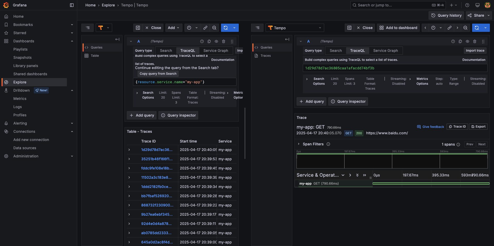

# Docker-compose 单机部署基于 Opentelemetry + GranafaLabs 生态的可观测平台

## 介绍

本文使用 docker-compose 部署一个可观测性平台，包含 OpenTelemetry、Loki、Tempo、Grafana、Prometheus。会是一个单机部署，试用于测试/开发环境，不建议在生产环境把全部服务部署在一台机器上。

> 生产环境的部署教程，请参考[生产环境可观测性平台搭建系列教程(还没写，哈哈)]。
>
> 本文也不对各个组件进行过多的说明，组件功能请自行查看官方文档

## 步骤

### 系统配置

1. ubuntu 22.04 ，磁盘配置：系统盘100G，数据盘 1TB(要注意数据盘的数据别被写满了)

### Step 1: Install Docker and Docker compose

1. 删除旧的 docker, 避免冲突

   ```shell
   for pkg in docker.io docker-doc docker-compose docker-compose-v2 podman-docker containerd runc; do sudo apt-get remove $pkg; done
   ```

2. 设置 `apt` Docker 存储库。

   > [!NOTE]
   >
   > 这里的命令最好一条条复制执行, 不要一下子复制全部。

   ```shell
   # Add Docker's official GPG key:
   sudo apt-get update
   sudo apt-get install ca-certificates curl
   sudo install -m 0755 -d /etc/apt/keyrings
   sudo curl -fsSL https://download.docker.com/linux/ubuntu/gpg -o /etc/apt/keyrings/docker.asc
   sudo chmod a+r /etc/apt/keyrings/docker.asc
   
   # Add the repository to Apt sources:
   echo \
     "deb [arch=$(dpkg --print-architecture) signed-by=/etc/apt/keyrings/docker.asc] https://download.docker.com/linux/ubuntu \
     $(. /etc/os-release && echo "${UBUNTU_CODENAME:-$VERSION_CODENAME}") stable" | \
     sudo tee /etc/apt/sources.list.d/docker.list > /dev/null
   sudo apt-get update
   ```

3. 下载最新版本 docker
   ```shell
   sudo apt-get install docker-ce docker-ce-cli containerd.io docker-buildx-plugin docker-compose-plugin -y
   ```

4. 运行 `hello-word` 镜像验证
   ```shell
   sudo docker run hello-world
   ```

   

5. 查看 docker compose 版本
   ```shell
   $ docker compose version
   Docker Compose version v2.34.0
   ```

### (Optional)Step 2: Install python3.12

> 正常情况下，AWS 上的 Ubuntu 22.04 带有 python3.10

1. 导入 Python 的 PPA
   ```shell
   sudo apt update 
   sudo apt upgrade
   sudo add-apt-repository ppa:deadsnakes/ppa
   ```

   也可以导入最新开发版本 Nightly PPA
   ```shell
   sudo add-apt-repository ppa:deadsnakes/nightly -y
   ```

2. 更新 APT 缓存和安装python3.12
   ```shell
   sudo apt update
   sudo apt install python3.12
   ```

3. 查看版本

   ```shell
   $ python3.12 --version
   Python 3.12.10
   ```

4. 安装 pip
   ```shell
   sudo apt install python3-pip
   ```

### Step 3: Docker compose 运行所有组件

1. `/data` 文件结构

   ```shell
   /data
   ├── docker-compose             # docker compose 配置
   │   ├── docker-compose.yml
   │   ├── grafana-provisioning
   │   │   └── datasources
   │   │       └── datasource.yml
   │   ├── otel-config.yaml
   │   ├── prometheus.yml
   │   ├── python-app
   │   │   └── app.py
   │   └── tempo.yaml
   ├── grafana                     # Grafana 数据
   ├── loki                        # Loki 日志数据
   ├── otel-collector              # OpenTelemetry Collector 数据
   ├── prometheus                  # Prometheus 数据
   └── tempo                       # Tempo 追踪数据
   
   ```

2. 创建目录
   ```shell
   sudo mkdir -p /data/{otel-collector,prometheus,loki,tempo,grafana,docker-compose}
   sudo mkdir -p /data/docker-compose/python-app
   sudo mkdir -p /data/otel-collector/logs
   sudo mkdir -p /data/docker-compose/grafana-provisioning/datasources/
   sudo chmod -R 777 /data
   sudo chown -R 65534:65534 /data/prometheus  # Prometheus 用户权限
   sudo chown -R 10001:10001 /data/loki       # Loki 用户权限
   sudo chown -R 472:472 /data/grafana        # Grafana 用户权限
   ```

3. 克隆仓库

   ```shel
   git clone https://github.com/mo-silent/o11y-deploy.git
   cd o11y-deploy/single-grafana
   sudo cp -r ./* /data/docker-compose
   ```

4. 启动服务

   ```shell
   cd /data/docker-compose/
   sudo mv grafana-datasource.yml /data/docker-compose/grafana-provisioning/datasources/datasource.yml
   sudo docker compose up -d
   ```

5. 查看服务启动情况
   ```shell
   $ sudo docker ps
   ```

   

### Step 4: 运行测试应用

1. 安装依赖
   ```shell
   cd /data/docker-compose/python-app
   python3 -m venv venv
   source venv/bin/activate
   pip3 install opentelemetry-distro opentelemetry-exporter-otlp-proto-http opentelemetry-instrumentation-logging opentelemetry-instrumentation-requests requests
   opentelemetry-bootstrap -a install
   ```
   
2. 运行程序
   
   > [!TIP]
   >
   > python 自动采集日志必须要设置的 ENV 变量。参考Github 案例: [Logging AutoInstrumentation does not support capturing INFO logs #3473](https://github.com/open-telemetry/opentelemetry-python/issues/3473)
   >
   > 这个 Issue 在当前时间 2025-04-17 还是 Open 状态
   >
   > ```shell
   > export OTEL_PYTHON_LOG_LEVEL=info
   > export OTEL_PYTHON_LOG_CORRELATION=true
   > export OTEL_PYTHON_LOGGING_AUTO_INSTRUMENTATION_ENABLED=true
   > ```
   
   ```shell
   export OTEL_EXPORTER_OTLP_ENDPOINT=http://localhost:4318
   export OTEL_EXPORTER_OTLP_PROTOCOL=http/protobuf
   export OTEL_SERVICE_NAME=my-app
   export OTEL_TRACES_EXPORTER=otlp
   export OTEL_METRICS_EXPORTER=otlp
   export OTEL_LOGS_EXPORTER=otlp
   export OTEL_PYTHON_LOG_LEVEL=info
   export OTEL_PYTHON_LOG_CORRELATION=true
   export OTEL_PYTHON_LOGGING_AUTO_INSTRUMENTATION_ENABLED=true
   opentelemetry-instrument python3 app.py
   ```
   

3. 如果在验证数据时, 查不到数据, 可以先排查程序问题, 按需将下面环境变量添加 console 输入

   > [!TIP]
   >
   > 最可能出现的 traces 问题

   ```shell
   export OTEL_TRACES_EXPORTER="otlp,console"
   export OTEL_METRICS_EXPORTER="otlp,console"
   export OTEL_LOGS_EXPORTER="otlp,console"
   ```

### Step 5: 验证数据

1. logs

   - Grafana 查看, 地址: `http://<IP>:3000/a/grafana-lokiexplore-app/explore`
     

   - curl
     ```shell
     curl -G "http://localhost:3100/loki/api/v1/query_range" \
       --data-urlencode 'query={service_name="test-app"}' \
       --data-urlencode 'start=1744803330892070099' \
       --data-urlencode 'end=1744805130892070099' \
       --data-urlencode 'limit=100'
     ```

2. metrics

   - Grafana, 地址: `http://<ip>:3000/exIPore/metrics`

     
     

   - curl
     ```shell
     curl http://locahost:8889/metrics
     ```

3. traces

   - Grafana Explore 查看, 选择数据源为 Tempo。地址: `http://<IP>:3000/explore`
     

     Traces 详细

     

   - curl
     ```shell
     curl -G -s http://localhost:3200/api/search --data-urlencode 'tags=service.name=cartservice' --data-urlencode minDuration=600ms
     ```

### 生产建议

1. Loki 和 tempo 存储在对象存储: S3、GCS、Azure

   > [!CAUTION]
   >
   > 对象存储在调用上会有成本, 注意配置。Github 有过案例: [Insanely high S3 bucket reads on Tempo #2461](https://github.com/grafana/tempo/discussions/2461)

   - loki 使用 s3 配置
     ```yaml
     storage_config:
       tsdb_shipper:
         active_index_directory: /loki/index
         cache_location: /loki/index_cache
         cache_ttl: 24h
       aws:
         s3: s3://region # 也可以明文 akdk s3://<access_key>:<uri-encoded-secret-access-key>@<region>
         bucketnames: <bucket1,bucket2>
     schema_config:
       configs:
       - from: 2020-05-15
         store: tsdb
         object_store: aws
         schema: v13
         index:
           prefix: index_
           period: 24h
     ```

   - Tempo 使用 S3 配置
     ```yaml
     storage:
       trace:
         backend: s3
         s3:
           endpoint: s3.amazonaws.com
           bucket: tempo
           access_key: <access_key> # 这里建议不要明文写, 用 IAM Role 附加到机器上
           secret_key: <secret_key>
     ```

2. Prometheus 使用 thanos 或 VictoriaMetrics

### 完整配置

1. 组件, 进入到目录 `/data/docker-compose/`

   - docker-compose.yaml

     ```yaml
     version: '3'
     services:
       otel-collector:
         image: otel/opentelemetry-collector-contrib:0.123.0
         command: ["--config=/etc/otel-config.yaml"]
         volumes:
           - /data/docker-compose/otel-config.yaml:/etc/otel-config.yaml
           - /data/otel-collector/logs:/var/log/otelcol  # Collector logs
         ports:
           - "1888:1888"   # pprof extension
           - "8888:8888"   # Prometheus metrics exposed by the Collector
           - "8889:8889"   # Prometheus exporter metrics
           - "13133:13133" # health_check extension
           - "4317:4317"   # OTLP gRPC receiver
           - "4318:4318"   # OTLP http receiver 
           - "55679:55679" # zpages extension
         depends_on:
           - loki
           - tempo
       
       node-exporter:
         image: prom/node-exporter:latest
         command:
           - '--path.rootfs=/host'
         pid: host
         restart: unless-stopped
         volumes:
           - '/:/host:ro,rslave'
         expose:
           - 9100
     
       cadvisor:
         image: gcr.io/cadvisor/cadvisor:latest
         restart: unless-stopped
         volumes:
           - /:/rootfs:ro
           - /var/run:/var/run:rw
           - /sys:/sys:ro
           - /var/lib/docker/:/var/lib/docker:ro
         expose:
           - 8080
     
       prometheus:
         image: prom/prometheus:v3.3.0
         volumes:
           - /data/docker-compose/prometheus.yml:/etc/prometheus/prometheus.yml
           - /data/prometheus:/prometheus 
         ports:
           - "9090:9090"
     
       loki:
         image: grafana/loki:3.4.3
         ports:
           - "3100:3100"
         volumes:
           - /data/loki:/loki
           - /data/docker-compose/loki-config.yaml:/etc/loki/local-config.yaml
         command: -config.file=/etc/loki/local-config.yaml
     
       tempo:
         image: grafana/tempo:latest
         command: ["-config.file=/etc/tempo.yaml"]
         volumes:
           - /data/docker-compose/tempo.yaml:/etc/tempo.yaml
           - /data/tempo:/tmp/tempo
         ports:
           - "3200:3200"
           - "4317" # otlp grpc
       
       grafana:
         container_name: grafana
         image: grafana/grafana-enterprise:11.6.0
         ports:
           - "3000:3000"
         volumes:
           - /data/grafana:/var/lib/grafana  # Dashboard and data source configurations
           - /data/docker-compose/grafana-provisioning:/etc/grafana/provisioning  # Pre-configured
         environment:
           - GF_SECURITY_ADMIN_PASSWORD=BLpl5Ri98f*OpA
     ```

   - otel-config.yaml
     ```yaml
     # Receivers
     receivers:
       otlp:
         protocols:
           grpc:
             endpoint: 0.0.0.0:4317
           http:
             endpoint: 0.0.0.0:4318
     
     # Processors
     
     # Exporters
     exporters:
       prometheus:
         endpoint: "0.0.0.0:8889"
         resource_to_telemetry_conversion:
           enabled: true
       otlphttp/logs:
         endpoint: "http://loki:3100/otlp"
         tls:
           insecure: true
       otlp/tempo:
         endpoint: "tempo:4317"
         tls:
           insecure: true
       debug: # 部署生产环境时可以关闭
         verbosity: detailed
     
     # Pipelines
     service:
       pipelines:
         metrics:
           receivers: [otlp]
           exporters: [prometheus]
         logs:
           receivers: [otlp]
           exporters: [otlphttp/logs]
         traces:
           receivers: [otlp]
           exporters: [otlp/tempo, debug]
     ```
     
   - prometheus.yml
     ```yaml
     storage:
       tsdb:
         path: /prometheus
     
     global:
       scrape_interval: 15s
     
     scrape_configs:
       - job_name: 'prometheus'
         static_configs:
           - targets: [ 'localhost:9090' ] # Monitor prometheus own metrics
       
       - job_name: 'otel-collector'
         scrape_interval: 5s
         static_configs:
           - targets: ['otel-collector:8889'] # Monitor Collector metrics
       - job_name: 'loki'
         static_configs:
           - targets: ['loki:3100'] # Monitor loki metrics
       
       - job_name: 'cadvisor'
         static_configs:
           - targets: ['cadvisor:8080']
       
       - job_name: 'node-exporter'
         scrape_interval: 5s
         static_configs:
           - targets: ['node-exporter:9100']
     ```
     
   - loki-config.yaml
     ```yaml
     auth_enabled: false
     
     limits_config:
       allow_structured_metadata: true
       volume_enabled: true
     
     server:
       http_listen_port: 3100
     
     common:
       ring:
         instance_addr: 0.0.0.0
         kvstore:
           store: inmemory
       replication_factor: 1
       path_prefix: /loki
     
     schema_config:
       configs:
       - from: 2020-05-15
         store: tsdb
         object_store: filesystem
         schema: v13
         index:
           prefix: index_
           period: 24h
           
     storage_config:
       tsdb_shipper:
         active_index_directory: /loki/index
         cache_location: /loki/index_cache
       filesystem:
         directory: /loki/chunks
     
     pattern_ingester:
       enabled: true
     ```
     
   - tempo.yaml
     
     ```yaml
     server:
       http_listen_port: 3200
     
     storage:
       trace:
         backend: local
         local:
           path: /tmp/tempo # 映射到宿主机的 /data/tempo
     distributor: 
       receivers:
         otlp:
           protocols:
             grpc:
               endpoint: "tempo:4317"
     ```
     
   - grafana-provisioning/datasources/datasource.yml

     ```yaml
     apiVersion: 1
     
     datasources:
       - name: Prometheus
         type: prometheus
         url: http://prometheus:9090
     
       - name: Loki
         type: loki
         url: http://loki:3100
     
       - name: Tempo
         type: tempo
         url: http://tempo:3200
         jsonData:
           tracesToLogs:
             datasourceUid: 'loki'
             tags: ['traceID']
     ```

2. Python 示例代码

   > [!TIP]
   >
   > 代码中的各组件地址，可以改成机器的IP地址。因为应用不一定部署在同一个机器上

   - python-app/app.py
     ```python
     import logging
     import time
     import requests
     from opentelemetry import metrics
     
     # 1. 设置日志级别
     # logging.basicConfig(level=logging.INFO)
     logging.basicConfig(level=logging.WARNING)
     logger = logging.getLogger(__name__)
     
     
     # 获取仪表用于手动指标
     meter = metrics.get_meter(__name__)
     counter = meter.create_counter("my_counter", description="自定义计数器")
     
     # 主循环
     while True:
         logger.info("这是一个日志消息")
         logging.warning("这是一个警告日志")
         counter.add(1)
         try:
             response = requests.get("https://www.baidu.com")
             logger.info(f"请求 baidu.com 返回状态码: {response.status_code}")
         except Exception as e:
             logger.error(f"请求出错: {e}")
         time.sleep(5)
     ```
     
     
   
   
