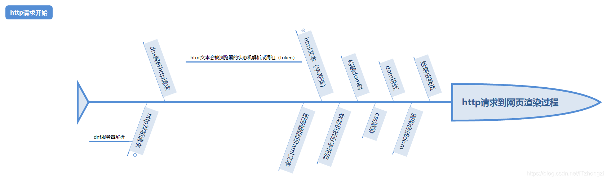

# 运维开发面试-一道网页访问不了引发的一系列排查问题

## 题目

如果客户告诉你公司的网页访问不了，你怎么排查？（不知道返回状态码）

> 本地测试公司的网站是否问题

本地没有，怎么排查

> 查看服务器防火墙是否禁用客户IP？查看应用日志，看对应的错误

服务器防火墙没有禁用，也没有日志

为什么要一开始就查应用，七层网络协议越高层协议越复杂，不应该从最低层排查吗？

再明确一点，客户访问不了公司网页，也访问不了百度
> 在客户机器测试网关能否到达

如果客户本来就没插网线呢？你这前面浪费了多少时间
> 本人内心，我tm，这人是傻子吧，靠，另一个想法，之前还真TM遇到过这样的人

客户能正常到达网关，网关也能访问外网，这时候你应该怎么排查

> ping 域名，Telnet 端口

都正常，接下来你应该怎么排查？

> 我人都懵了，我不知道，想了半天

面试官看出了我的窘境，可能你知识受限，那你应该怎么做去解决这个问题？

> 百度，问其他更有经验的人

假设百度跟其他人都没遇到你这样的问题，没办法帮你，你应该怎么做

平常有没有用过一些排查工具，借助什么工具去解决

> 刚听到没人帮忙，百度也不行，有点懵圈

面试官看我没回答，就说了解过http请求到加载页面的整个过程吗？（简单了解过，不太记得）

你现在可以查百度看看，这是哪个阶段出了问题

> 在dns解析请求到服务器返回html，这一段除了问题

对，那你应该怎么排查，或者用什么工具排查？

> 后面认真想了想，小心翼翼的说了一句 wireshark？

对，抓包，这时假设你发现抓包的时候，客户的出口IP变了，并不是实际路由器的出口IP，你应该怎么用？

> 查一下路由有没有做NAT，SNAT这些

路由一切正常，没有这些东西

> 当时脑子一抽，直接说看本机有没有做NAT

面试官说本机NAT?本机能做NAT吗？你了解过 VPN 吗？（用过）那你知道VPN是几层协议吗？

> 四层，socket？

面试官那有三层，二层一层吗？（不知道）那你用过VPN的全局代理吗？

> 恍然大悟，对哦。VPN 会把出口IP给变了，这时心里懊恼，我真是蠢，前几周才做了代理抓包，这么快就忘记了
> 不过还有一点，面试官问到人都傻了，没想太多，就直接回答。以后需要冷静思考问题

这里告一段落，面试官说别看这个问题简单，但是我之前跟一个人聊了两个小时

http 代理的VPN是七层的，所以这就是为什么能ping通，也能Telnet通的原因

下面继续其他假设，如果 ping 不通呢

> ping 不通分两种情况，一种是能够正常解析出IP地址，一种是不能

能解析出IP地址，就是ping不通，网关也不通

> traceroute 看路由

嗯，这时候你发现路由到广州的站点就过不去了，这时候应该怎么排查

> 个人说：用其他地区的机器去测试，脑子还抽了说用内网机器去测试

有用过排查工具吗？再提示一下，那些不同地方的ping测试

> 哦，ping 网站（心里想： 脑子坏了吧，也是前段时间抓包用过），其实我前面的其他公网机器也是一样的(更傻逼了)

如果你那台外网机器也刚好又问题呢？这不又卡住了

如果这时你发现ping，除了广州外，其他地区都正常，并且都是**不同IP**应该这么改，这个原因是什么？

> GA,全球加速？（脑残了，不同IP是重点）

那些全球加速，用的是什么技术？

> Anycast IP？（面试官强调 不同IP），CDN

那这种情况怎么改？能快速解决客户的问题

> CDN 地域转发

假设这个CDN没有这个功能呢？

> 想了一会，小心说道去掉CDN？

嗯，面试官又继续提问了。

